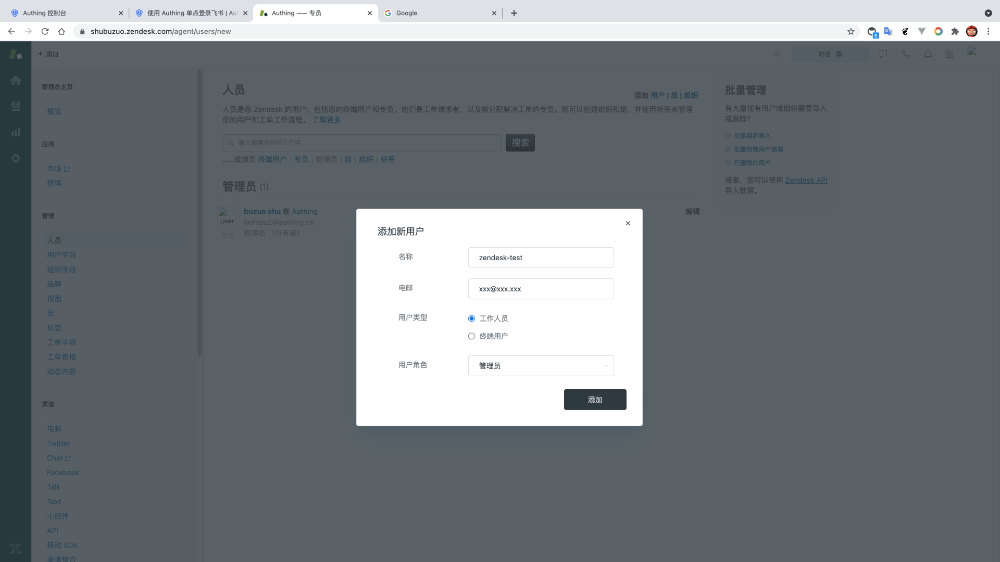

<IntegrationDetailCard title="体验登录">

进入 **ZenDesk**，选择 **设置** -> **管理** -> **人员**，进行 **添加用户** 操作。

为该用户选择对应角色，完成 **用户添加**。

复制应用访问链接，在新的浏览器隐身窗口中打开。

进入 **Authing** 登录页面。

在登录界面输入之前创建的用户账号密码，即可成功登录到 **ZenDesk**。

</IntegrationDetailCard>
