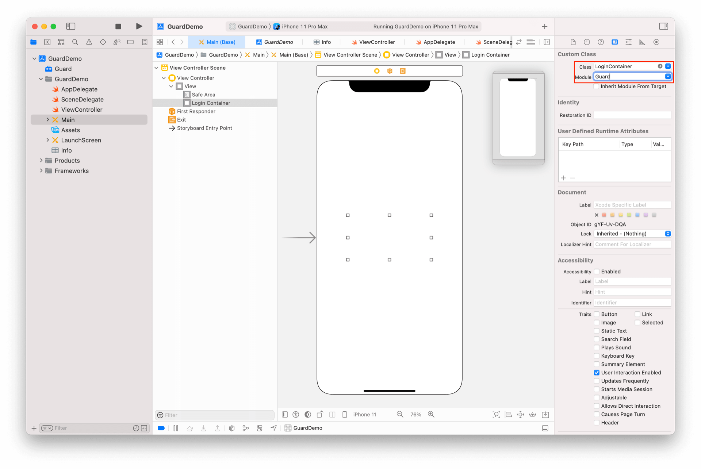

# LoginContainer

<LastUpdated/>

此组件为辅助类型控件。我们将一组登录控件放置到 LoginContainer 里面，并设置 LoginContainer 类型，方便 LoginMethodTab 完成登录方式切换。

## 属性

| 属性名                     | 类型 | 说明 | 默认值 |
| ----------------------- |:--------:| :------:| :-----: |
|  type     |    Int    |   登录方式类型。0 手机号码+验证码；1 帐号+密码   |    0   |

## 创建

放置一个 UIView，并将其类型改为 LoginContainer

