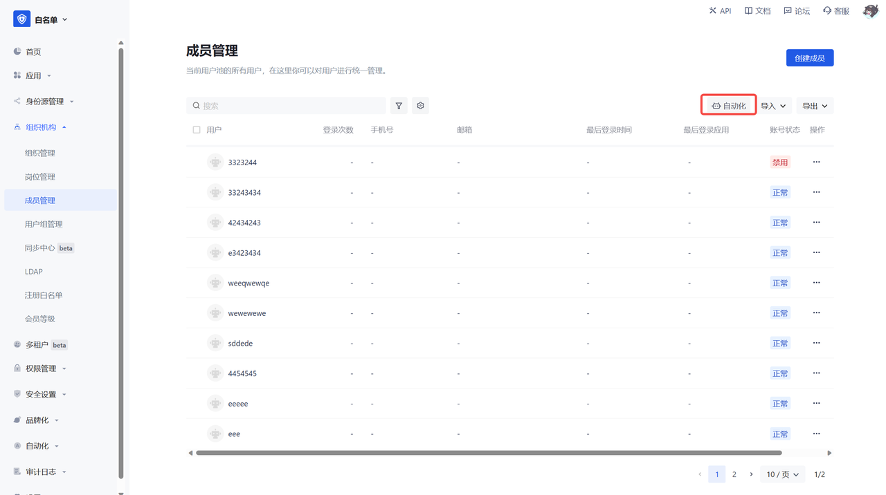
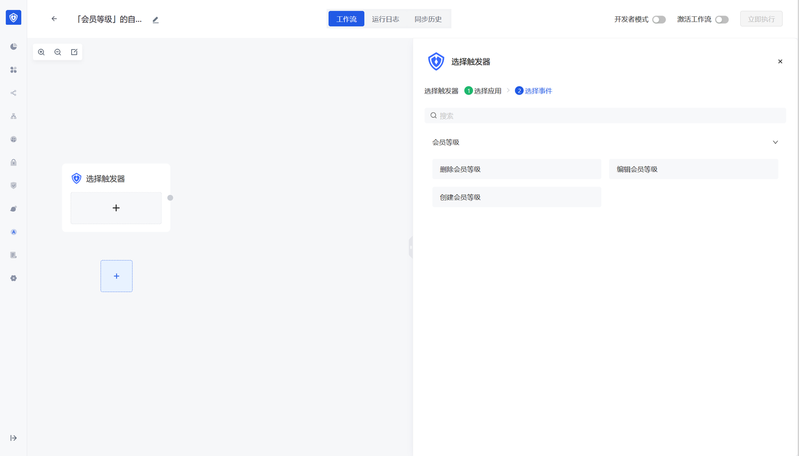

# 元数据概览

## 概述

Authing 3.0 是<strong>以事件驱动为中心</strong>的低代码身份云平台，而作为企业级的身份云平台，Authing 一直在探索如何为开发者提供快速且灵活的复杂功能构建能力，除了开放的 API 和 SDK 及自动化编排引擎外，Authing 创新性提供<strong>首个基于身份云平台的元数据引擎</strong>，通过图形化的界面帮助开发者快速定义个性化的业务规则和业务功能，并提供了开箱即用的用户、组织机构、用户分组、岗位管理、设备管理、UEBA 等<strong>身份领域数据模型</strong>，方便开发者开箱即用。

同时我们为用户提供了创建数据对象、查询数据对象详情、编辑数据对象 等 <strong>API</strong>，及创建行数据 / 列数据、编辑行数据 / 列数据、删除行数据 / 列数据等开箱即用的<strong>元数据事件</strong>，开发者可以快速在身份自动化画布中监听元数据事件变动并联动平台内外自定义操作。例如在自适应 MFA 安全场景下，你可以通过 UEBA 元数据模型，实现数据的联动监控。

基于 Authing 强大的身份<strong>自动化编排引擎、元数据引擎、及全量事件驱动 API</strong>，Authing 真正帮助开发者实现了基于身份的动态能力扩展和自动化业务运营，为企业级软件开发注入了无限的创造力和灵活性，从而实现更高效的低代码构建旅程，这为也 Authing 用户带来了极大的敏捷性和快速响应能力，使其在快速的市场需求和业务需求变化下从容应对，并大幅度降低开发成本。

## 什么是元数据

元数据 （metadata ）是关于数据的组织、数据域及其关系的信息，简单来说，元数据就是被用来<strong>描述数据的数据</strong>，一般来说可分为：<strong>技术元数据、业务元数据、操作元数据、管理元数据</strong>。

## Authing 元数据的用户价值

1. 用户可以自定义数据对象，发布相应的功能菜单。实现功能发布及菜单管理。
2. 用户可以配置这个功能中有哪些字段。字段类型支持常见的文本、数字、日期、选择等类型。
3. 用户可以配置这个功能的操作。实现增删改查等预置操作。
4. 用户可以配置详情页的布局，可以通过拖拽形式控制字段布局及占位长度。
5. 提供<strong>身份领域的最佳领域模型</strong>。用户可以将用户目录的现有功能（用户、组织、部门、岗位、用户组、应用访问控制）进行灵活自定义字段及操作。
6. 用户发布的功能可以<strong>自动发布默认事件</strong>，用户可以在<strong>身份自动化模块配置</strong>新功能的工作流。
7. 提供标准的 API 接口及 SDK 能力

## API 地址

[元数据 API 文档地址](https://api-explorer.authing.cn/?tag=tag/%E7%AE%A1%E7%90%86%E5%85%83%E6%95%B0%E6%8D%AE/API%20%E5%88%97%E8%A1%A8/operation/MetaDataController_createModel)

## SDK

3.0.12-alpha.2

## 元数据 & 身份自动化

### 身份自动化模块功能详细说明：

[身份自动化文档地址](https://docs.authing.cn/v2/workflow/overview)

### 元数据  & 身份自动化功能联动

- 领域模型 & 自定义的数据对象都会在列表页展示自动化图标，点击后将自动生成一条工作流，并筛选出该数据对象相关的事件。
- 自定义数据对象创建后，将默认生成创建行数据 & 列数据、编辑行数据 & 列数据、删除行数据 & 列数据事件。
- 特别注意：只有同时具有身份自动化权益才会展示身份自动化入口，若只有元数据权益不展示

