# 功能二：字段管理

## 功能说明
支持常见的字段类型，包括：文本（单行文本、多行文本）、数字、日期、选择（布尔值、枚举值）、关联数据类型。

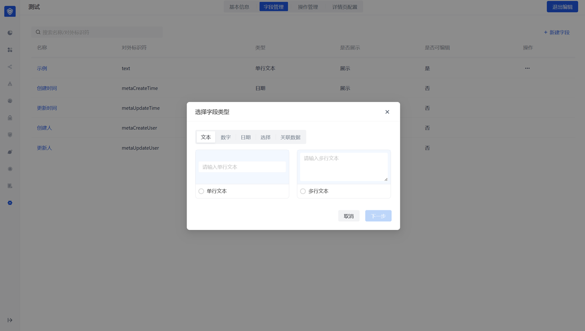

## 文本类型
- 填写了帮助说明的字段，在用户创建时都会有对应的 hover 提示图标，提示说明。
- 校验规则目前支持：手机号、邮箱及自定义校验方式（正则表达式）。
- 文本类型可以控制限制对应的文本长度。

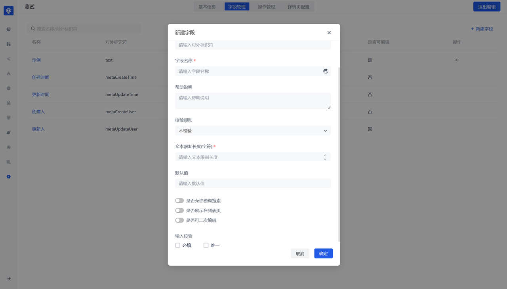

## 数字类型
- 数字类型可以配置控制用户输入的数字上下限。
- 支持配置展示给用户的数字格式，如：保留小数位数，千分位，百分比等。

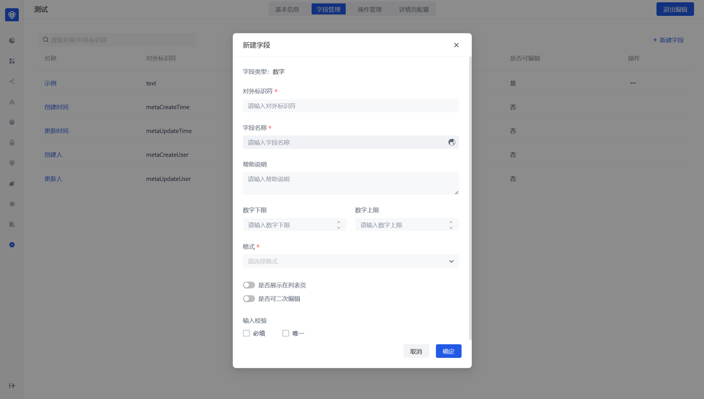

## 日期类型
- 数字类型可以配置控制用户输入的日期范围。
- 支持配置展示给用户的日期格式。

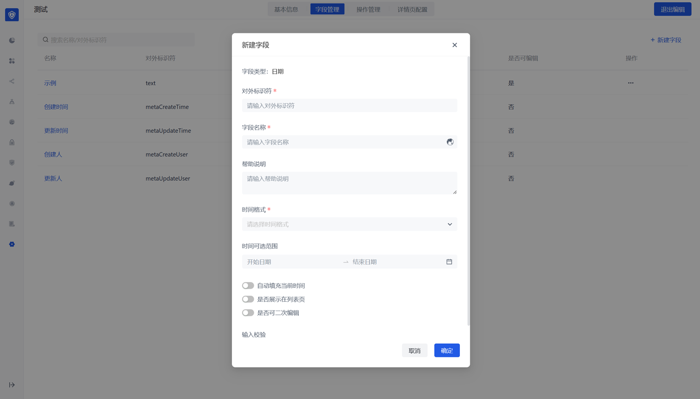

## 选择类型
选择类型包括布尔值和枚举值，其中枚举值可以配置对应的 value 和描述。

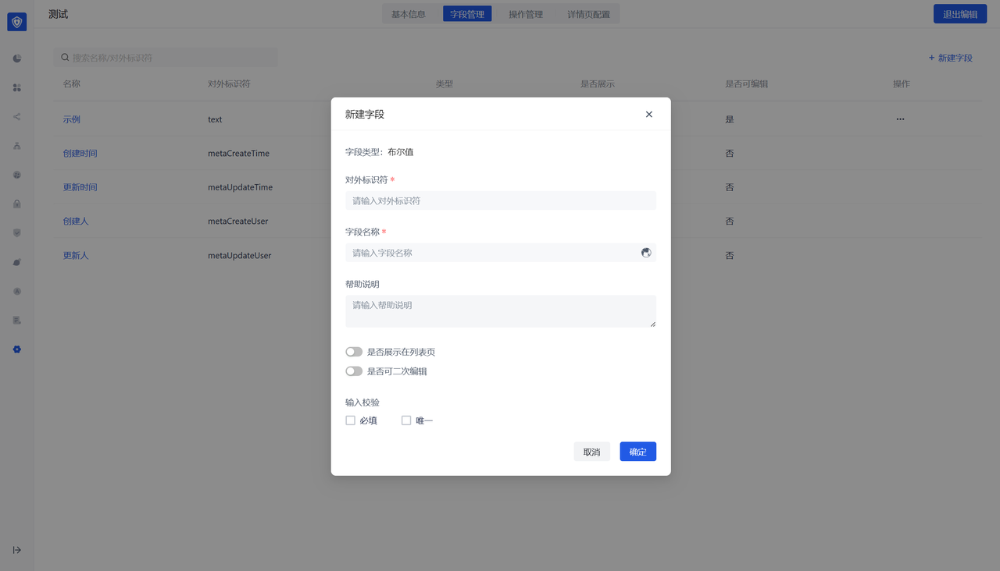

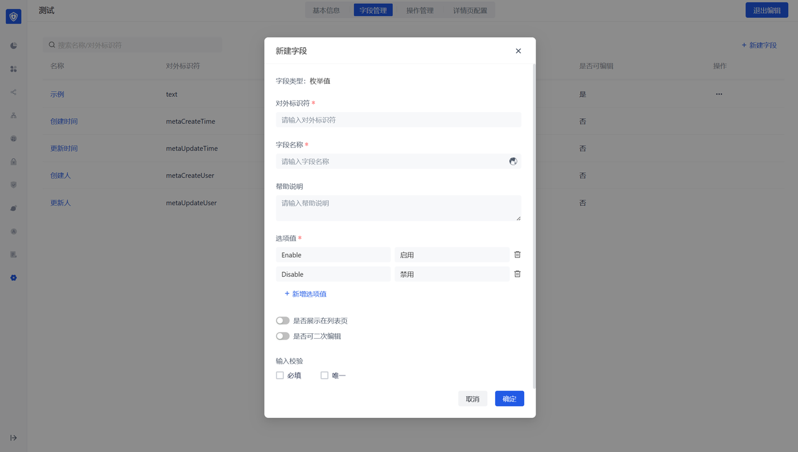

# 关联数据
关联数据类型：即可以创建一个字段，字段的<strong>下拉值取自其他数据对象的数据</strong>。

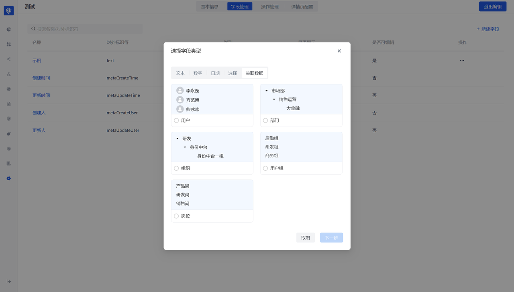

选择数据时展示字段：控制对应的下拉值及展示时默认展示关联对象的哪个字段，<strong>建议配置显示具有唯一性的字段</strong>，便于区分关联数据。

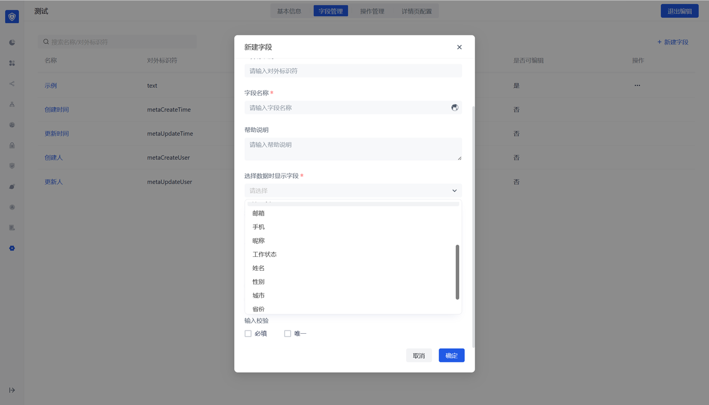

可选范围：可以控制关联数据的下拉值范围，如不选择默认可选择全部数据。

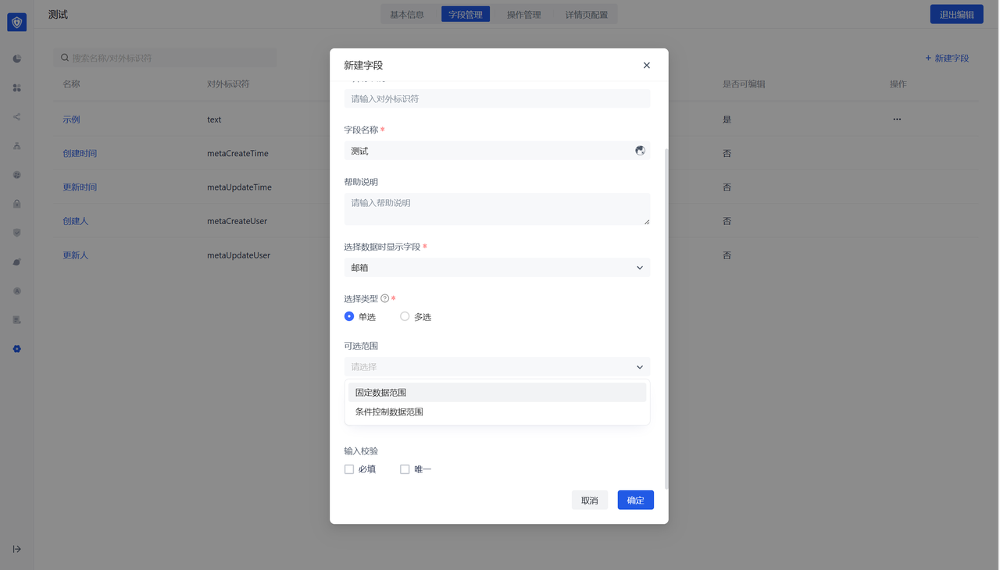

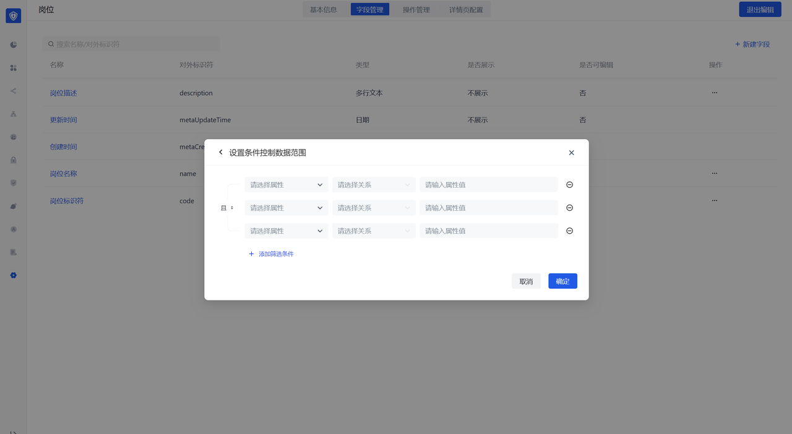

特别注意：配置了关联数据类型后，除了正在配置的数据对象外，会在被关联的数据对象侧也生成一个关联类型字段，但默认不展示，如两侧的关联字段都展示，可以实现<string>双向数据关联</string>。即：A 与 B 关联，A 测更新的关联关系，B 侧同步更新；B 侧更新的的关联关系，A 侧也同步更新。

用户视角
- 列表页展示该数据对象配置了列表页展示的字段
- 支持搜索，支持筛选

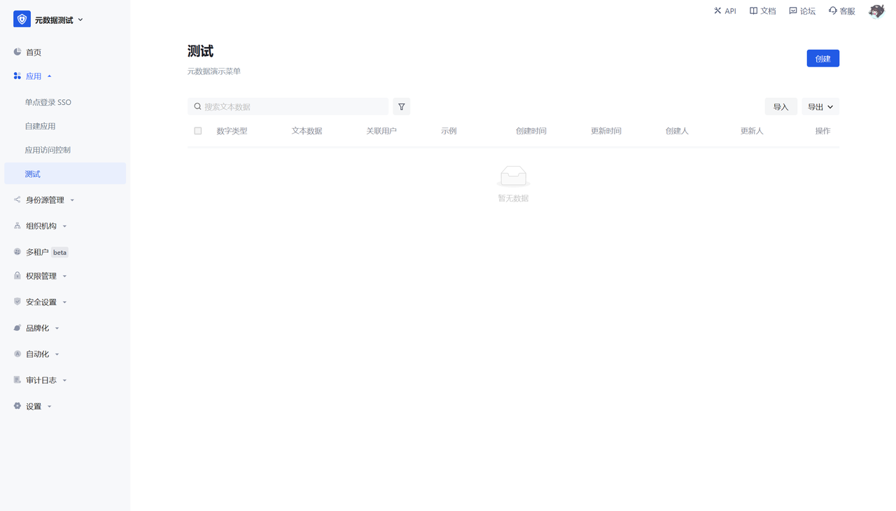

创建页展示该数据对象所有创建的字段

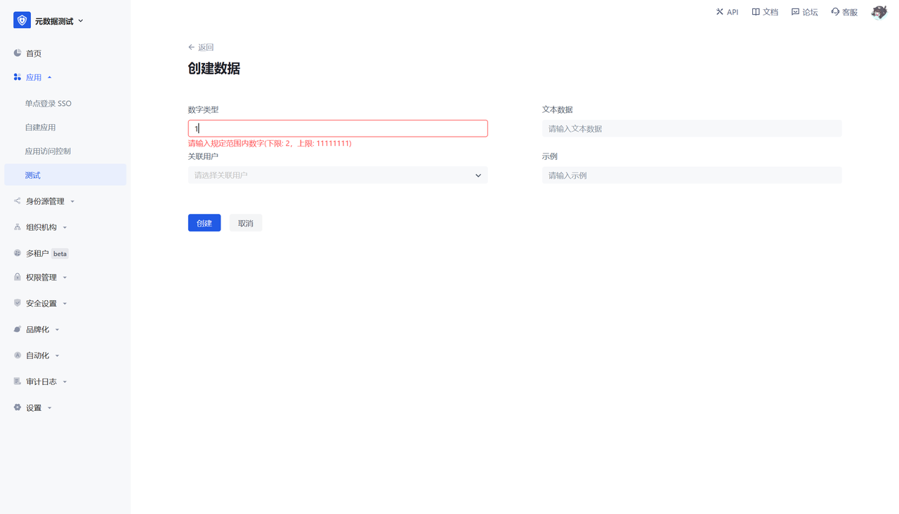
