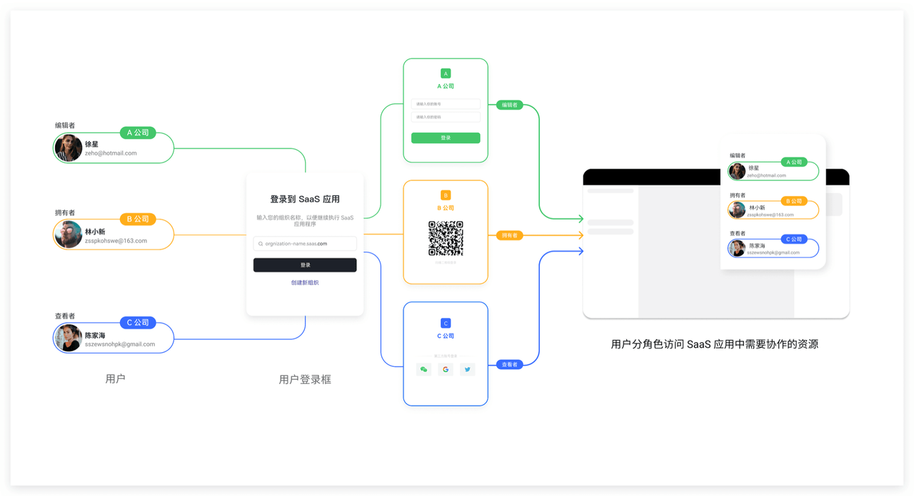
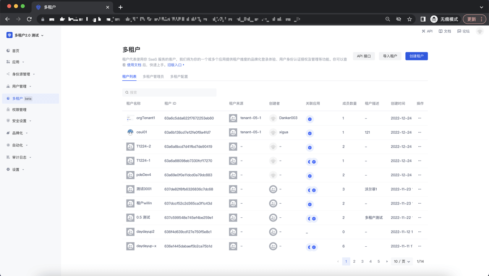
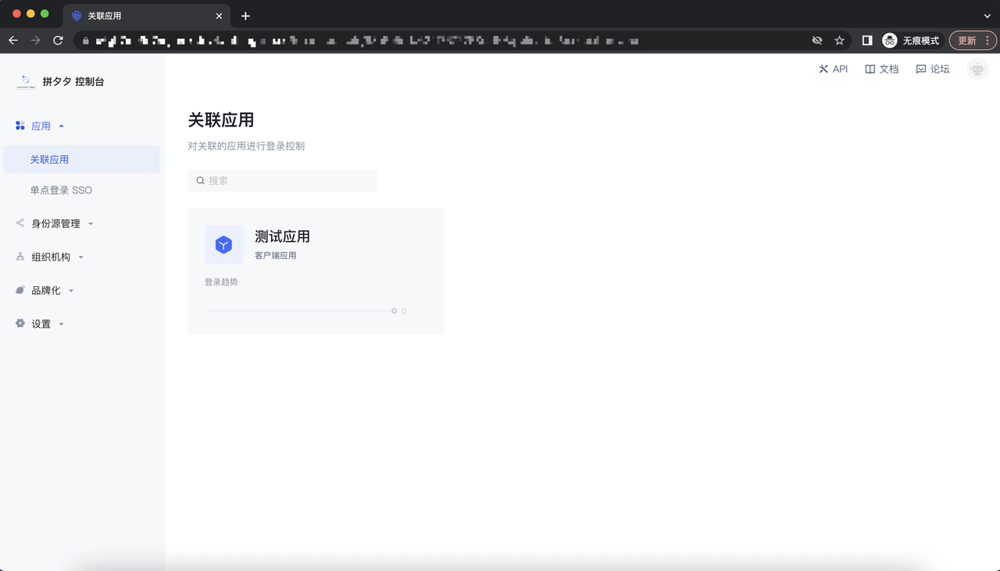
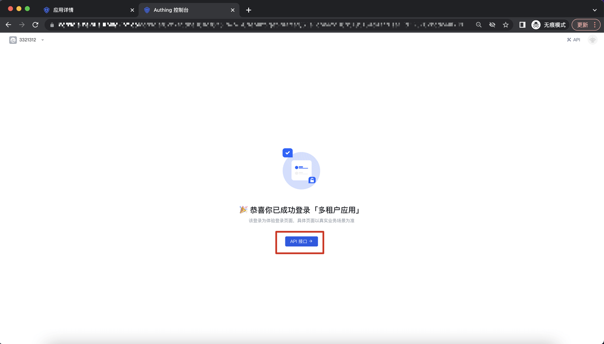

# 概览

<LastUpdated/>

多租户是 Authing 为企业客户提供的场景化解决方案。它不仅能够帮助 SaaS 企业更好的管理自己的合作伙伴和客户，同时也满足了企业客户搭建 Saas 平台及应用为第三方提供服务及资源的诉求。

Authing 将为客户提供多租户场景下的最佳实践：
- 一行代码快速创建租户，简单配置清晰管理租户。
- 通过开发者友好的 SDK 及 API，快速集成 Saas 型应用。
- 为每个租户提供高安全、高性能、高 Authing 身份云基础设施。
以上功能无法满足你的需求？请联系 销售顾问 或官网客服了解更多详情。

## 多租户控制台

多租户控制台位于 Authing B2B 场景的用户池里，多租户控制台旨在帮助 Saas 企业更好的管理租户，其中包括对多租户的配置及租户的管理能力：

## 租户控制台

我们为每个租户提供了租户控制台及相应的 API 接口，旨在帮助 Saas 客户的合作伙伴更好的使用 Authing 提供的基础身份云设施：

## Saas 型应用 Demo

Authing 为客户提供搭建 Saas 型应用的 Demo 及相关的 API 接口，旨在帮助客户更好的搭建 Saas 型应用及提供相应的资源或服务给到第三方企业：

