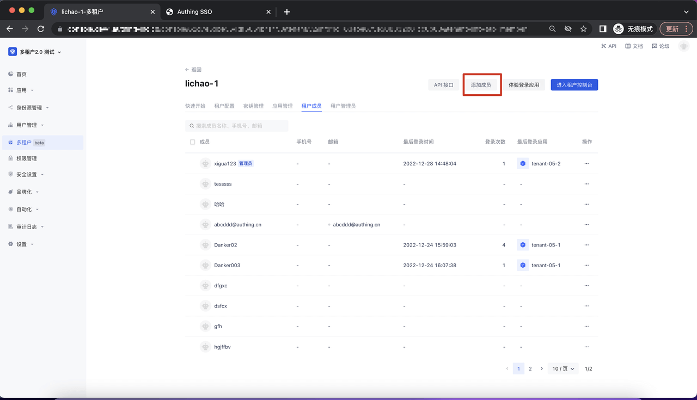
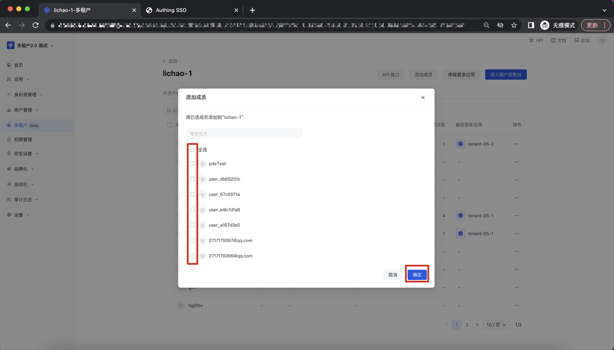
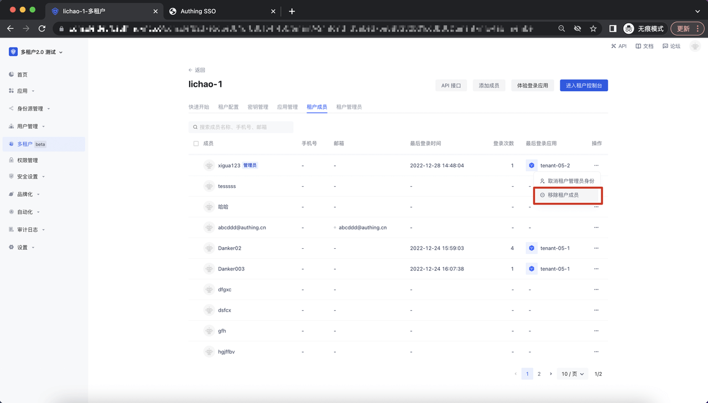
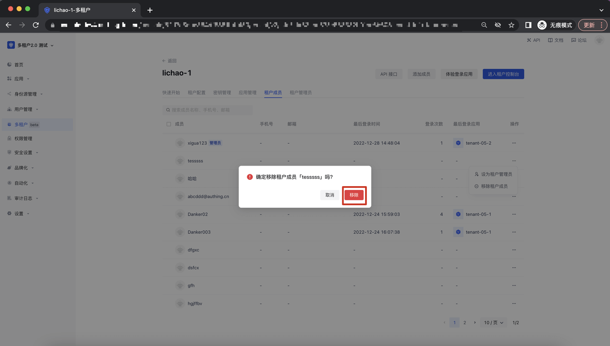
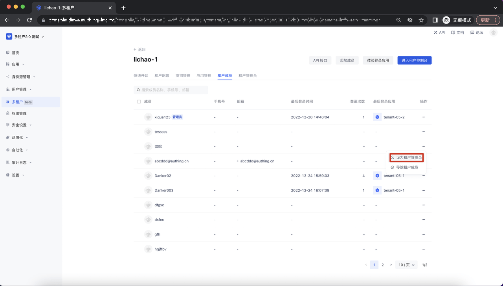
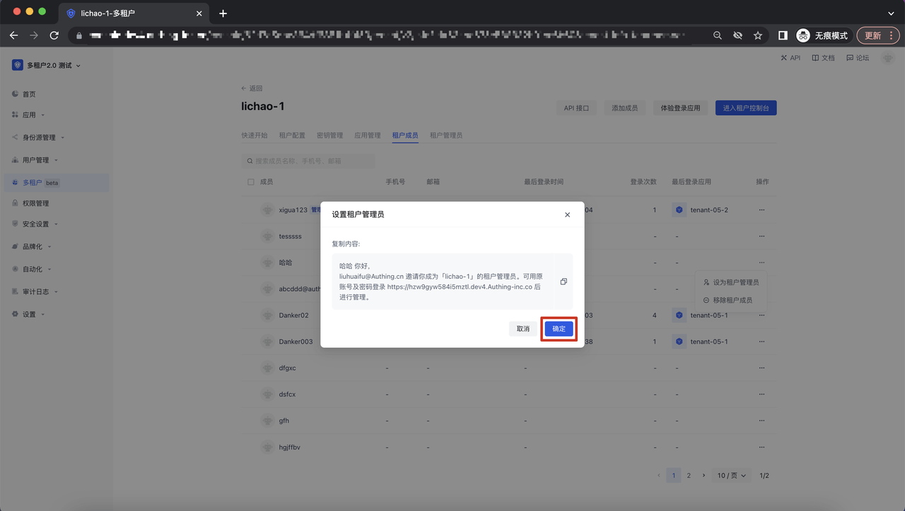
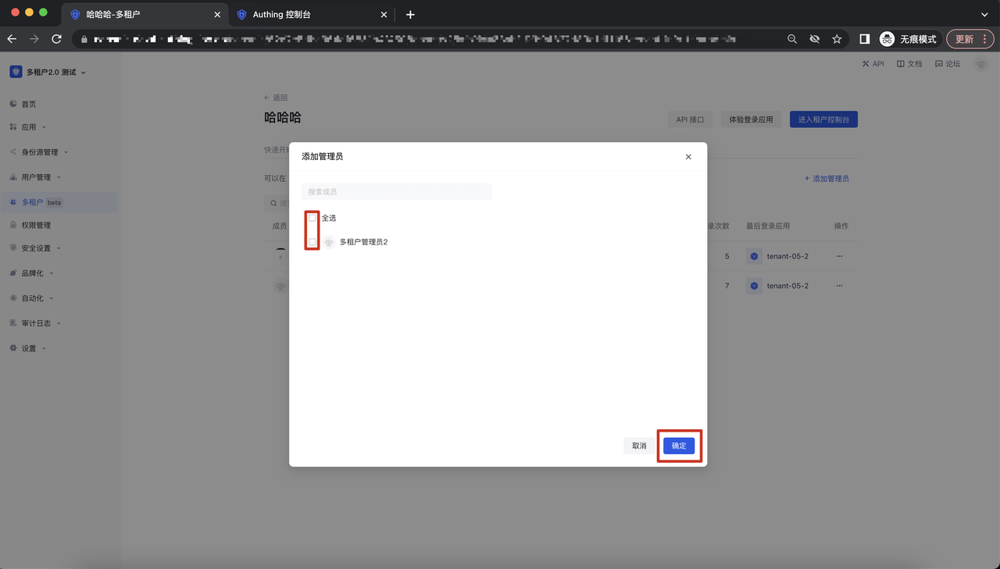
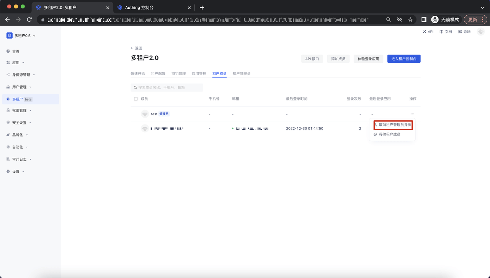
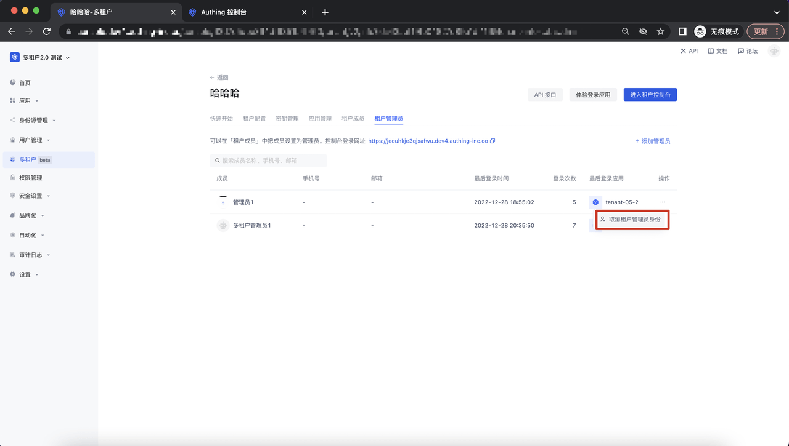
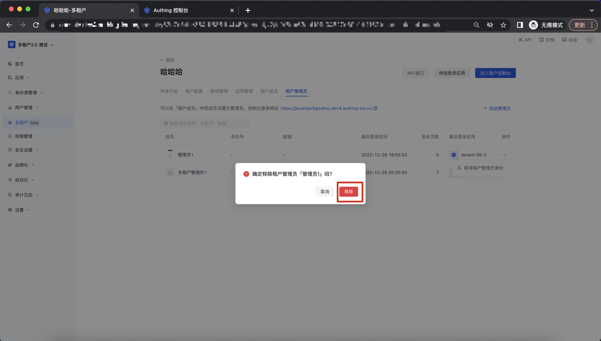

# 管理租户成员 & 管理员

<LastUpdated/>

## 添加租户成员

进入租户详情页面-租户成员Tab， 点击「添加成员」调起添加成员的弹窗：

勾选相关的用户，点击「确认」，该用户将添加为该租户成员；

## 移除租户成员

在租户详情页面-租户成员Tab，点击操作，点击「移除租户成员」button，调起移除租户成员的二次确认弹窗：

点击「移除」button，移除成功后，该用户将从该租户成员中移除；

## 设置租户管理员

在租户详情页面-租户成员Tab，点击操作，点击「设为租户管理员」button，调起设为租户成员的二次确认弹窗：

点击设为租户管理员，弹出二次确认弹窗，点击确定，即可将该租户成员设置为租户管理员：

## 添加租户管理员

在租户详情页-租户管理员 Tab，点击添加，拉起添加管理员弹窗，勾选相应的租户内用户，点击「确定」button ：

## 移除租户管理员

在租户详情页面-租户成员Tab，点击操作及「取消租户管理员身份」button，调起移除二次确认弹窗：

在租户详情页-租户管理员 Tab，点击操作及「取消租户管理员身份」button，调起移除二次确认弹窗：

点击「移除」button,即可移除相应的管理员；

