# 配置租户关联应用

## 关联应用

在租户详情页面，点击关联应用，之后调起关联应用弹窗：

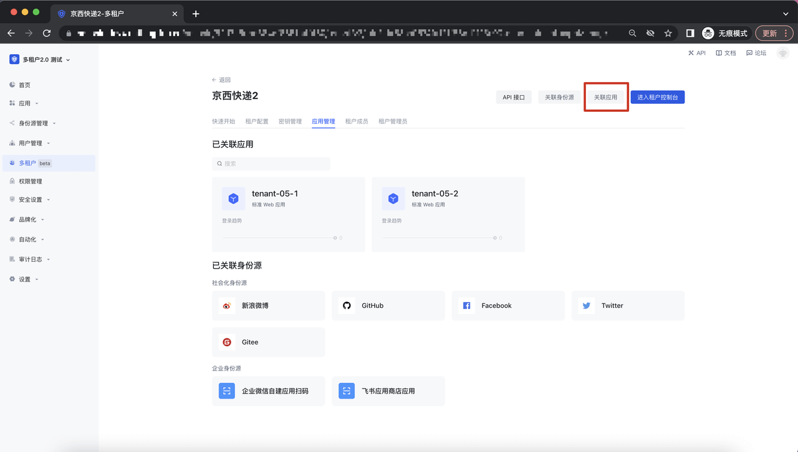

点击「添加」即可将该应用与租户进行关联；

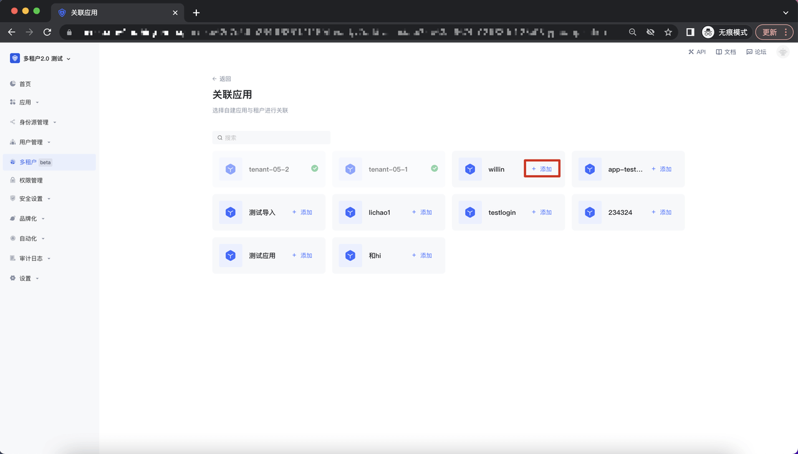

## 移除关联应用

点击应用卡片上的「移除」按钮，调起二次确认弹窗，即可取消该应用与租户的绑定关系：

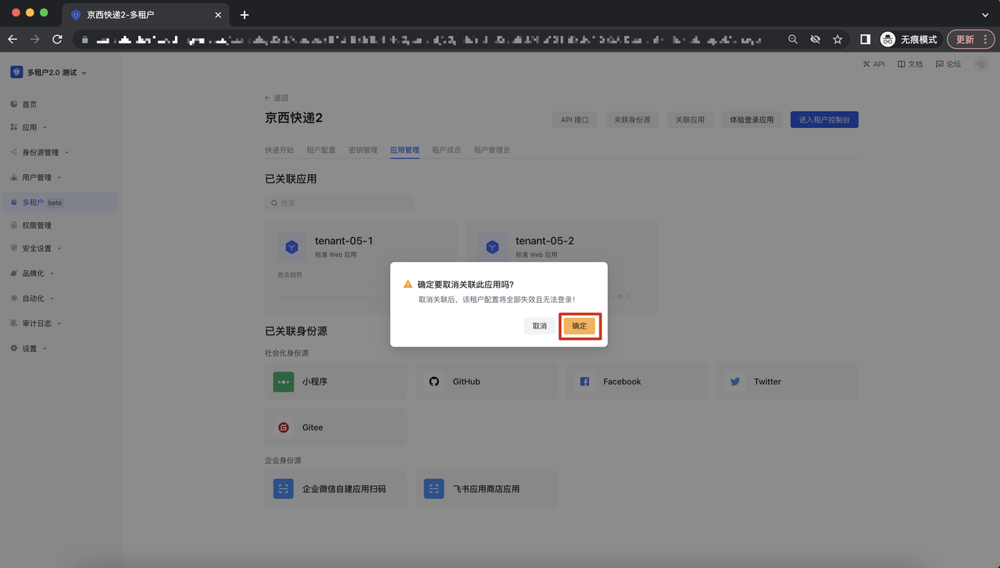

## 关联身份源

在租户详情页面，点击关联身份源，之后调起关联身份源弹窗：

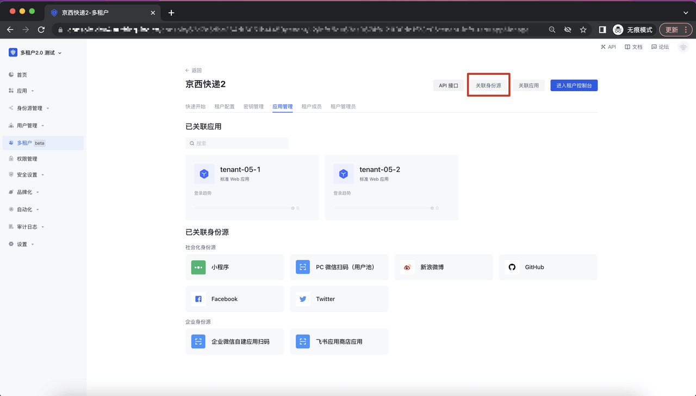

点击「添加」即可将该身份源与租户进行关联；

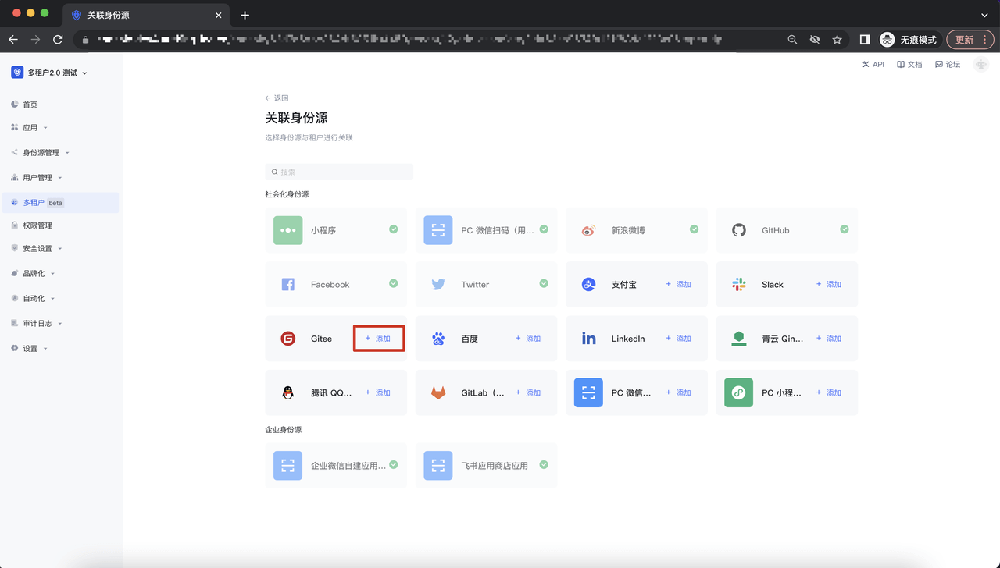

## 移除关联身份源

点击身份源卡片上的「移除」按钮，调起二次确认弹窗，即可取消该身份源与租户的绑定关系：

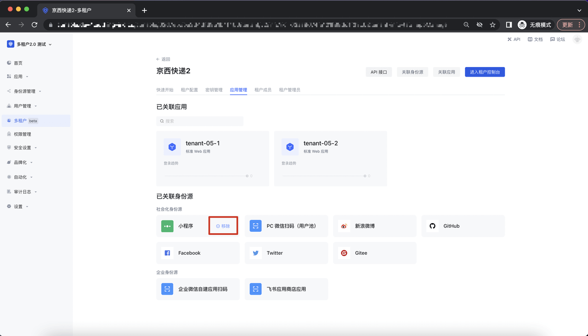

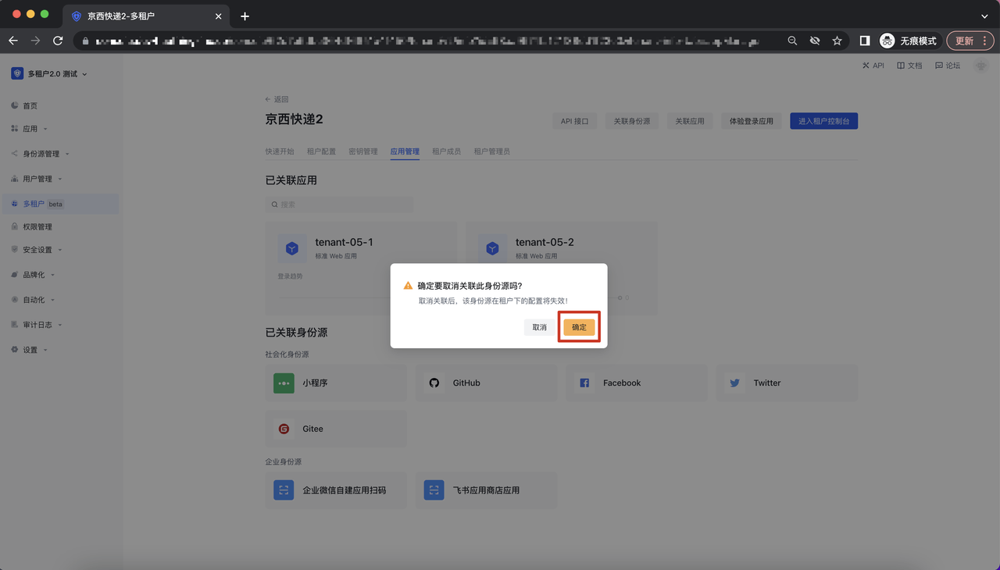

## 应用管理

点击应用卡片，进入应用详情页面：

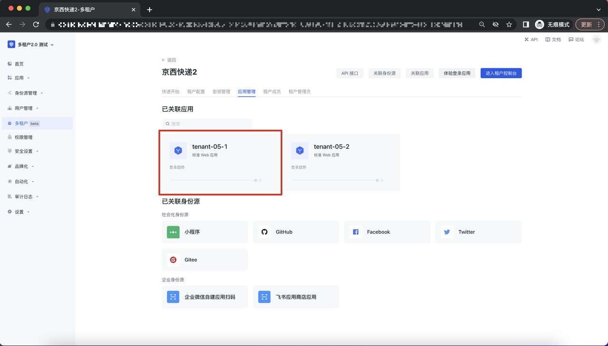

## 体验登录应用

点击应用详情页面的右上角的「体验登录」，进入到体验登录 Guard 界面：

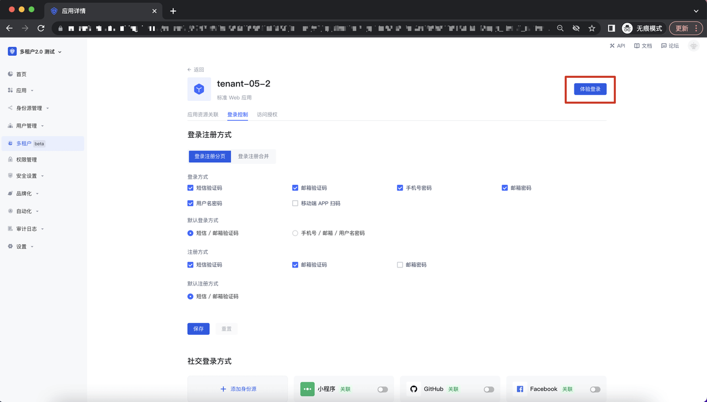

## 应用资源关联

可以将该应用下的资源关联给租户；关联成功后，在租户控制台，可以将相应的资源授权给租户下的成员、角色及组织机构：

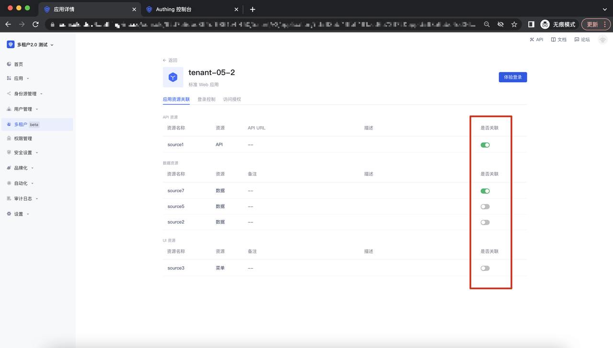

## 登录控制

可以在该页面进行应用在该租户下的 Guard 登录配置：

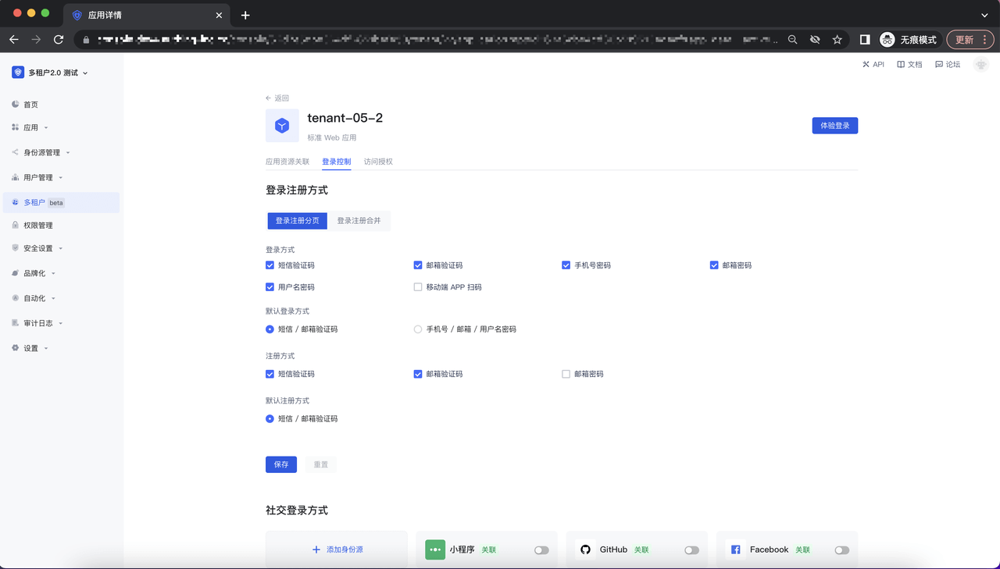

## 访问授权

可以在该页面对租户下的成员进行访问授权控制：

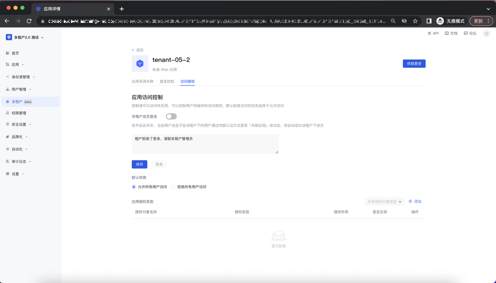
