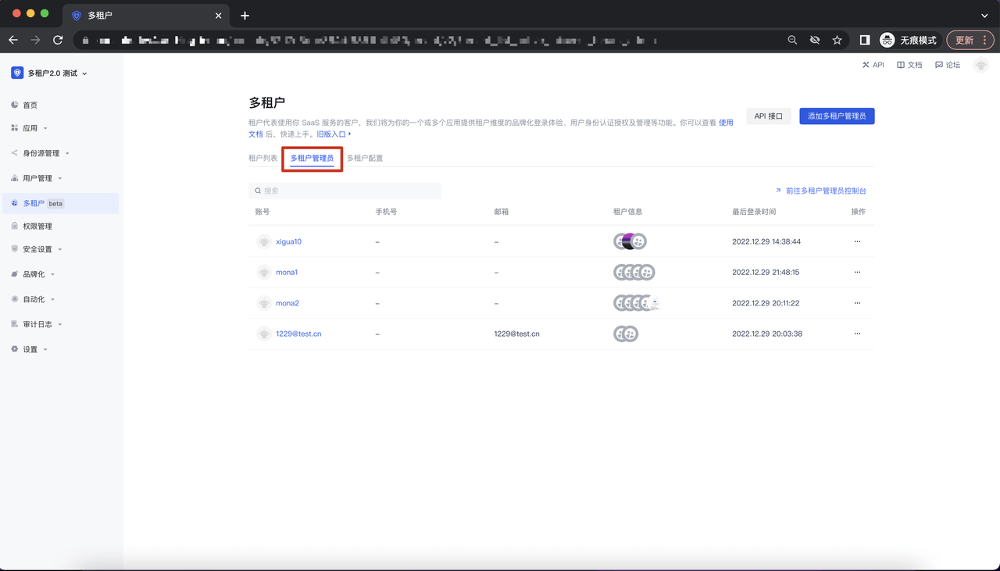
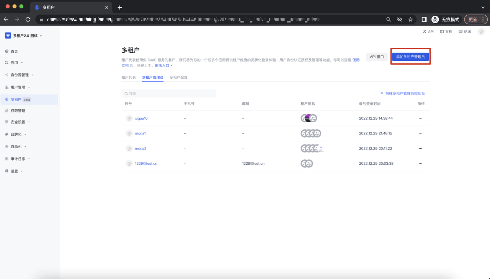
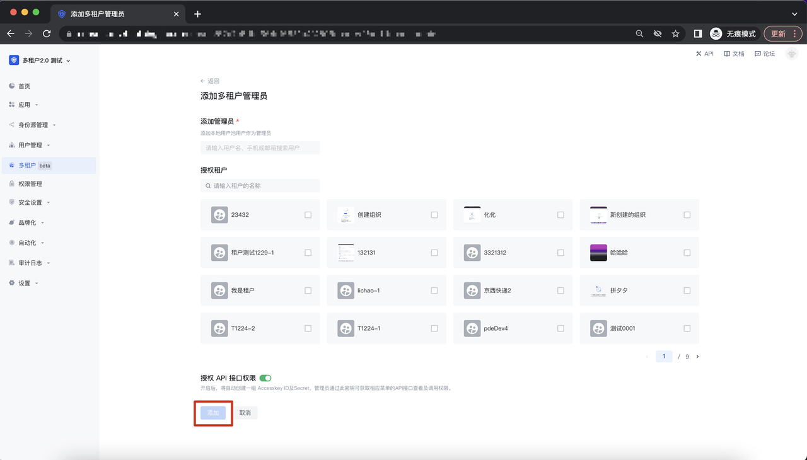
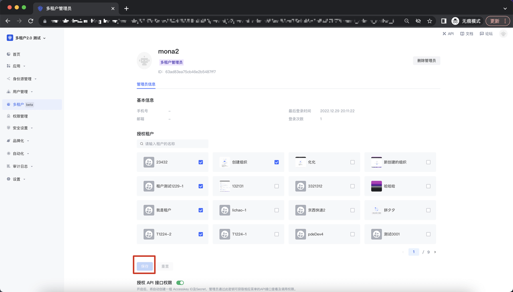
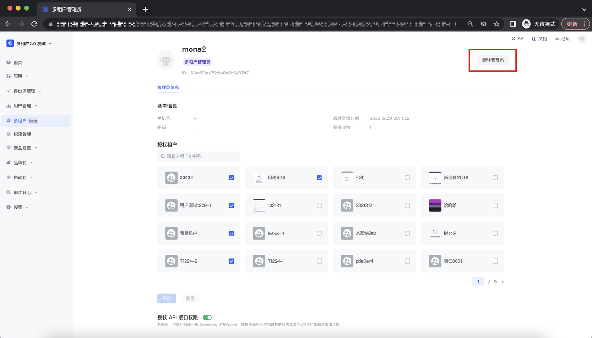
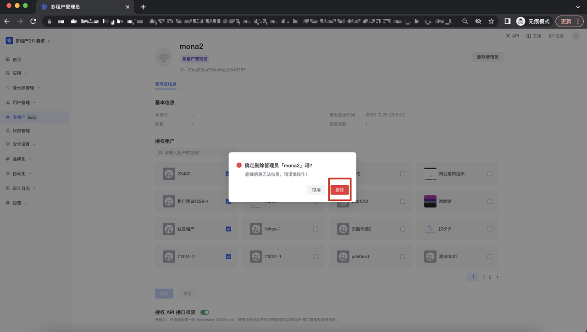
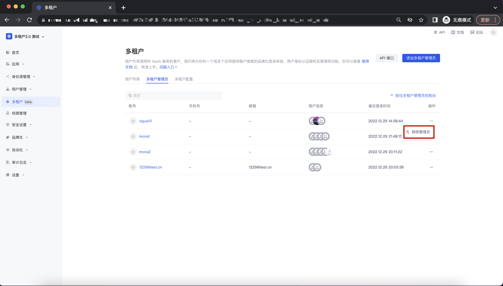
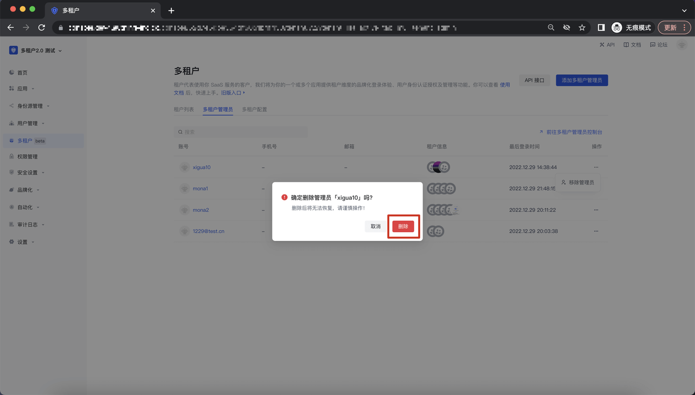

# 多租户管理员

<LastUpdated/>

## 多租户管理员列表

进入多租户模块，点击「多租户管理员」Tab，进入到多租户管理员列表：

## 添加多租户管理员

在多租户管理员列表页面右上角，点击「添加多租户管理员」，进入到添加多租户管理员页面：

在添加多租户管理员页面，添加相应的用户及授权相关的租户、API 接口权限给到该管理员，点击「添加」即可添加成功；

## 查看/编辑多租户管理员

添加完成后，进入到多租户管理员的编辑页面，可以对既有的租户及 API 接口授权进行修改，点击「保存」button 即可完成修改：

## 删除多租户管理员

### 路径 1 : 多租户管理员编辑页面

在租户管理员编辑页面，点击右上角的「删除管理员」button，调起删除的二次确认弹窗：

点击删除管理员 button，该管理员就会从多租户管理员 list 被删除；

### 路径 2 :多租户管理员 list

在多租户管理员 list ，点击操作及移除管理员 button ，调起「移除管理员」二次确认弹窗：

点击删除管理员 button，该管理员就会从多租户管理员 list 被删除；

