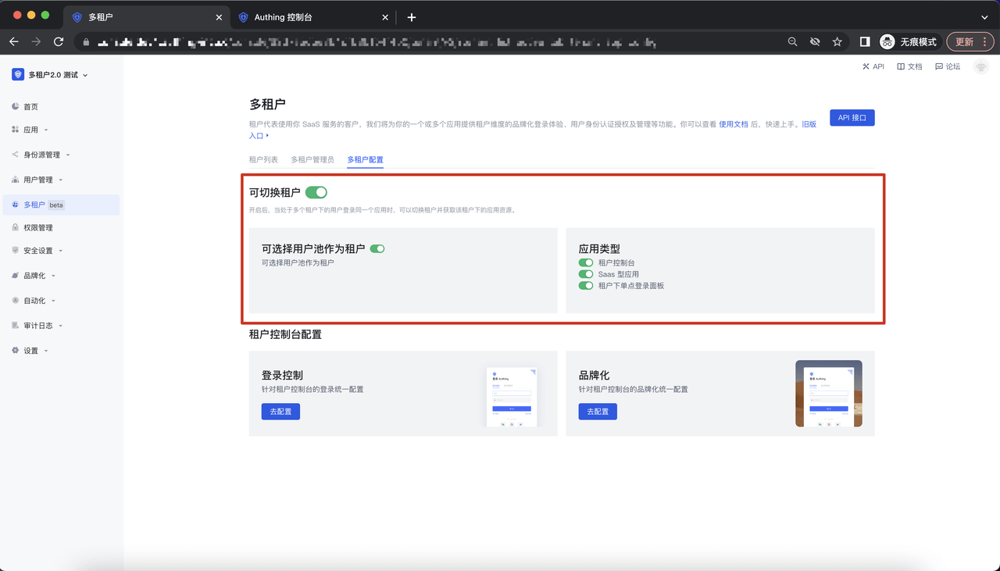
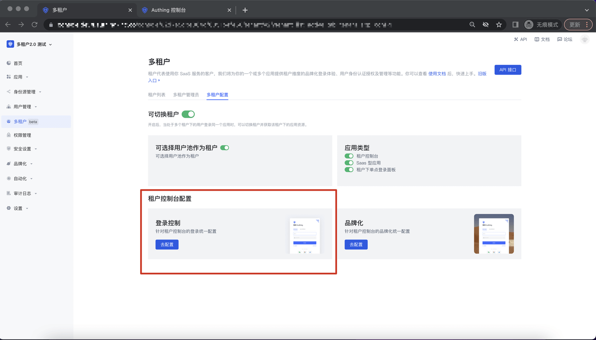
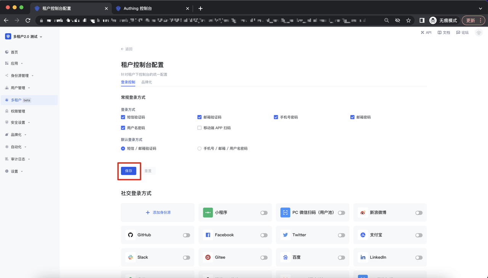
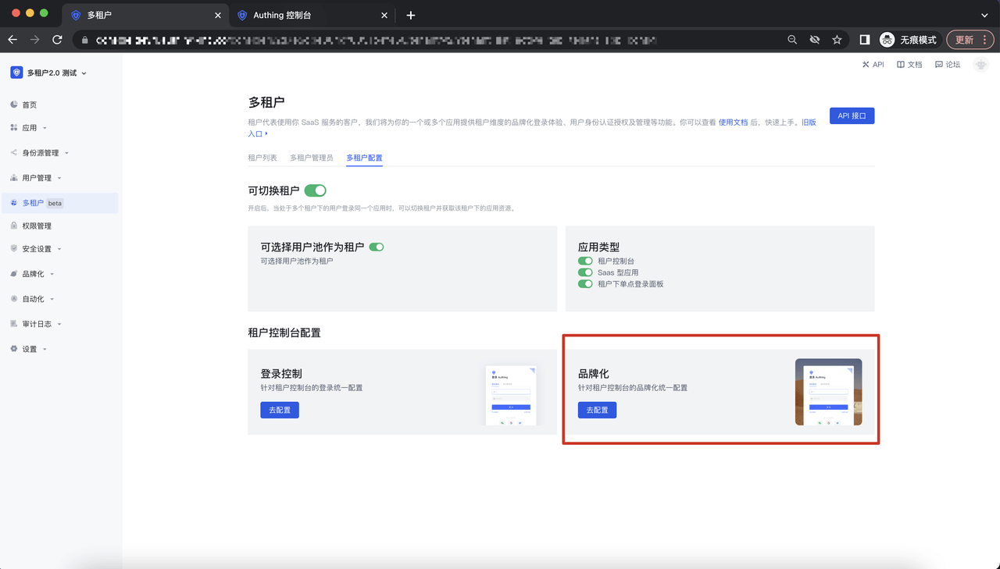

# 多租户配置

<LastUpdated/>

## Saas 应用切换租户

该功能为是否可切换租户的开关，当一个用户在多个租户下，通过配置租户控制台、 Saas 型应用、租户下单点登录面板是否可切换，来定义租户和租户之间的隔离性；

## 租户控制台配置

### 租户控制台登录配置

进入多租户配置 Tab，点击登录控制-去配置，进入到租户控制台配置-登录控制详情页面：

在该页面，可以进行常规登录及第三方身份源（社交登录、企业化登录）登录方式：

### 租户控制台品牌化

进入多租户配置 Tab，点击登录控制-品牌化，进入到租户控制台配置-品牌户详情页面：

在该页面，可以进行 Guard 整体样式、常规登录和扫码登录的配置，点击「保存配置」button 即可保存相关配置；

