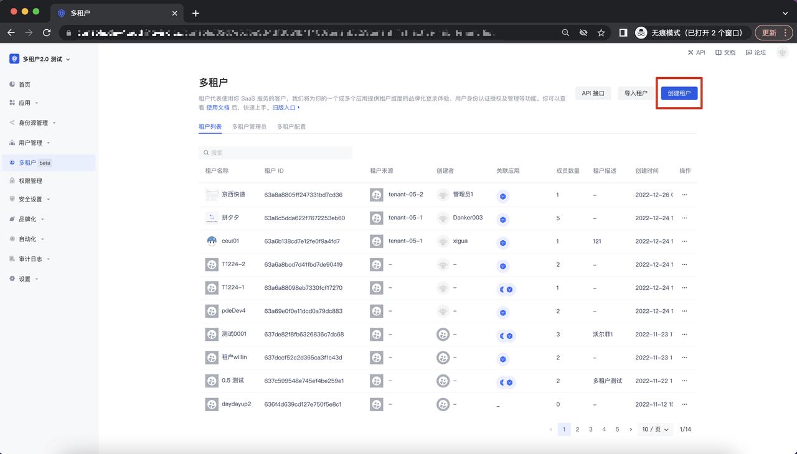
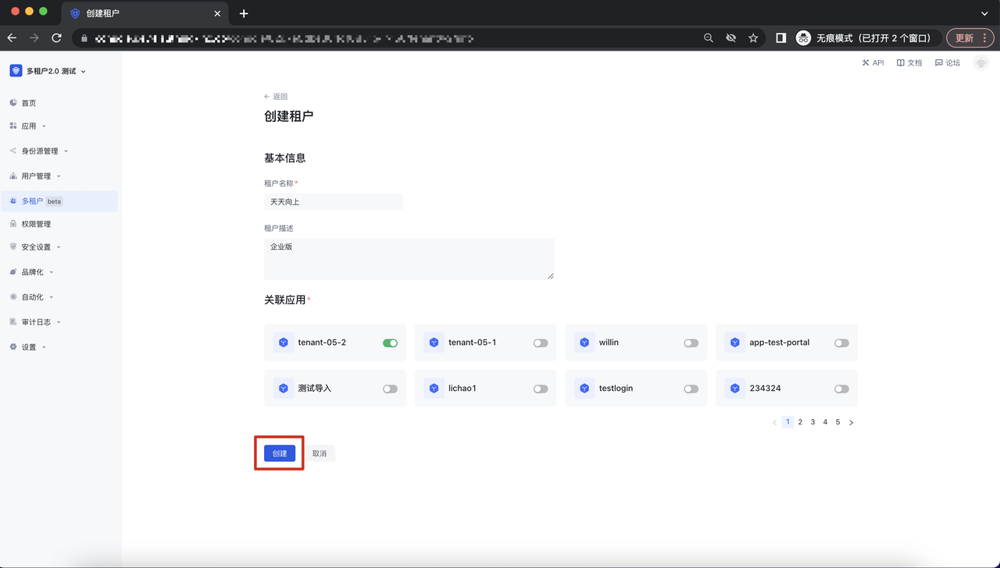
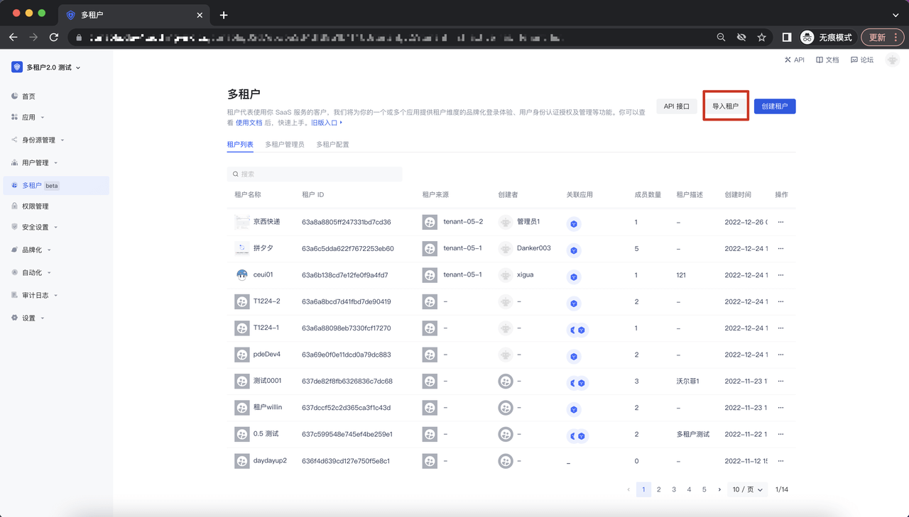
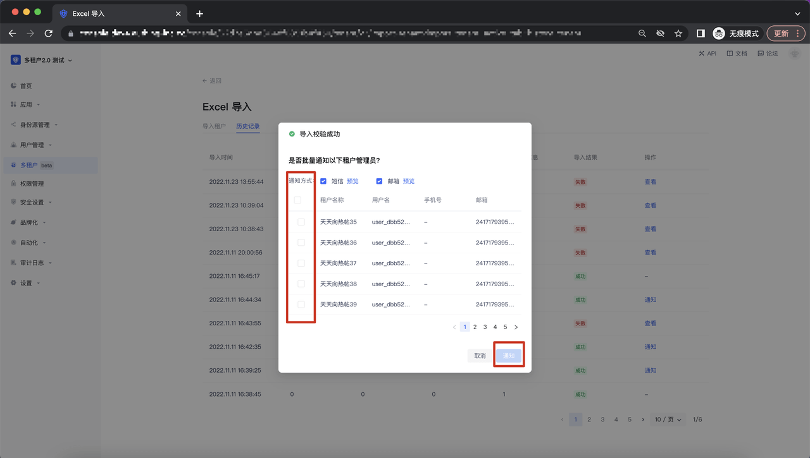
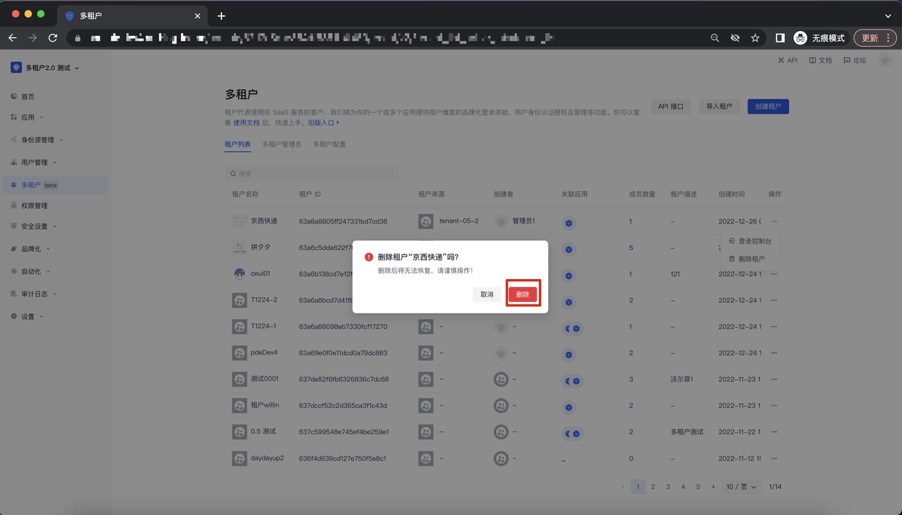
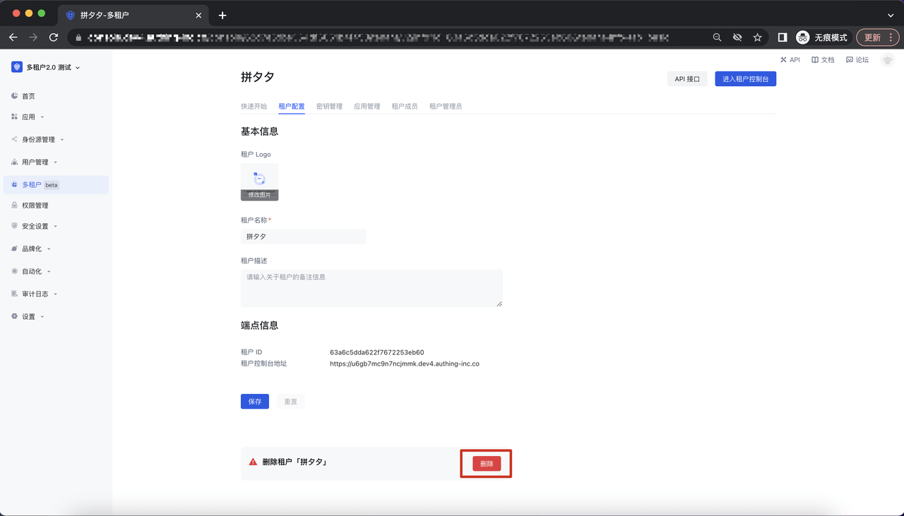
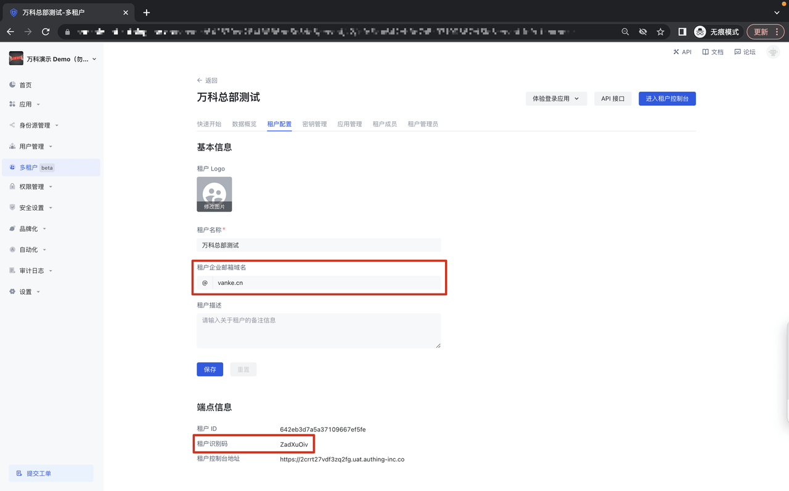
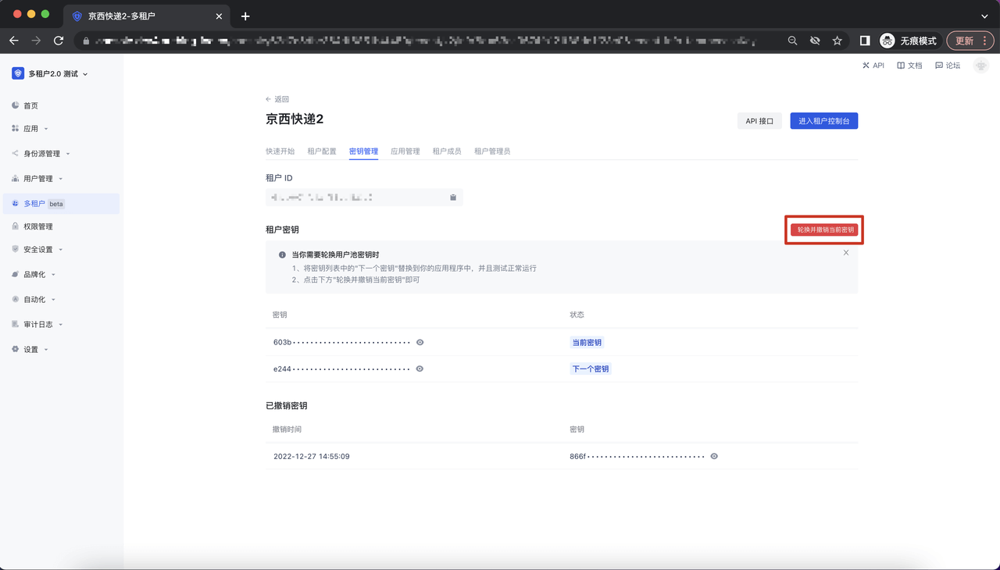
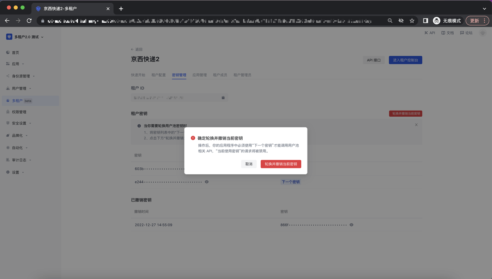

# 如何对租户进行增、删、改、查

## 创建/编辑租户

打开多租户模块，点击「创建租户」button：

在调起的创建租户弹窗内，填写租户名称及租户相关信息，点击创建：

创建完成后，进入租户列表，可以看到刚刚创建的这一个租户的基本信息，在这里可以对租户的基础信息进行配置：

## 批量导入租户

打开多租户模块，点击「导入租户」button；

进入导入租户页面，按照提供的导入模板进行导入；

导入成功后，进入历史记录页面，可以在此短信/邮件批量的通知租户管理员；

# 删除租户

删除租户有俩个入口，首先可以在租户列表点击更多，调起删除 button；

点击「删除租户」button，调起二次确认弹窗：

其次，在租户详情页面，租户配置这里，点击删除 button：

# 配置租户基础信息

在租户详情页面，租户配置 Tab 页面，可以对租户的 Logo、租户名称、租户描述进行编辑，编辑完成后点击保存：

# 如何查看及使用租户密钥

在租户详情页面，点击密钥管理 Tab，可以查看到相关的租户密钥信息，点击密钥轮换，则可以生成新的密钥：

