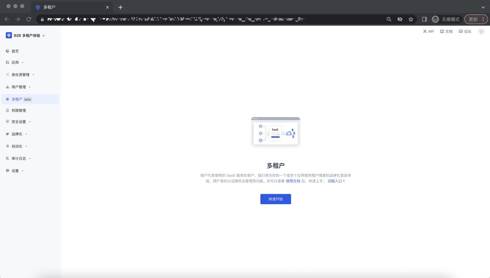
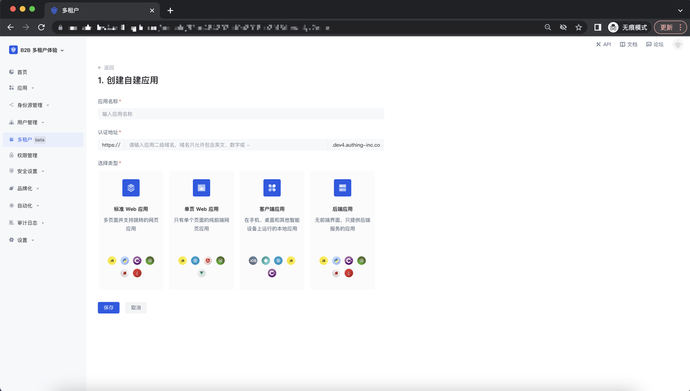
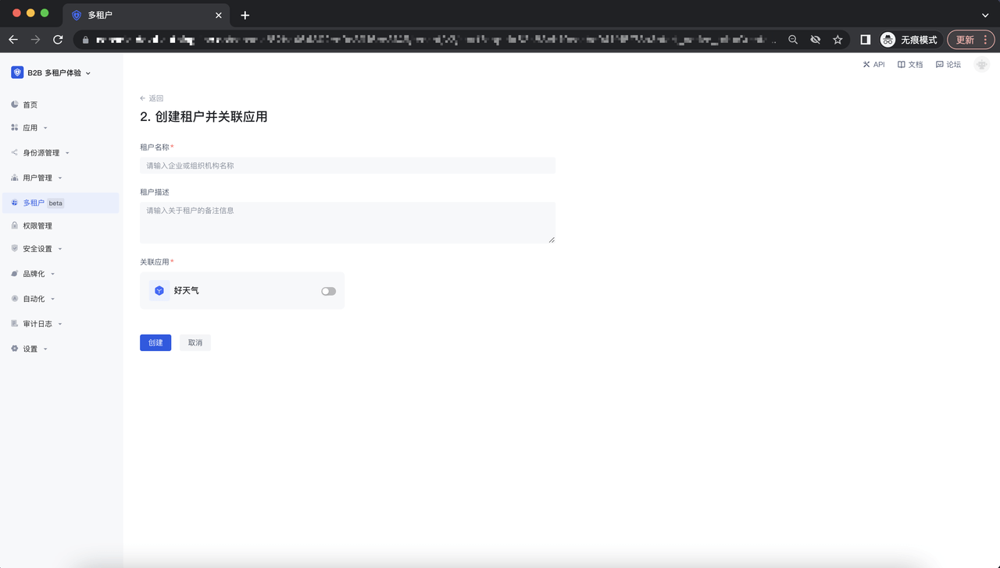
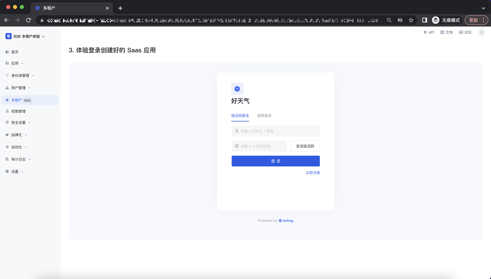
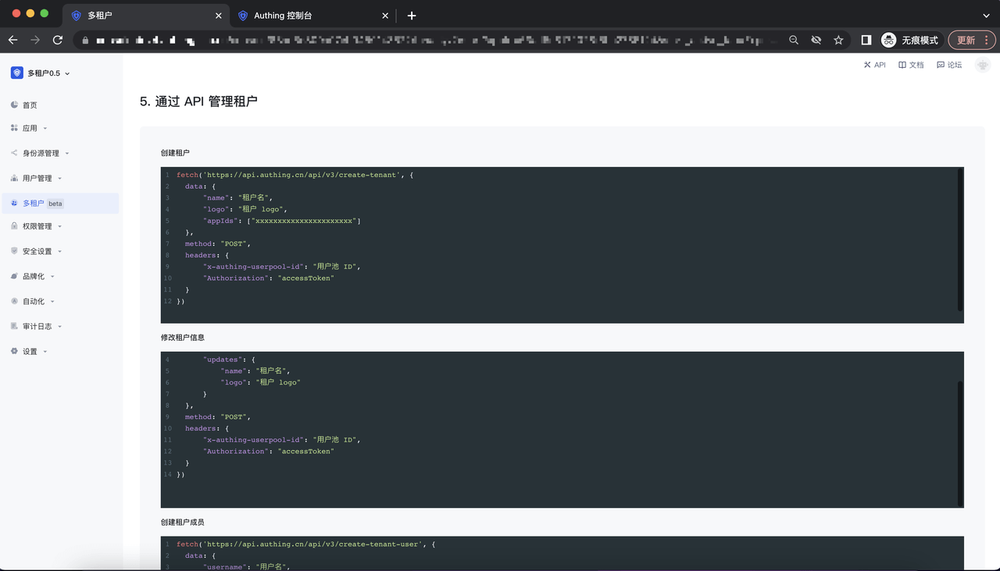
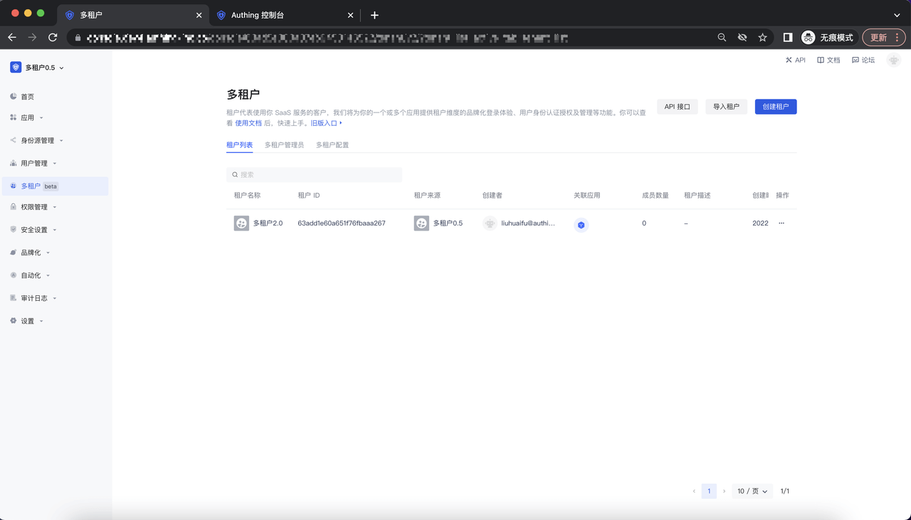

# 快速开始

<LastUpdated/>

首先进入 Authing 控制台， 在控制台菜单栏点击 「多租户」模块，进入到多租户默认页面，点击「快速开始」button；

## Step 1: 创建一个自建应用

## Step 2: 创建一个租户

## Step 3: 体验登录创建好的 Saas 应用

## Step 4: 登录成功并集成 Saas 应用

## Step 5: 通过 API 管理租户

点击「开始多租户之旅」button，进入多租户 list 页面：

