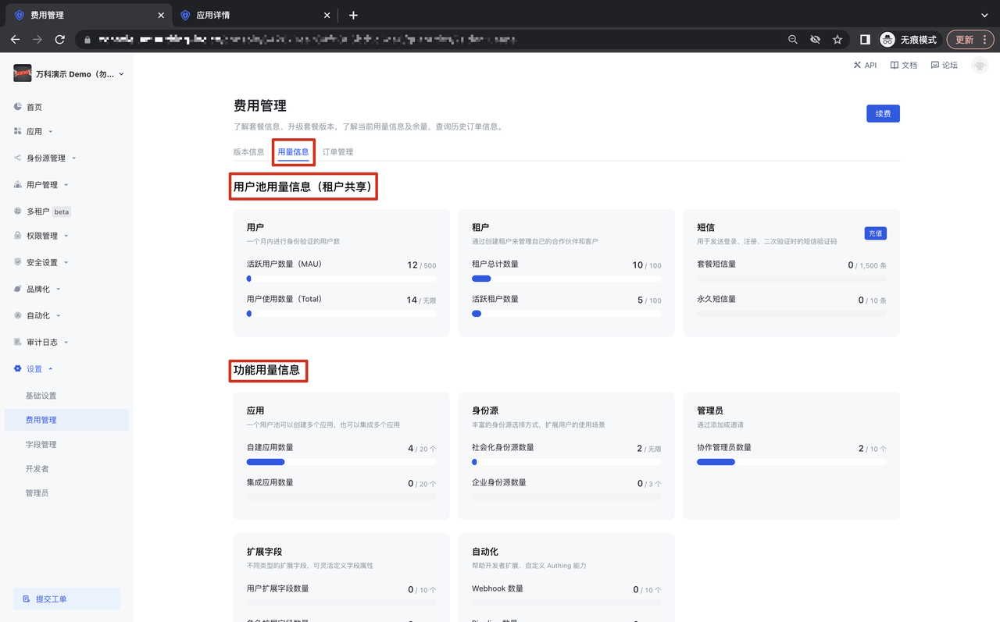
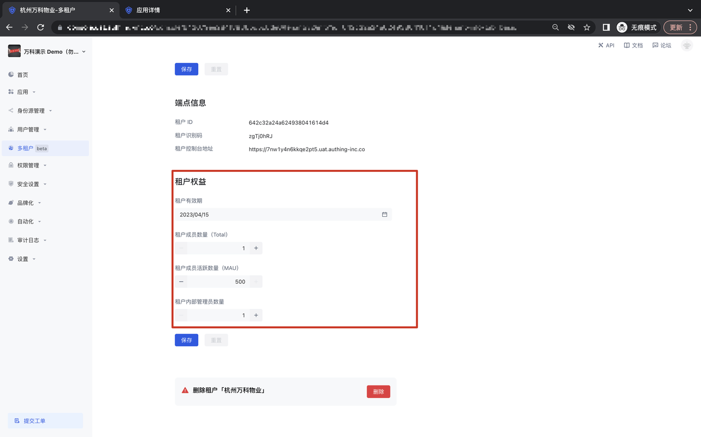

# 用户池计量/租户权益设置

<LastUpdated/>

## B2B 用户池计量计费
在设置-费用管理-用量信息模块，可以看到该用户池版本的用户池用量信息及功能用量信息，其中用户池用量信息与租户进行共享，功能用户量信息进行用户池级别的单独计量；

## 租户权益设置
打开「多租户模块」-「租户列表」 Tab，进入某个租户详情页面，在「租户权益」模块，可以对租户的有效期、租户成员数量、租户成员活跃数量、租户内部管理员数量进行限制；

