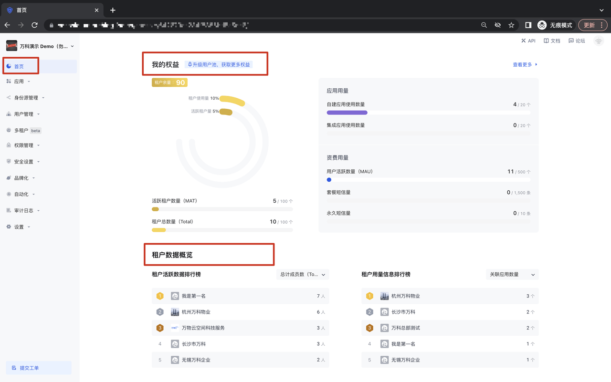
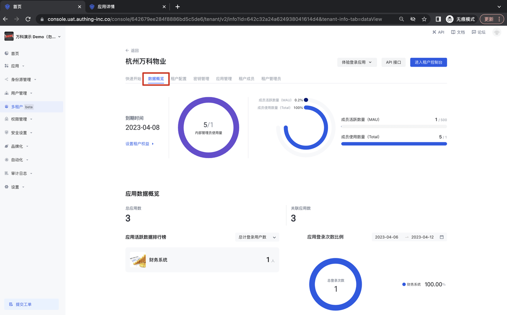
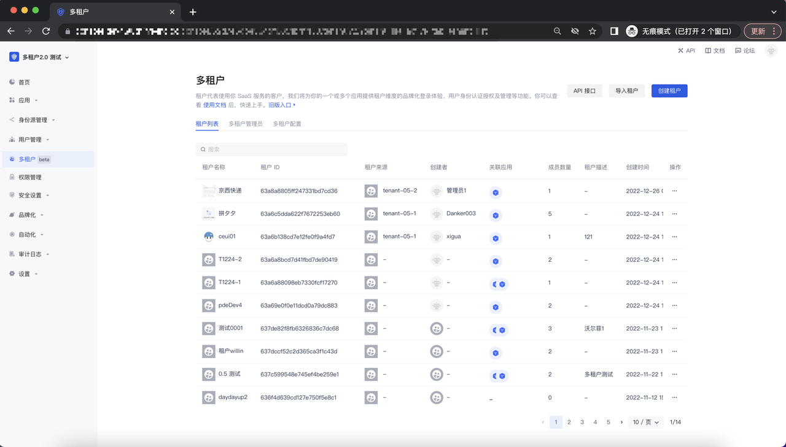
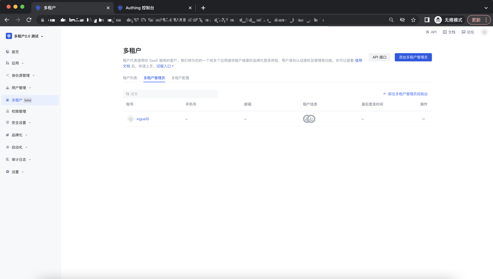
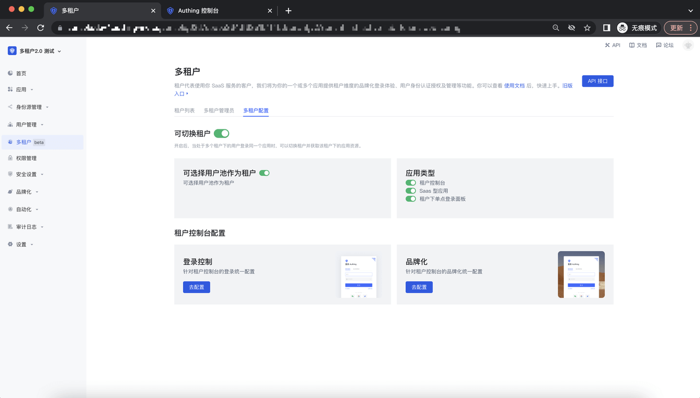

# 租户管理

<LastUpdated/>

## 数据概览
在 Authing 2B 用户池场景下，我们提供了租户管理视角的数据概览，在这里，你可以看到所有租户的应用和用户活跃数据；与此同时，也可以看到租户的用量信息使用情况，方便更好的监控及管理租户；

在某个租户详情页面，点击数据概览，可以看到专属于这个租户的使用数据详情：

## 租户列表

租户列表旨在帮助客户管理相关的租户，通过获取租户的头像、名称、ID 及租户的其它情况，帮助多租户超级管理员及多租户管理员更快捷的管理租户；

相关操作说明：[如何创建/批量导入/删除租户](https://docs.authing.cn/v2/multi-tenant-console/operation-tenant.html)

## 多租户管理员

该列表展示了所有的多租户管理员，我们目前支持将用户池内的用户设置为多租户管理员，多租户管理员拥有一个或多个租户的全部读、写权限；

相关操作说明：[多租户管理员](https://docs.authing.cn/v2/multi-tenant-console/association-apps.html)

## 多租户配置

多租户配置主要为客户提供了定义多租户模型的相关能力。客户根据自己的业务，可定义租户间的隔离性，与此同时，可以选择对租户控制台进行统一的登录及品牌化配置；

相关操作说明：[多租户配置](https://docs.authing.cn/v2/multi-tenant-console/admin-management.html)