# 用户故事

<LastUpdated/>

## 开发一个提供天气资源服务的多租户应用

我叫黎开发，我所在的公司是一个给快递物流及外卖公司提供天气资源应用 Sass 服务的平台：「好天气」。目前我们签约了京西快递、美丽团、有点饿等受天气状况影响较为深的业务场景的企业。通过 Web 端应用，帮助他们提供天气预测、天气资源等资讯服务。

我们在多租户及租户管理方面，缺乏相应的基础设施支持，所以公司希望采购一个提供多租户能力的 Saas 服务平台，帮助我们搭建多租户能力及稳定的将应用下资源授权给不同的企业及他们的员工使用。

接下来，我们即将模拟在一个提供天气资源应用的 Saas 服务平台多租户模型中，涉及到的用户如何在各自的角色中，完成自己的多租户旅程。

**以上场景中的参与者**

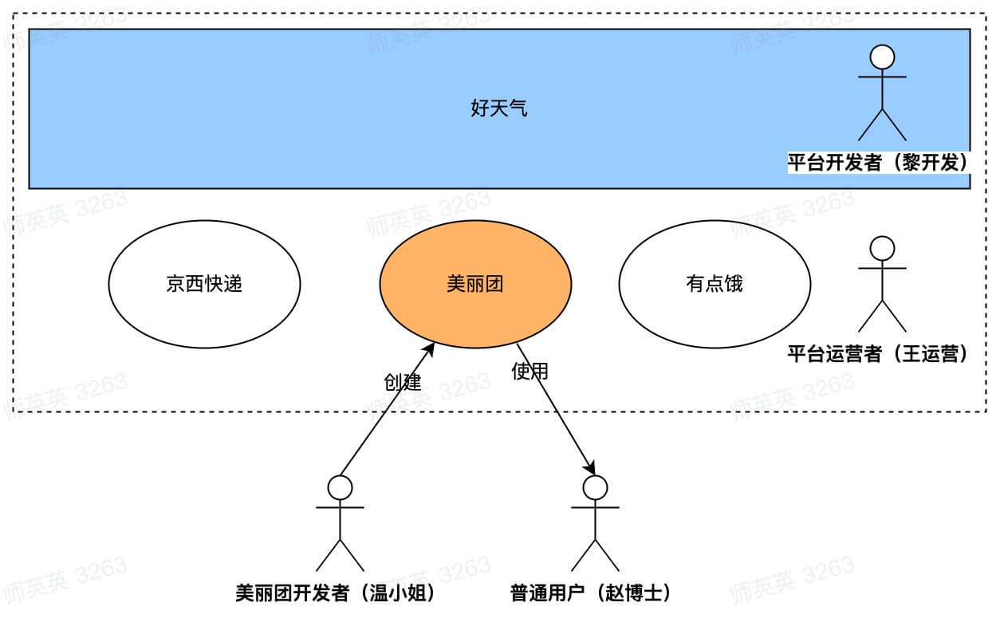

- **好天气平台开发者（黎开发）**：负责通过 Authing 控制台及 API 接口接入多租户及提供应用资源给到相关的客户；
- **好天气平台多租户管理员（王运营）**：负责管理京西快递、美丽团、有点饿等租户；
- **美丽团开发者（温小姐）**：负责采购天气资源服务且作为超级管理员，创建美丽团租户及管理相应的资源；
- **美丽团普通用户（赵博士）**：在美丽团，负责每天登录天气资源服务的应用，根据天气预测，决定外卖员的派送费调整策略；

**用户旅程中的步骤**

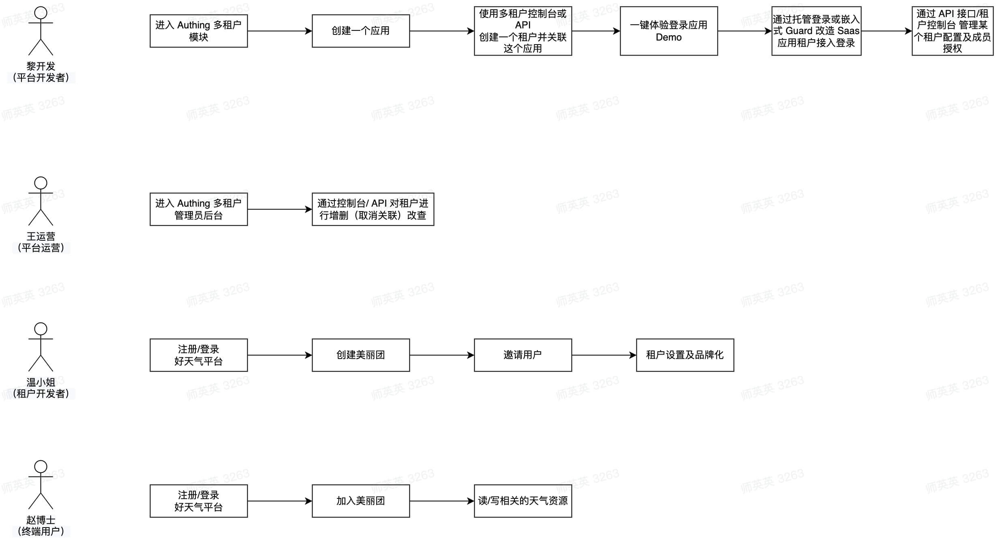

## 好天气平台开发者（黎开发）的用户旅程

### 1. 新建应用「好天气」

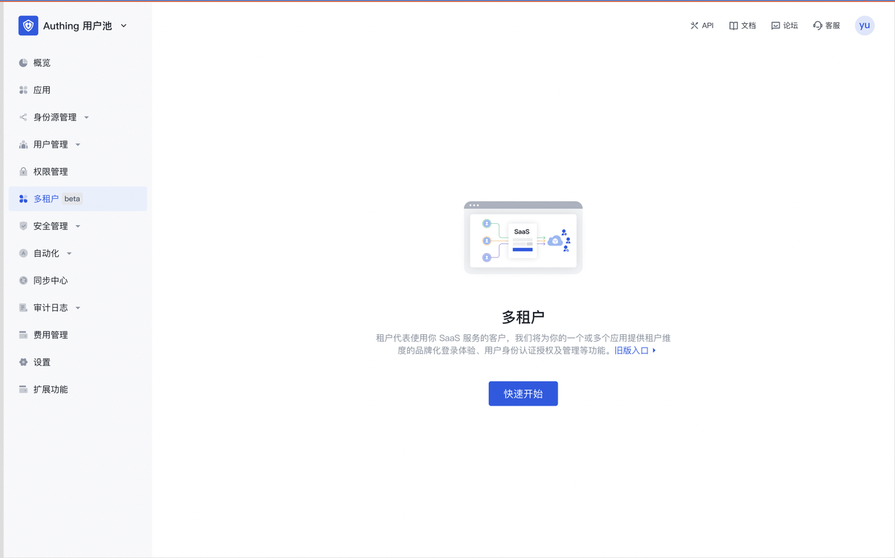

为了接入 Authing，黎开发需要在 Authing 创建一个自建应用，名字就为好天气，它代表的就是好天气这个 SaaS 应用。

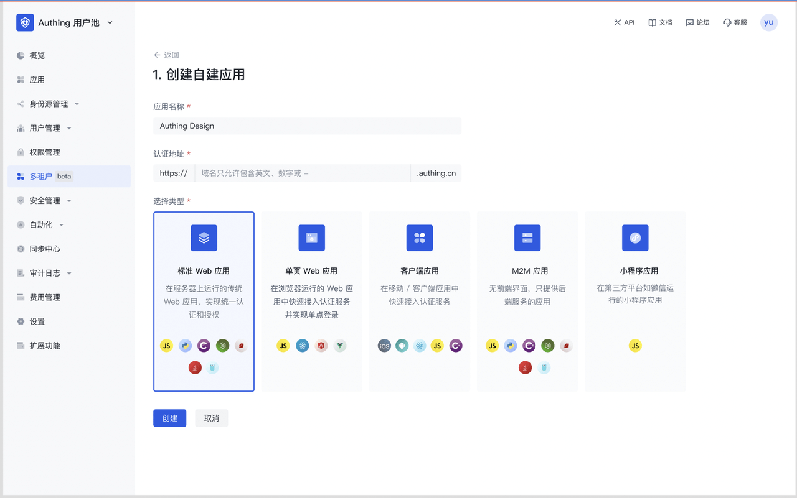

### 2. 新建租户-同时关联应用

为了体验 Authing 的多租户功能，黎开发尝试创建一个**租户**，将其关联到好天气这个应用，这个租户就代表了好天气中的某一个租户。进入**多租户**菜单，点击「创建租户」，进入创建租户页面。输入**租户名称、描述**，**关联应用**选择**好天气**，点击「创建」即可完成创建。

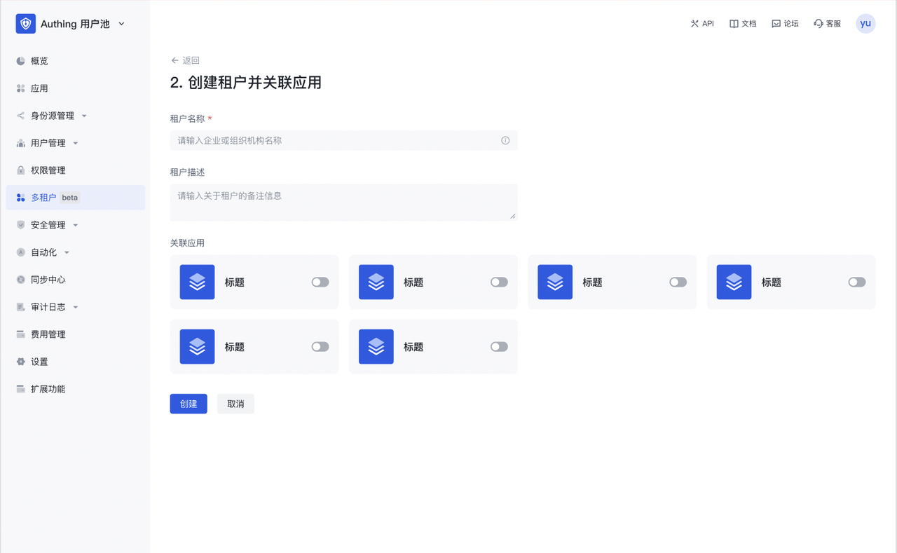

黎开发还看到了如下提示：如果你想使用 API 创建租户，可以调用如下 API：

```JavaScript
fetch('https://api.authing.cn/api/v3/create-tenant', {
    data: {
        "name": "租户 A",
        "logo": "租户 logo",
        "appIds": ["xxxxxxxxxxxxxxxxxxxxxx"]
    },
    method: "POST",
    headers: {
        "x-authing-userpool-id": "用户池 ID",
        "Authorization": "accessToken"
    }
})
```

### 3. 体验登录 Authing 示例 SaaS 应用

然后黎开发开始体验登录，会跳转至租户登录页，可以看到带有应用信息和租户信息的登录页：


### 4. 登录成功并集成 SaaS 应用

输入账号密码，即可登录到 Authing 提供的示例 SaaS 应用：

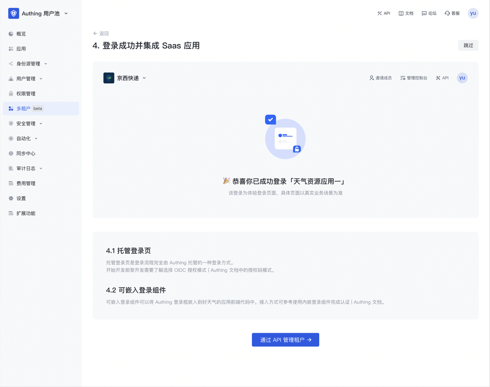

在上一步中黎开发体验登录了 Authing 提供的示例 SaaS 应用，现在黎开发应该将租户的登录接入到好天气系统中。Authing 提供了两种方式用于接入登录，区别可参考：[托管登录页 vs 可嵌入登录组件](https://docs.authing.cn/v2/concepts/embeded-vs-hosted.html)

#### 4.1 托管登录页
托管登录页是登录流程完全由 Authing 托管的一种登录方式。
开始开发前黎开发需要了解[选择 OIDC 授权模式 | Authing 文档](https://docs.authing.cn/v2/concepts/oidc/choose-flow.html)中的授权码模式。

然后需要修改应用的**登录回调 URL**：

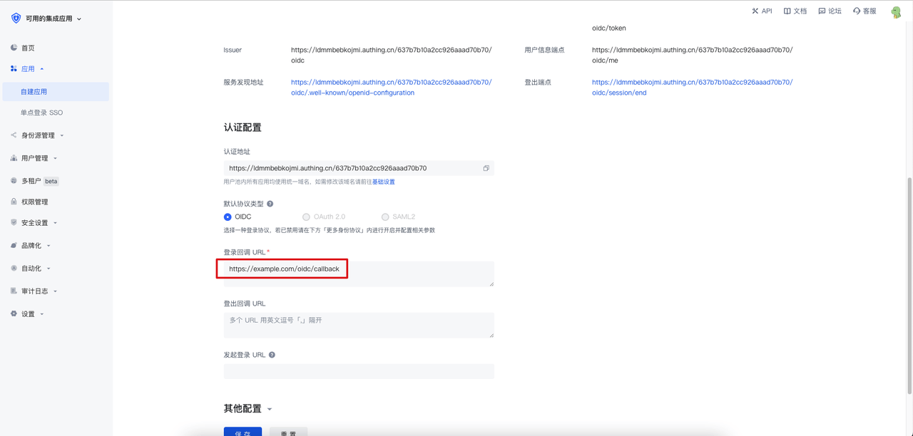

此 URL 表示好天气接收 OIDC code 的地址。

当好天气的用户需要登录时，黎开发应该调用 Authing 提供的 [标准协议认证模块 | Authing 文档](https://docs.authing.cn/v2/reference/sdk-for-node/authentication/StandardProtocol.html#%E7%94%9F%E6%88%90-oidc-%E5%8D%8F%E8%AE%AE%E7%9A%84%E7%94%A8%E6%88%B7%E7%99%BB%E5%BD%95%E9%93%BE%E6%8E%A5) SDK 构建一个登录链接，并将用户重定向到此链接。

```JavaScript
import { AuthenticationClient } from 'authing-js-sdk';

// 初始化 Authing SDK
const authenticationClient = new AuthenticationClient({
  appId: 'AUTHING_APP_ID',
  appSecret: 'AUTHING_APP_SECRET',
  appHost: 'https://{YOUR_DOMAIN}.authing.cn',
  protocol: 'oidc',
  tenantId: 'YOUR_TENANT_ID'
});

// 生成 URL
const url = authenticationClient.buildAuthorizeUrl({
    scope: 'openid email username profile',
    state: 'xxxxx',
    responseType: 'code',
    redirectUri: 'https://example.com/oidc/callback'
})

// 重定向
res.redirect(url)
```

其中 `AUTHING_APP_ID`、`AUTHING_APP_SECRET`、`AUTHING_APP_DOMAIN` 分别在如下位置获取：

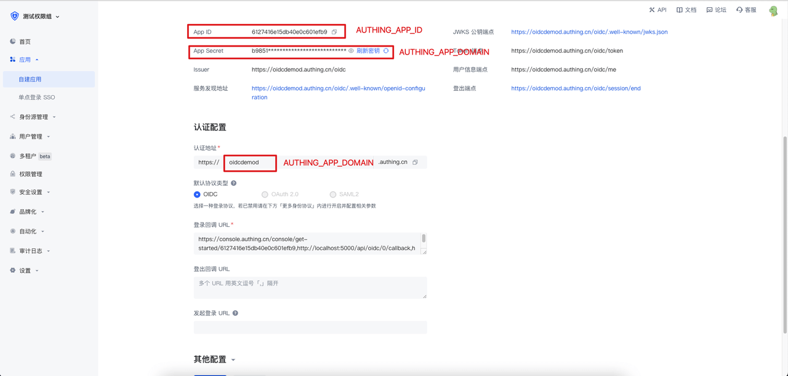

`tenantId` 是你的租户 ID，获取方式如下：

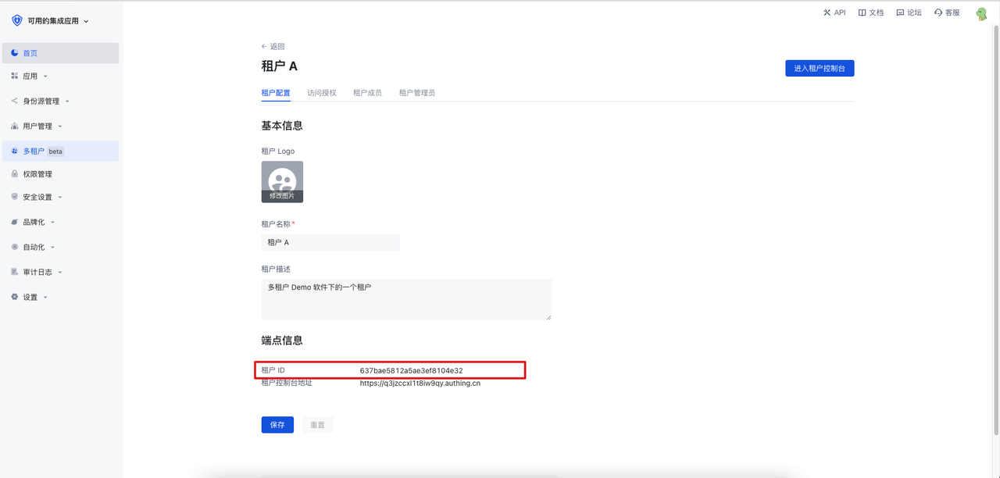

若不知道用户希望登录哪个租户，`tenantId` 可以为空，Authing 登录页在用户输入完账密校验通过后，会让用户自主选择需要登录的租户。

在 Authing 侧认证完成后，浏览器会重定向到你的登录回调 URL，并携带 **code** 参数，然后黎开发需要调用 SDK 获取 token，然后获取用户信息，如果发起登录时传入了 `tenantId` 参数或者用户选择了租户，获取到的用户信息中会包含 `tenantId` 字段，否则不会包含：

```JavaScript
// code 换 token
const token = await authenticationClient.getAccessTokenByCode(code)

// token 换用户信息
const userInfo = await authenticationClient.getUserInfoByAccessToken(token)

// 用户信息示例
// {
//   "address": {
//     "country": null,
//     "postal_code": null,
//     "region": null,
//     "formatted": null
//   },
//   "birthdate": null,
//   "family_name": null,
//   "gender": "U",
//   "given_name": null,
//   "locale": null,
//   "middle_name": null,
//   "name": null,
//   "nickname": null,
//   "picture": "https://files.authing.co/authing-console/default-user-avatar.png",
//   "preferred_username": null,
//   "profile": null,
//   "updated_at": "2021-03-03T06:17:14.485Z",
//   "website": null,
//   "zoneinfo": null,
//   "email": "test1@authing.cn",
//   "email_verified": false,
//   "sub": "603f184cec4505e2868431fc", // subject 的缩写，为用户 ID
//   "phone_number": null,
//   "phone_number_verified": false,
//   "tenant_id": "xxxxxxxxxxxxxxx"
// }

```

此时好天气系统已经获取到了用户信息，黎开发应该把登录态保存到 session 中，用于后续的业务逻辑。

#### 4.2 可嵌入登录组件

可嵌入登录组件可以将 Authing 登录框嵌入到好天气的应用前端代码中。接入方式可参考[使用内嵌登录组件完成认证 | Authing 文档](https://docs.authing.cn/v2/guides/basics/authenticate-first-user/use-embeded-login-component/)。

```JavaScript
// App.tsx
import { GuardProvider } from "@authing/guard-react";
import "@authing/guard-react/dist/esm/guard.min.css";

import React from "react";

// 你的业务代码根组件
import RouterComponent from "./router";

function App() {
  return (
    <GuardProvider
      appId="AUTHING_APP_ID"
      tenantId="xxxxxxxxxxxxx"
    >
      <RouterComponent></RouterComponent>
    </GuardProvider>
  );
}

```

```JavaScript
import { useGuard, User } from "@authing/guard-react";
import React, { useEffect } from "react";

export default function Login() {
  // 获取 Guard 实例
  const guard = useGuard();

  useEffect(() => {
    // 使用 start 方法挂载 Guard 组件到你指定的 DOM 节点，登录成功后返回 userInfo
    guard.start("#authing-guard-container").then((userInfo: User) => {
      console.log("userInfo: ", userInfo);
    });
  }, []);

  return (
    <div>
      <div id="authing-guard-container"></div>
    </div>
  );
}

```

在组件接受的参数列表中，`tenantId` 参数表示用户希望登录的租户，若未传入此参数，Authing 登录框在认证后也会展示用户所在租户列表供用户选择，登录完成后会返回用户信息，用户信息中会带有 `tenantId` 参数，表示用户登录的租户，获取用户信息后，黎开发可以用于后续的业务开发。

### 5. 通过 API 管理租户
登录接入完成后，黎开发为了让好天气的租户管理员能够在好天气的界面中管理他们的租户，他决定接入 Authing 的管理侧 API。黎开发需要先在 Authing 控制台获取用户池 ID 和秘钥。

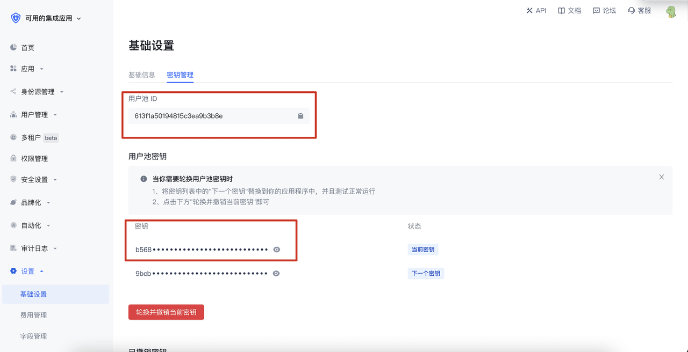

然后获取 **accessToken**：

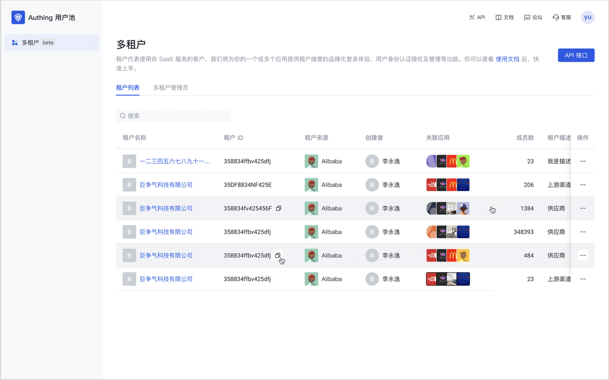

然后使用 **accessToken** 请求租户管理接口。以下以租户、租户成员的简单管理为例：

**创建租户**
```JavaScript
fetch('https://api.authing.cn/api/v3/create-tenant', {
    data: {
        "name": "租户名",
        "logo": "租户 logo",
        "appIds": ["xxxxxxxxxxxxxxxxxxxxxx"]
    },
    method: "POST",
    headers: {
        "x-authing-userpool-id": "用户池 ID",
        "Authorization": "accessToken"
    }
})
```

**修改租户信息**
```JavaScript
fetch('https://api.authing.cn/api/v3/update-tenant', {
    data: {
        "tenantId": "租户 ID",
        "updates": {
            "name": "租户名",
            "logo": "租户 logo"
        }
    },
    method: "POST",
    headers: {
        "x-authing-userpool-id": "用户池 ID",
        "Authorization": "accessToken"
    }
})
```

**创建租户成员**
```JavaScript
fetch('https://api.authing.cn/api/v3/create-tenant-user', {
    data: {
        "username": "用户名",
        "password": "密码"
    },
    method: "POST",
    headers: {
        "x-authing-userpool-id": "用户池 ID",
        "Authorization": "accessToken"
    }
})
```

**修改租户成员信息**
```JavaScript
fetch('https://api.authing.cn/api/v3/update-tenant-user', {
    data: {
        "memberId": "租户成员 ID"
        "updates": {
            "username": "用户名",
            "password": "密码"
        }
    },
    method: "POST",
    headers: {
        "x-authing-userpool-id": "用户池 ID",
        "Authorization": "accessToken"
    }
})
```

更多 API 可以查看 [https://api.authing.cn/openapi/v3/management/](https://api.authing.cn/openapi/v3/management/)

## 好天气平台的多租户管理员（王运营）的用户旅程
### 1. 配置租户

作为好天气的运营同学，王运营的账号也在好天气用户池中，当需要作为多租户管理员管理京西快递、美丽团、有点饿。同时他可以直接一键登录到租户控制台，对租户进行相关品牌化的配置。
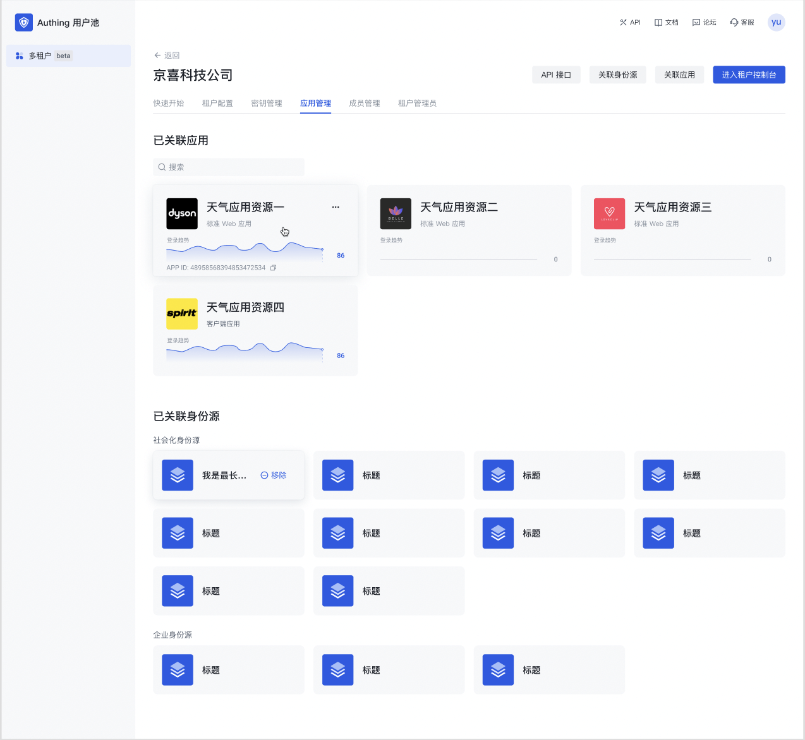


### 2. 通过 API 接口对某个租户增删改查

**新增租户**
```JavaScript
fetch('https://api.authing.cn/api/v3/create-tenant', {
    data: {
        name: '租户一',
        logo: 'https://image.example.com/logo.jpg'
    },
    method: "POST",
    headers: {
        "x-authing-userpool-id": "用户池 ID",
        "Authorization": "accessToken"
    }
})
```
**修改租户**
```JavaScript
fetch('https://api.authing.cn/api/v3/update-tenant', {
    data: {
        tenantId: 'xxxxxxxxxxxxxxxxxxxx',
        name: '租户一',
        logo: 'https://image.example.com/logo.jpg'
    },
    method: "POST",
    headers: {
        "x-authing-userpool-id": "用户池 ID",
        "Authorization": "accessToken"
    }
})
```

**租户详情**
```JavaScript
fetch('https://api.authing.cn/api/v3/get-tenant', {
    data: {
        tenantId: 'xxxxxxxxxxxxxxxxxxxx'
    },
    method: "GET",
    headers: {
        "x-authing-userpool-id": "用户池 ID",
        "Authorization": "accessToken"
    }
})
```

**删除租户**
```JavaScript
fetch('https://api.authing.cn/api/v3/delete-tenant', {
    data: {
        tenantId: 'xxxxxxxxxxxxxxxxxxxx'
    },
    method: "POST",
    headers: {
        "x-authing-userpool-id": "用户池 ID",
        "Authorization": "accessToken"
    }
})
```

## 美丽图开发者（温小姐）的用户旅程
### 1. 注册账户
温小姐通过千度搜索进入了好天气官网，点击登录进入了 Authing 提供的的托管登录界面，通过手机号和邮箱注册并登录了账号。登录完成后，跳转回好天气的 OIDC Callback URL，通过 OIDC 流程，好天气系统获取到了用户信息。这时候，系统检验出了她不属于任何租户，同时引导她去创建一个组织。

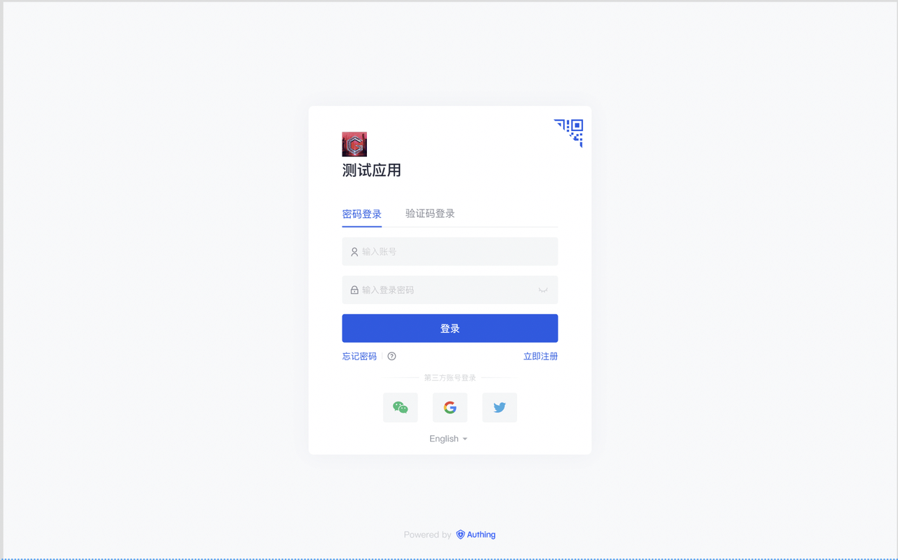


温小姐注册账号时会调用 Authing 的如下 API
```JavaScript
fetch('https://api.authing.cn/api/v3/signup', {
    data: {
        phone: '137xxxxxxxxx',
        password: 'xxxxxx'
    },
    method: "POST",
    headers: {
        x-authing-userpool-id: '用户池 ID',
        x-authing-tenant-id: '租户 ID'
    }
})
```

### 2. 创建美丽团

温小姐点击了界面上的「**创建组织**」按钮，输入企业名、logo 等必要信息，保存时会调用 Authing 的认证侧接口 /v3/api/create-my-tenant ，Authing 会创建租户并关联到好天气应用，同时将温小姐设置为**租户管理员**。

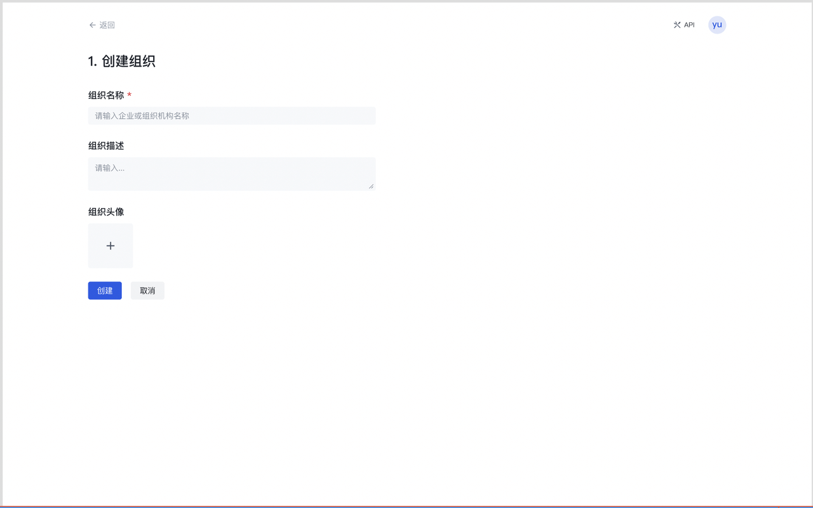

同时可以调用 Authing 的如下 API

```JavaScript
fetch('https://api.authing.cn/api/v3/create-my-tenant', {
    data: {
        name: '美丽团'
        logo: 'https://picture.example.com/xxx.jpg'
    },
    method: "POST",
    headers: {
        x-authing-userpool-id: '用户池 ID',
        Authorization: '温小姐的 acccessToken'
    }
})
```
### 3. 邀请成员

完成基本设置后，温小姐可以通过邮件方式邀请更多的同事加入到美丽团中，也可以直接发送链接，每个链接都可以设定有效期。

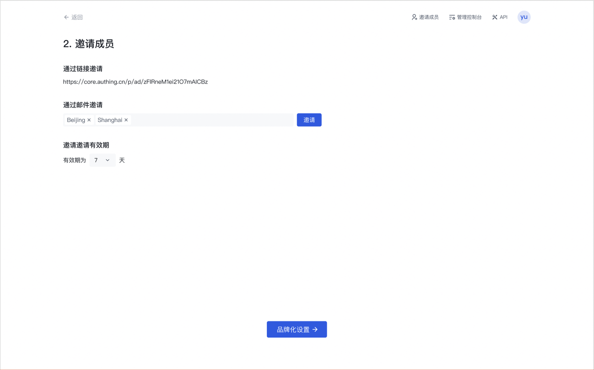

```JavaScript
fetch('https://api.authing.cn/api/v3/invitate-tenant-user', {
    data: {
        invitateType: 'phone',
        expireTime: 7,
        invitateValue: '137xxxxxxxx',
        tenantId: 'xxxxxxxxxxxxxxx'
    },
    method: "POST",
    headers: {
        "x-authing-userpool-id": "用户池 ID",
        "Authorization": "accessToken"
    }
})
```

### 4. 品牌化

而后，温小姐会进入**美丽团**管理界面。温小姐将登录页面背景、loading 动画等改成了与自己企业相关的样式。[点击查看更多的配置]() >>


### 5. 通过 API 管理美丽团的用户

基本设置完成后，温小姐为了在美丽团的界面中管理自己的用户，她决定接入 Authing 的管理侧 API。温小姐需要先在美丽团控制台获取租户 ID 和秘钥。

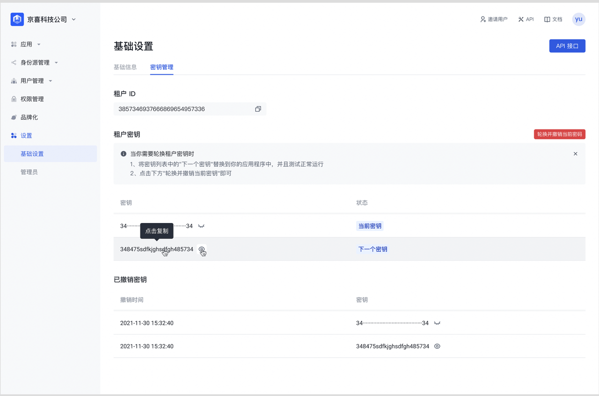

然后获取 **accessToken：**

```JavaScript
const token = fetch('https://api.authing.cn/api/v3/get-management-token', {
    data: {
        "accessKeyId": "用户池 ID",
        "accessKeySecret": "用户池秘钥"
    },
    method: "POST"
})
```

然后使用 **accessToken** 请求租户管理接口。以下以租户、租户成员的简单管理为例：

**创建子管理员**

```JavaScript
// 原有成员设置为管理员
fetch('https://api.authing.cn/api/v3/add-tenant-admin', {
    data: {
        "memberId": "成员 ID"
    },
    method: "POST",
    headers: {
        "x-authing-userpool-id": "用户池 ID",
        "Authorization": "accessToken"
    }
})

// 直接创建管理员
fetch('https://api.authing.cn/api/v3/create-tenant-admin', {
    data: {
        "username": "用户名",
        "password": "密码"
    },
    method: "POST",
    headers: {
        "x-authing-userpool-id": "用户池 ID",
        "Authorization": "accessToken"
    }
})
```

**创建成员**

```JavaScript
fetch('https://api.authing.cn/api/v3/create-tenant-user', {
    data: {
        "username": "用户名",
        "password": "密码"
    },
    method: "POST",
    headers: {
        "x-authing-userpool-id": "用户池 ID",
        "Authorization": "accessToken"
    }
})
```

**修改成员信息**

```JavaScript
fetch('https://api.authing.cn/api/v3/update-tenant-user', {
    data: {
        "memberId": "租户成员 ID"
        "updates": {
            "username": "用户名",
            "password": "密码"
        }
    },
    method: "POST",
    headers: {
        "x-authing-userpool-id": "用户池 ID",
        "Authorization": "accessToken"
    }
})
```

更多 API 可以查看 [https://api.authing.cn/openapi/v3/management/](https://api.authing.cn/openapi/v3/management/)

## 美丽团普通用户（赵博士）的用户旅程

### 1. 接受邀请，创建账户

赵博士收到好天气的美丽团企业邀请链接，点击到了 Authing 提供的账号激活界面，通过输入验证码、密码等操作，完成了账号注册，登录后跳转到了好天气 OIDC Callback URL，通过 OIDC 协议，好天气系统获取到了带有 `tenantId` 的用户信息，好天气将用户重定向到了美丽团在好天气的功能界面。

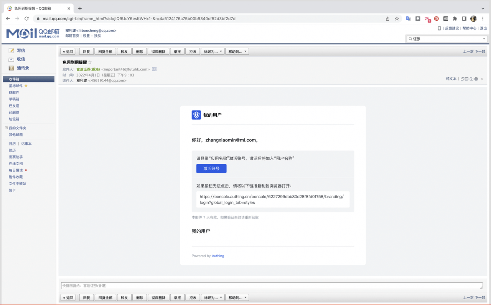

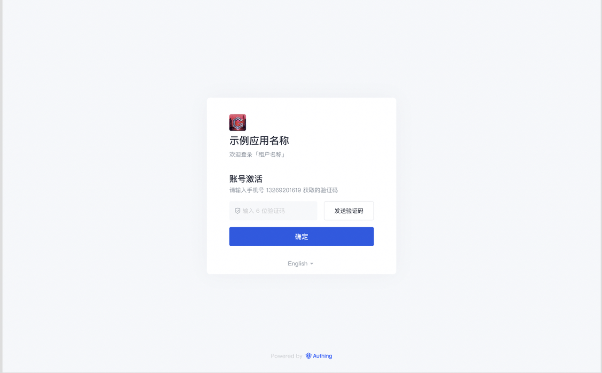

### 2. 查看天气情况

使用好天气查看最近的天气情况。

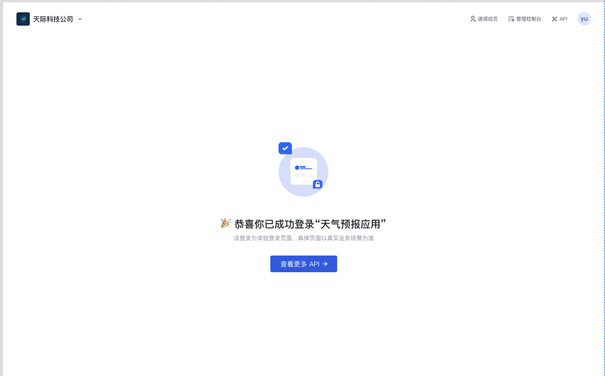