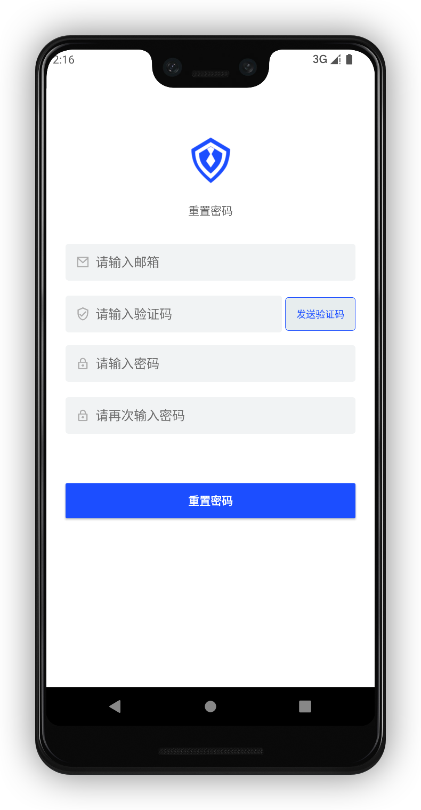

# 邮箱地址重置密码

<LastUpdated/>

阅读此教程之前，确保已经完成了 [开发准备](/reference-new/Mobile-and-client-applications/sdk-for-android/develop.md)

将上一个 [手机号码重置密码](./reset-password-by-phone.md) 教程的全部控件复制粘贴过来

修改 PhoneNumberEditText 的类型为 EmailEditText

修改 GetVerifyCodeButton 的类型为 GetEmailCodeButton

## 运行

