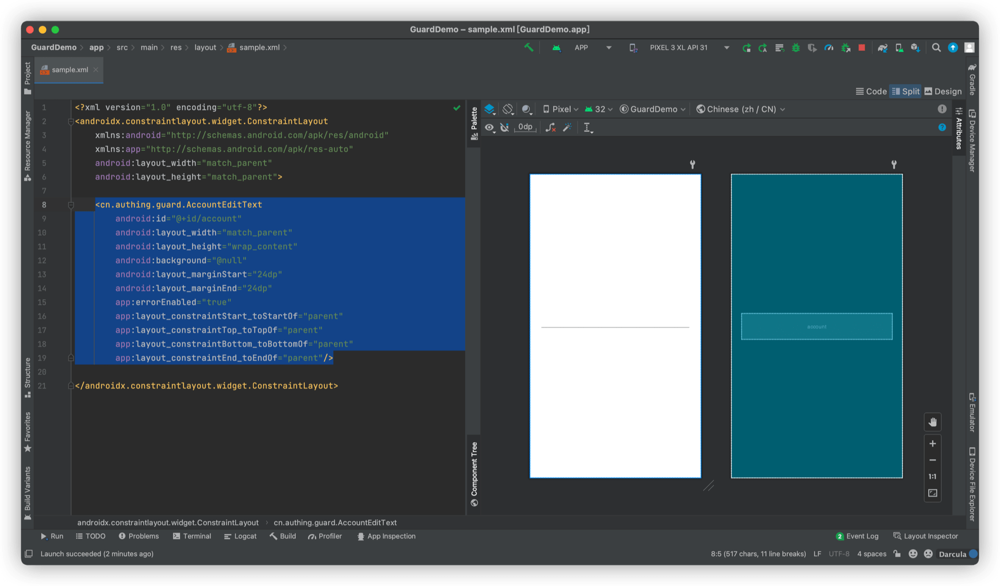

# AccountEditText

<LastUpdated/>

此组件将用户输入作为帐号字段传给服务端。帐号可以为电话号码、邮箱、用户名，errorEnabled 属性控制是否显示错误信息。

## 示例


## 创建

放置一个 AccountEditText

```xml
<cn.authing.guard.AccountEditText
    android:id="@+id/account"
    android:layout_width="match_parent"
    android:layout_height="wrap_content"
    android:background="@null"
    android:layout_marginStart="24dp"
    android:layout_marginEnd="24dp"
    app:errorEnabled="true"
    app:layout_constraintStart_toStartOf="parent"
    app:layout_constraintTop_toTopOf="parent"
    app:layout_constraintBottom_toBottomOf="parent"
    app:layout_constraintEnd_toEndOf="parent"/>
```



## 特性

提示语可以根据控制台设置动态变化。比如我们在控制台做如下修改：


再次运行：


