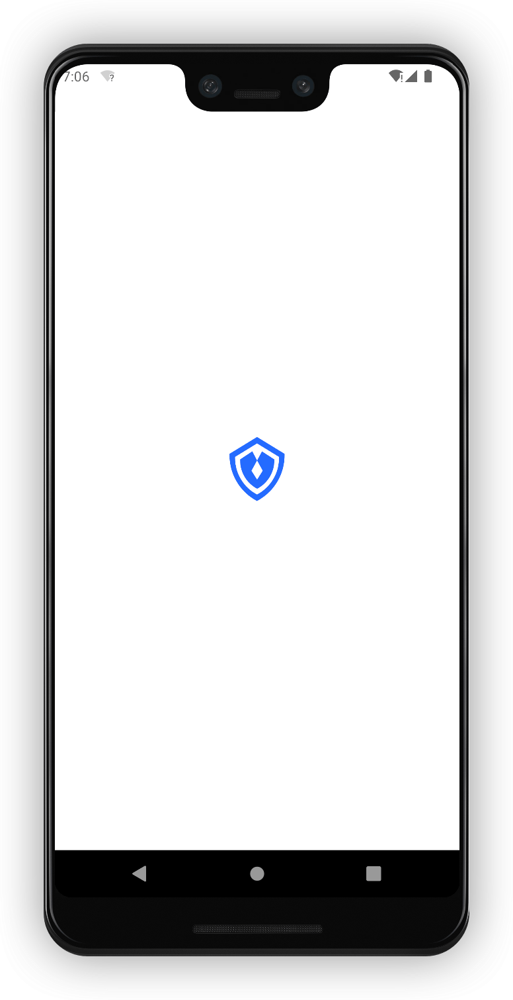
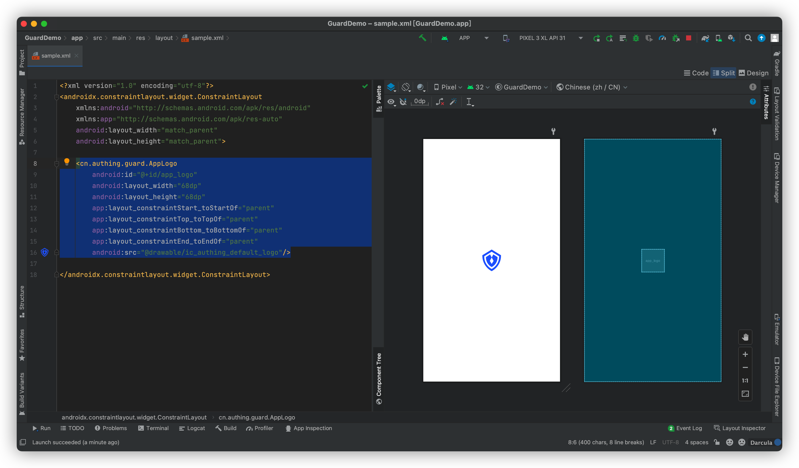

# AppLogo

<LastUpdated/>

此组件可以根据控制台设置，动态显示应用图标。首次加载后，在本地有文件缓存，第二次进入登录界面时，先加载本地缓存，再发起网络请求更新图片。

## 示例



## 创建

放置一个 AppLogo

```xml
<cn.authing.guard.AppLogo
    android:id="@+id/app_logo"
    android:layout_width="68dp"
    android:layout_height="68dp"
    app:layout_constraintStart_toStartOf="parent"
    app:layout_constraintTop_toTopOf="parent"
    app:layout_constraintBottom_toBottomOf="parent"
    app:layout_constraintEnd_toEndOf="parent"
    android:src="@drawable/ic_authing_default_logo"/>
```


