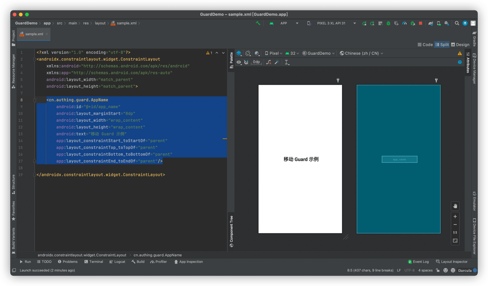

# AppName

<LastUpdated/>

此组件可以根据控制台设置，动态显示应用名称。

## 示例


## 创建

放置一个 AppName

```xml
<cn.authing.guard.AppName
    android:id="@+id/app_name"
    android:layout_marginStart="8dp"
    android:layout_width="wrap_content"
    android:layout_height="wrap_content"
    android:text="移动 Guard 示例"
    app:layout_constraintStart_toStartOf="parent"
    app:layout_constraintTop_toTopOf="parent"
    app:layout_constraintBottom_toBottomOf="parent"
    app:layout_constraintEnd_toEndOf="parent"/>
```


