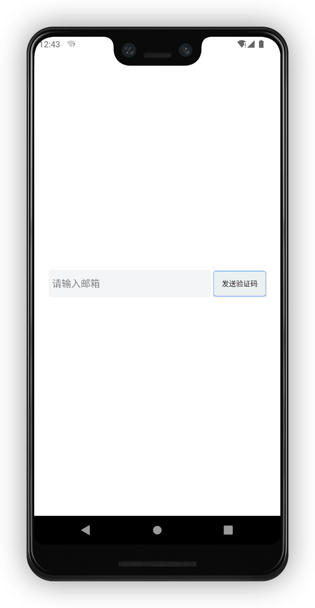
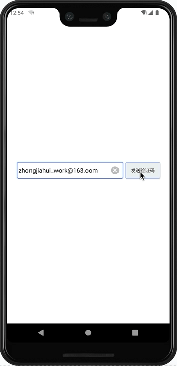
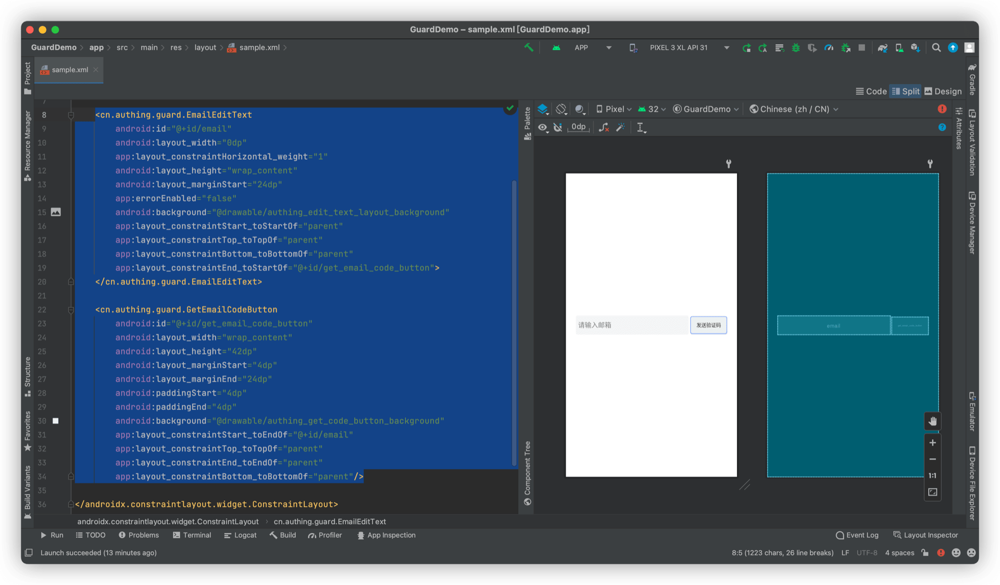

# GetEmailCodeButton

<LastUpdated/>

此组件将给指定邮箱发送邮箱验证码。邮箱获取优先级如下：

EmailEditText 内容 -> AccountEditText 内容 -> 存在于 AuthFlow 中的帐号信息

发送邮箱验证码时，此组件会处于禁用状态并自动播放加载动画

## 示例






## 属性

| 属性名                     | 类型 | 说明 | 默认值 |
| ----------------------- |:--------:| :------:| :-----: |
| android_tint |    reference\|color    |   点击后，旋转动画的颜色   |    Authing 主题蓝色   |
| loadingLocation |    enum    |   旋转动画的位置。left 表示在文字左边旋转；right 表示在文字右方旋转; over 表示在文字中间旋转; cover 表示在旋转动画在中间，并且不显示文字。   | over   |

## 创建

放置一个 GetEmailCodeButton

```xml
<cn.authing.guard.GetEmailCodeButton
    android:id="@+id/get_email_code_button"
    android:layout_width="wrap_content"
    android:layout_height="42dp"
    android:layout_marginStart="4dp"
    android:layout_marginEnd="24dp"
    android:paddingStart="4dp"
    android:paddingEnd="4dp"
    android:background="@drawable/authing_get_code_button_background"
    app:layout_constraintStart_toEndOf="@+id/email"
    app:layout_constraintTop_toTopOf="parent"
    app:layout_constraintEnd_toEndOf="parent"
    app:layout_constraintBottom_toBottomOf="parent"/>
```


