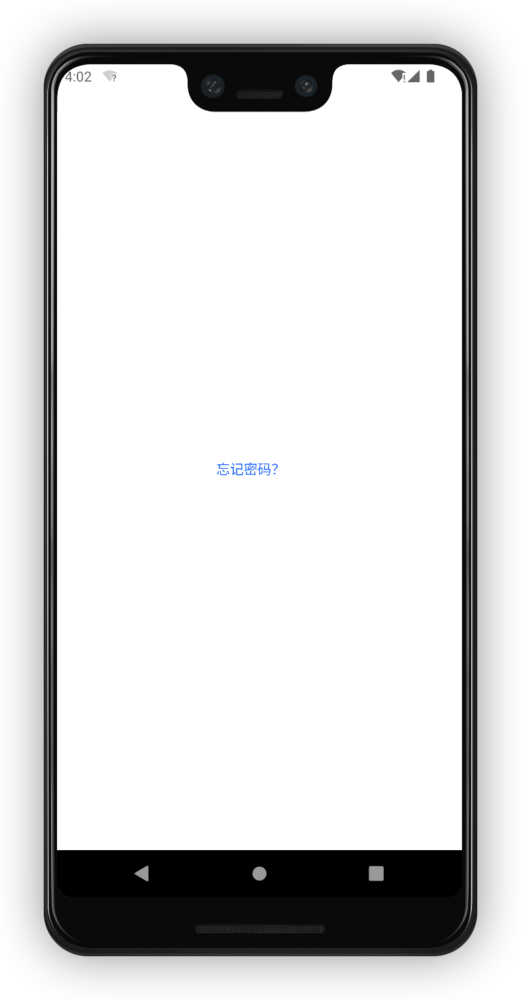
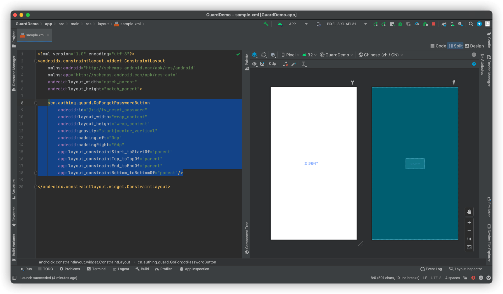

# GoForgotPasswordButton

<LastUpdated/>

此组件提供跳转按钮的样式和国际化文本

## 示例



## 创建

放置一个 GoForgotPasswordButton

```xml
<cn.authing.guard.GoForgotPasswordButton
    android:id="@+id/tv_reset_password"
    android:layout_width="wrap_content"
    android:layout_height="wrap_content"
    android:gravity="start|center_vertical"
    android:paddingLeft="0dp"
    android:paddingRight="0dp"
    app:layout_constraintStart_toStartOf="parent"
    app:layout_constraintTop_toTopOf="parent"
    app:layout_constraintEnd_toEndOf="parent"
    app:layout_constraintBottom_toBottomOf="parent"/>
```


