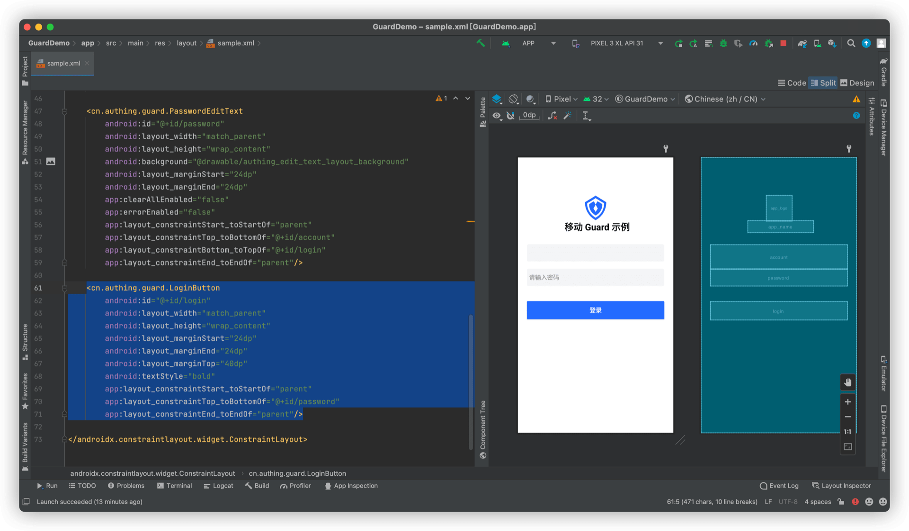

# LoginButton

<LastUpdated/>

当用户点击此组件时，它会根据当前页面的其他 Guard 组件信息来决定发起哪种认证请求。假设当前页面有 AccountEditText 和 PasswordEditText 的组合，该组件就会使用帐号密码进行登录。

## 示例


发起登录时，此组件会处于禁用状态并自动播放加载动画。


## 创建

放置一个  LoginButton

```xml
<cn.authing.guard.LoginButton
    android:id="@+id/login"
    android:layout_width="match_parent"
    android:layout_height="wrap_content"
    android:layout_marginStart="24dp"
    android:layout_marginEnd="24dp"
    android:layout_marginTop="40dp"
    android:textStyle="bold"
    app:layout_constraintStart_toStartOf="parent"
    app:layout_constraintTop_toBottomOf="@+id/password"
    app:layout_constraintEnd_toEndOf="parent"/>
```


