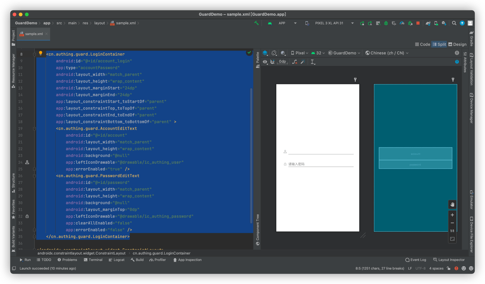

# LoginContainer

<LastUpdated/>

此组件为辅助类型控件。我们将一组登录控件放置到 LoginContainer 里面，并设置 LoginContainer 类型，方便 LoginMethodTab 完成登录方式切换。

## 属性

| 属性名                     | 类型 | 说明 | 默认值 |
| ----------------------- |:--------:| :------:| :-----: |
|  type     |    enum    |   登录方式类型：phoneCode 手机号码+验证码；accountPassword 帐号+密码；emailCode：邮箱+验证码   | phoneCode   |

## 创建

放置一个 LoginContainer

```xml
<cn.authing.guard.LoginContainer
    android:id="@+id/account_login"
    app:type="accountPassword"
    android:layout_width="match_parent"
    android:layout_height="wrap_content"
    android:layout_marginStart="24dp"
    android:layout_marginEnd="24dp"
    app:layout_constraintStart_toStartOf="parent"
    app:layout_constraintTop_toTopOf="parent"
    app:layout_constraintEnd_toEndOf="parent"
    app:layout_constraintBottom_toBottomOf="parent" >
    <cn.authing.guard.AccountEditText
        android:id="@+id/account"
        android:layout_width="match_parent"
        android:layout_height="wrap_content"
        android:background="@null"
        app:leftIconDrawable="@drawable/ic_authing_user"
        app:errorEnabled="true" />
    <cn.authing.guard.PasswordEditText
        android:id="@+id/password"
        android:layout_width="match_parent"
        android:layout_height="wrap_content"
        android:background="@null"
        android:layout_marginTop="0dp"
        app:leftIconDrawable="@drawable/ic_authing_password"
        app:clearAllEnabled="false"
        app:errorEnabled="false" />
</cn.authing.guard.LoginContainer>
```


