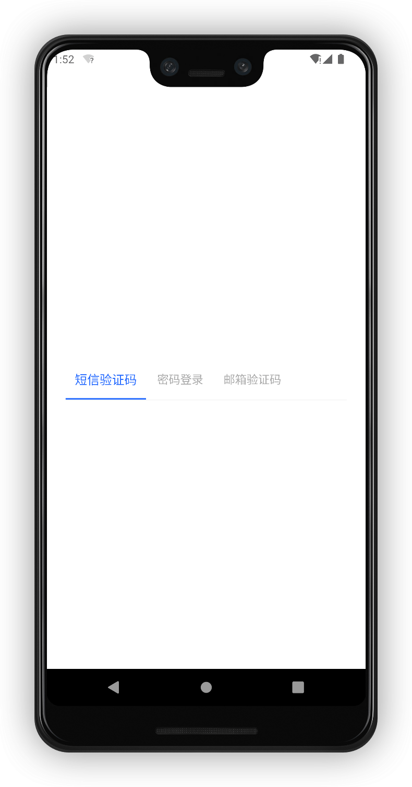
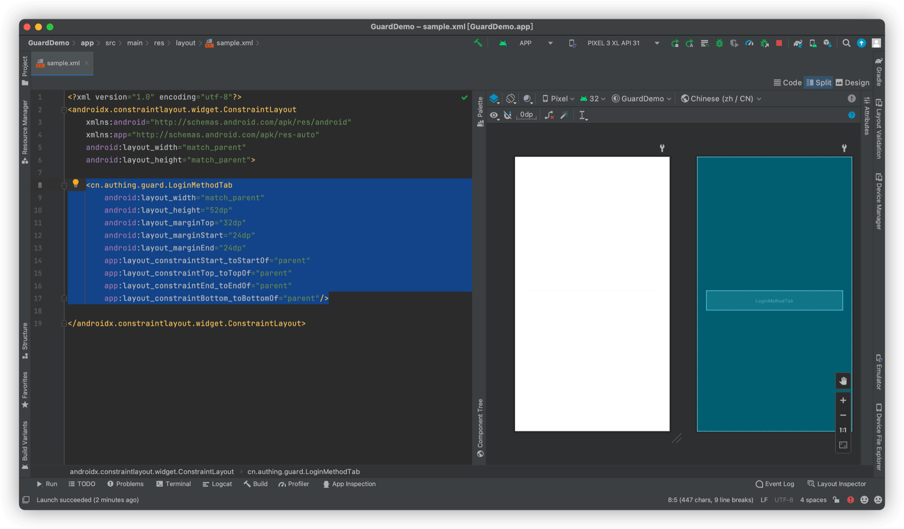
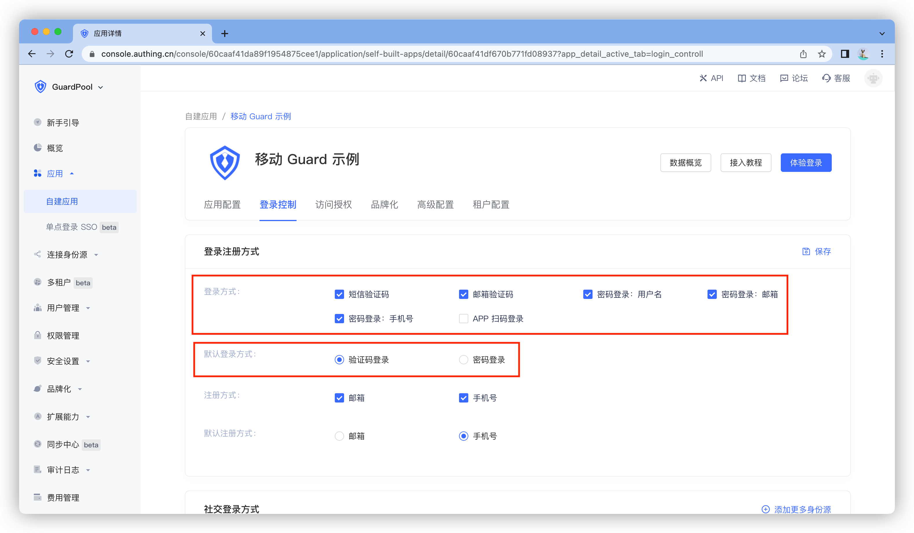

# LoginMethodTab

<LastUpdated/>

此组件根据控制台配置动态展示登录方式。

## 示例



## 创建

放置一个 LoginMethodTab

```xml
<cn.authing.guard.LoginMethodTab
    android:layout_width="match_parent"
    android:layout_height="52dp"
    android:layout_marginTop="32dp"
    android:layout_marginStart="24dp"
    android:layout_marginEnd="24dp"
    app:layout_constraintStart_toStartOf="parent"
    app:layout_constraintTop_toTopOf="parent"
    app:layout_constraintEnd_toEndOf="parent"
    app:layout_constraintBottom_toBottomOf="parent"/>
```



## 特性

显示内容可以根据控制台设置动态变化，控制台位置：



>默认登录方式会放到最左边