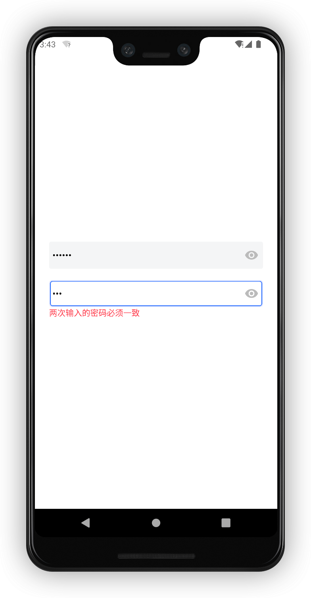
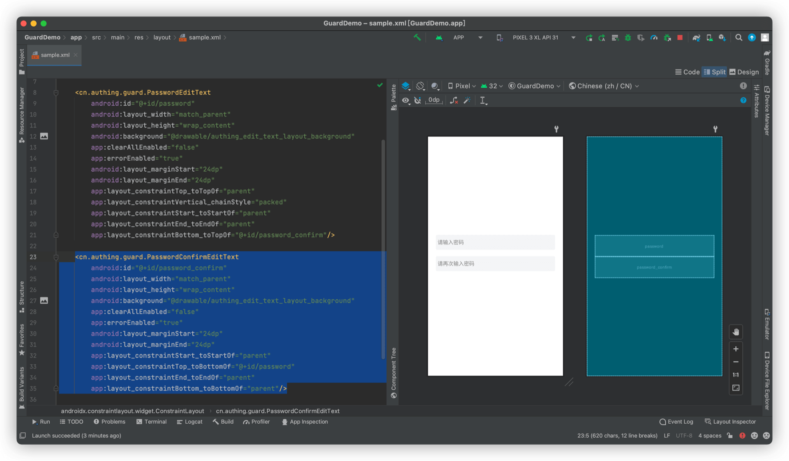

# PasswordConfirmEditText

<LastUpdated/>

此组件此组件为辅助类型控件，和 PasswordEditText 搭配使用，errorEnabled 属性控制是否显示错误信息。

常用场景：注册、重置密码

功能：功能和 PasswordEditText 一致以外，多了校验和密码输入框输入的密码是否一致功能

## 示例



## 创建

放置一个 PasswordConfirmEditText

```xml
<cn.authing.guard.PasswordConfirmEditText
    android:id="@+id/password_confirm"
    android:layout_width="match_parent"
    android:layout_height="wrap_content"
    android:background="@drawable/authing_edit_text_layout_background"
    app:clearAllEnabled="false"
    app:errorEnabled="true"
    android:layout_marginStart="24dp"
    android:layout_marginEnd="24dp"
    app:layout_constraintStart_toStartOf="parent"
    app:layout_constraintTop_toBottomOf="@+id/password"
    app:layout_constraintEnd_toEndOf="parent"
    app:layout_constraintBottom_toBottomOf="parent"/>
```


