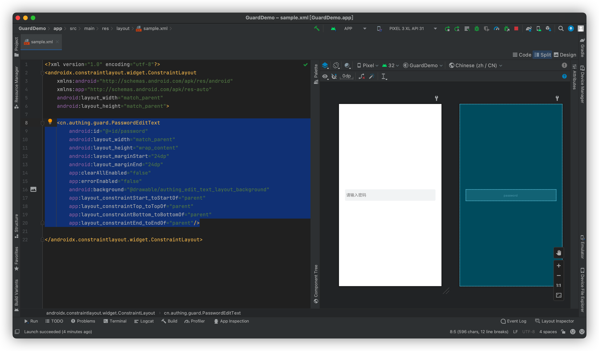

# PasswordEditText

<LastUpdated/>

此组件将用户输入作为密码字段传给服务端。默认提供显示/隐藏密码按钮，errorEnabled 属性控制是否显示错误信息。

## 示例


## 创建

放置一个 PasswordEditText

```xml
<cn.authing.guard.PasswordEditText
    android:id="@+id/password"
    android:layout_width="match_parent"
    android:layout_height="wrap_content"
    android:layout_marginStart="24dp"
    android:layout_marginEnd="24dp"
    app:clearAllEnabled="false"
    app:errorEnabled="true"
    android:background="@drawable/authing_edit_text_layout_background"
    app:layout_constraintStart_toStartOf="parent"
    app:layout_constraintTop_toTopOf="parent"
    app:layout_constraintBottom_toBottomOf="parent"
    app:layout_constraintEnd_toEndOf="parent"/>
```


