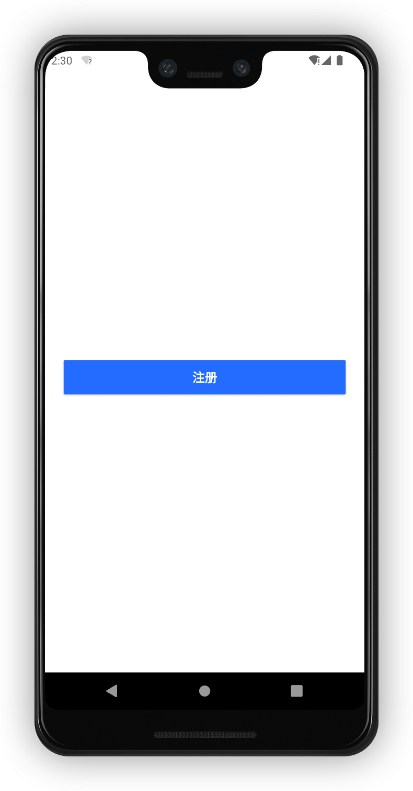
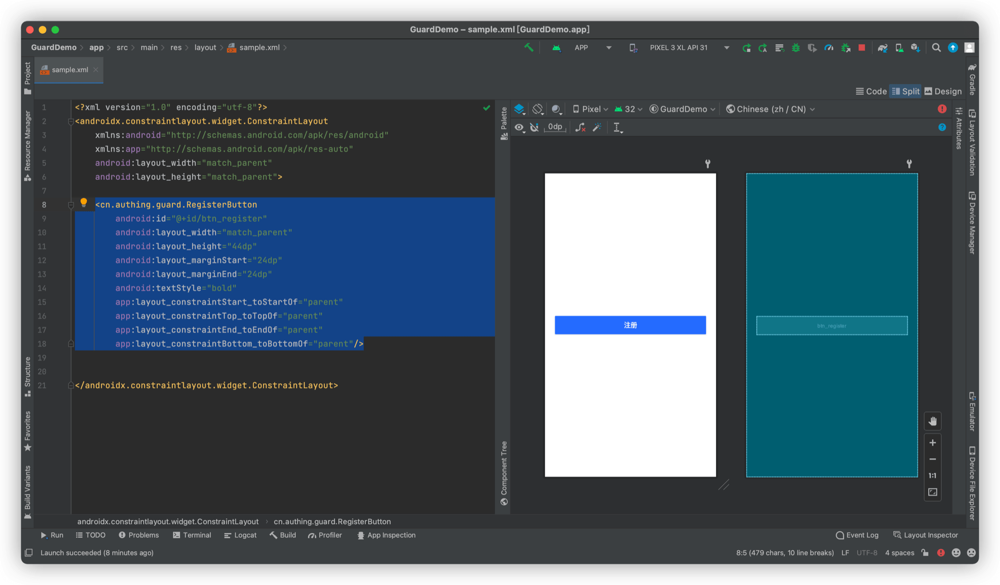

# RegisterButton

<LastUpdated/>

当用户点击此组件时，它会根据当前页面的其他 Guard 组件信息发起注册请求。

## 示例



## 创建

放置一个 RegisterButton

```xml
<cn.authing.guard.RegisterButton
    android:id="@+id/btn_register"
    android:layout_width="match_parent"
    android:layout_height="44dp"
    android:layout_marginStart="24dp"
    android:layout_marginEnd="24dp"
    android:textStyle="bold"
    app:layout_constraintStart_toStartOf="parent"
    app:layout_constraintTop_toTopOf="parent"
    app:layout_constraintEnd_toEndOf="parent"
    app:layout_constraintBottom_toBottomOf="parent"/>
```


