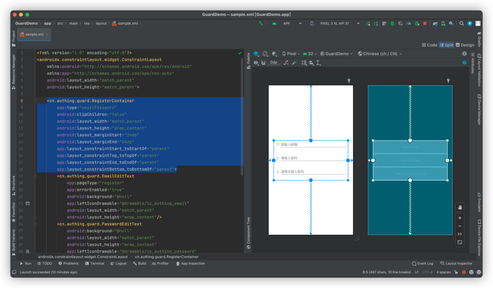

# RegisterContainer

<LastUpdated/>

此组件为辅助类型控件。我们将一组注册控件放置到 RegisterContainer 里面，并设置 RegisterContainer 类型，方便 RegisterMethodTab 完成注册方式切换。

## 属性

| 属性名                     | 类型 | 说明 | 默认值 |
| ----------------------- |:--------:| :------:| :-----: |
|  type     |    enum    |   注册方式类型。phoneCodePassword 手机号码+验证码；emailPassword 邮箱+密码   | phoneCodePassword   |

## 创建

放置一个 RegisterContainer

```xml
<cn.authing.guard.RegisterContainer
    app:type="emailPassword"
    android:clipChildren="false"
    android:layout_width="match_parent"
    android:layout_height="wrap_content"
    android:layout_marginStart="24dp"
    android:layout_marginEnd="24dp"
    app:layout_constraintStart_toStartOf="parent"
    app:layout_constraintTop_toTopOf="parent"
    app:layout_constraintEnd_toEndOf="parent"
    app:layout_constraintBottom_toBottomOf="parent">
    <cn.authing.guard.EmailEditText
        app:pageType="register"
        app:errorEnabled="true"
        android:background="@null"
        app:leftIconDrawable="@drawable/ic_authing_email"
        android:layout_width="match_parent"
        android:layout_height="wrap_content"/>
    <cn.authing.guard.PasswordEditText
        android:background="@null"
        android:layout_width="match_parent"
        android:layout_height="wrap_content"
        app:leftIconDrawable="@drawable/ic_authing_password"
        app:clearAllEnabled="false"
        app:errorEnabled="true"
        android:layout_marginTop="4dp"/>
    <cn.authing.guard.PasswordConfirmEditText
        android:layout_width="match_parent"
        android:layout_height="wrap_content"
        android:background="@null"
        app:leftIconDrawable="@drawable/ic_authing_password"
        app:clearAllEnabled="false"
        app:errorEnabled="true"
        android:layout_marginTop="4dp"/>
</cn.authing.guard.RegisterContainer>
```


