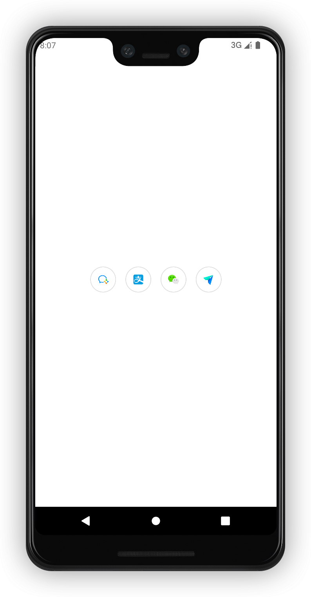
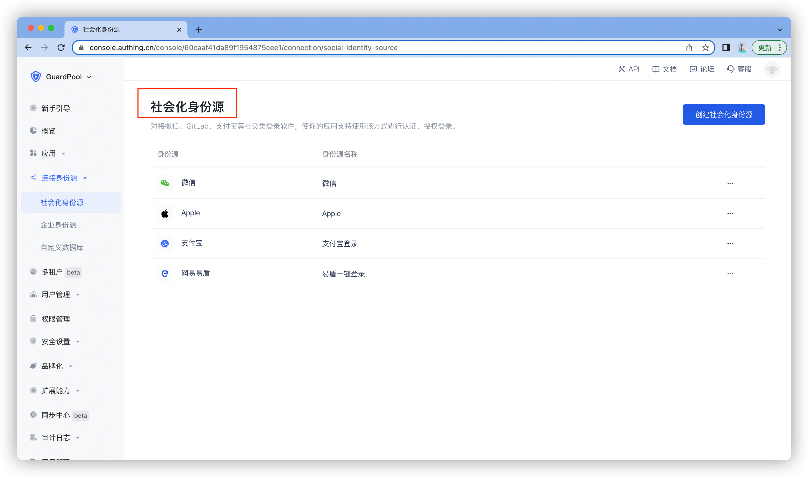
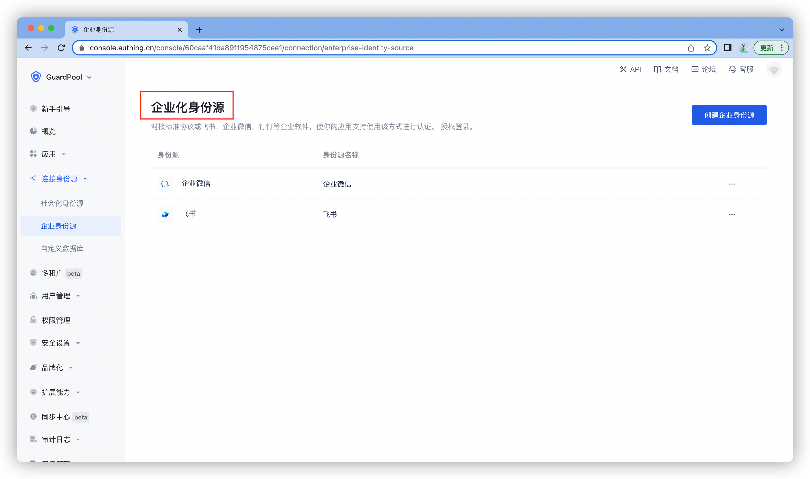
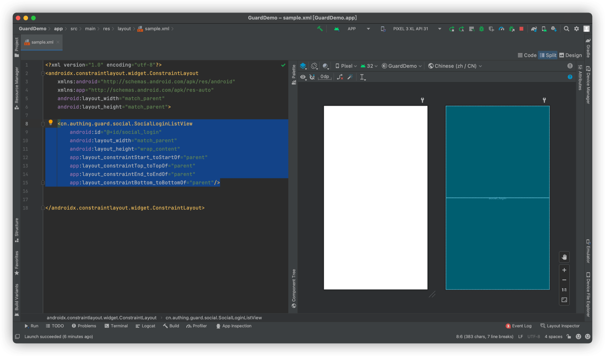

# SocialLoginListView

<LastUpdated/>

此组件根据控制台设置显示社会化登录源和企业身份源。用户点击图标时，拉起相应 App 完成认证。

## 示例

## 控制台设置

## 创建

放置一个 SocialLoginListView

## 属性

| 属性名                     | 类型 | 说明 | 默认值 |
| ----------------------- |:--------:| :------:| :-----: |
| loginSource |    String    |   社会化登录源。auto：跟随控制台；wechat\|alipay\|lark\|wecom，用 \| 隔开   |    auto   |
