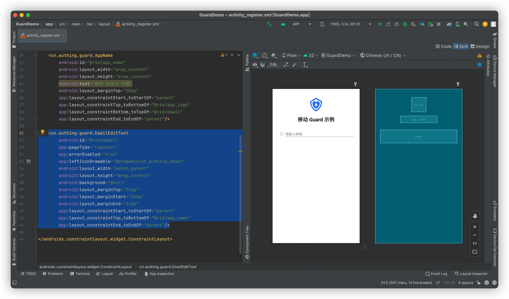
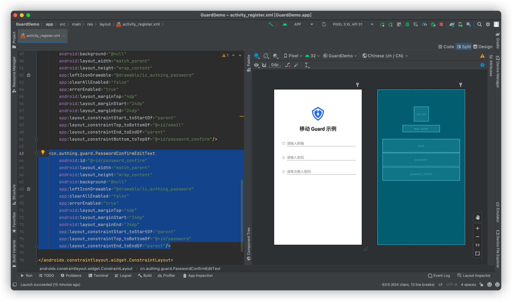
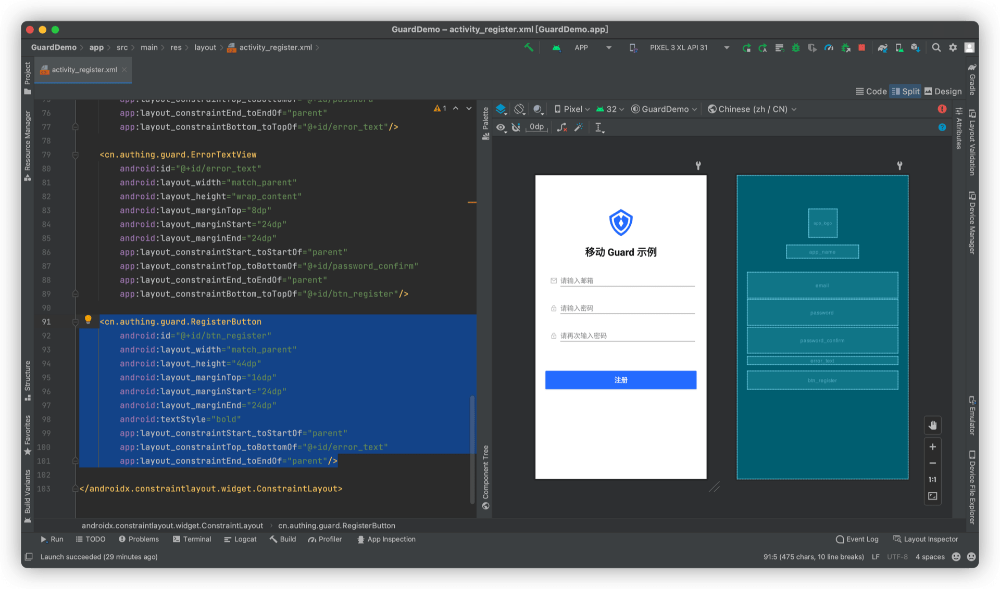

# 基础注册示例

<LastUpdated/>

阅读此教程之前，确保已经完成了 [开发准备](/reference/sdk-for-android/quick.md)

## 在 xml 上放置超组件

放置一个 EmailEditText



再放置一个 PasswordEditText


再放置一个 PasswordConfirmEditText



再放置一个 ErrorTextView


再放置一个 RegisterButton



## 运行


一个具有注册业务能力的界面就开发完了，输入有效的邮箱和密码，点击注册按钮就可以完成注册。如果注册出现错误，服务器返回的错误信息也能直接显示在 ErrorTextView 上。

>Guard 超组件提供了一些默认的视觉效果，如输入框获取焦点时，会播放一个高亮边框的动画；输入框提示语跟随 Authing 控制台配置；密码输入框默认提供 “显示明文”按钮；点击注册按钮时，会播放加载动画等等。如果需要自定这些视觉效果，请参考每个组件的详细说明。

接下来，我们需要设置回调以获取用户信息：

```swift
RegisterButton btn = findViewById(R.id.btn_register);
btn.setOnRegisterListener((code, message, data)->{
  runOnUiThread(()->{
    if (code == 200) {
      //register success
    }
  });
});
```

## 完整示例代码

```xml
<?xml version="1.0" encoding="utf-8"?>
<androidx.constraintlayout.widget.ConstraintLayout
    xmlns:android="http://schemas.android.com/apk/res/android"
    xmlns:app="http://schemas.android.com/apk/res-auto"
    android:layout_width="match_parent"
    android:layout_height="match_parent">

    <cn.authing.guard.AppLogo
        android:id="@+id/app_logo"
        android:layout_width="68dp"
        android:layout_height="68dp"
        android:layout_marginTop="80dp"
        app:layout_constraintStart_toStartOf="parent"
        app:layout_constraintEnd_toEndOf="parent"
        app:layout_constraintTop_toTopOf="parent"
        app:layout_constraintBottom_toTopOf="@+id/app_name"
        app:layout_constraintVertical_chainStyle="packed"
        android:src="@drawable/ic_authing_default_logo"/>

    <cn.authing.guard.AppName
        android:id="@+id/app_name"
        android:layout_width="wrap_content"
        android:layout_height="wrap_content"
        android:text="移动 Guard 示例"
        android:layout_marginTop="20dp"
        app:layout_constraintStart_toStartOf="parent"
        app:layout_constraintTop_toBottomOf="@+id/app_logo"
        app:layout_constraintBottom_toTopOf="@+id/email"
        app:layout_constraintEnd_toEndOf="parent"/>

    <cn.authing.guard.EmailEditText
        android:id="@+id/email"
        app:pageType="register"
        app:errorEnabled="true"
        app:leftIconDrawable="@drawable/ic_authing_email"
        android:layout_width="match_parent"
        android:layout_height="wrap_content"
        android:background="@null"
        android:layout_marginTop="32dp"
        android:layout_marginStart="24dp"
        android:layout_marginEnd="24dp"
        app:layout_constraintStart_toStartOf="parent"
        app:layout_constraintTop_toBottomOf="@+id/app_name"
        app:layout_constraintEnd_toEndOf="parent"
        app:layout_constraintBottom_toTopOf="@+id/password"/>

    <cn.authing.guard.PasswordEditText
        android:id="@+id/password"
        android:background="@null"
        android:layout_width="match_parent"
        android:layout_height="wrap_content"
        app:leftIconDrawable="@drawable/ic_authing_password"
        app:clearAllEnabled="false"
        app:errorEnabled="true"
        android:layout_marginTop="4dp"
        android:layout_marginStart="24dp"
        android:layout_marginEnd="24dp"
        app:layout_constraintStart_toStartOf="parent"
        app:layout_constraintTop_toBottomOf="@+id/email"
        app:layout_constraintEnd_toEndOf="parent"
        app:layout_constraintBottom_toTopOf="@+id/password_confirm"/>

    <cn.authing.guard.PasswordConfirmEditText
        android:id="@+id/password_confirm"
        android:layout_width="match_parent"
        android:layout_height="wrap_content"
        android:background="@drawable/authing_edit_text_layout_background"
        app:leftIconDrawable="@drawable/ic_authing_password"
        app:clearAllEnabled="false"
        app:errorEnabled="true"
        android:layout_marginTop="4dp"
        android:layout_marginStart="24dp"
        android:layout_marginEnd="24dp"
        app:layout_constraintStart_toStartOf="parent"
        app:layout_constraintTop_toBottomOf="@+id/password"
        app:layout_constraintEnd_toEndOf="parent"
        app:layout_constraintBottom_toTopOf="@+id/error_text"/>

    <cn.authing.guard.ErrorTextView
        android:id="@+id/error_text"
        android:layout_width="match_parent"
        android:layout_height="wrap_content"
        android:layout_marginTop="8dp"
        android:layout_marginStart="24dp"
        android:layout_marginEnd="24dp"
        app:layout_constraintStart_toStartOf="parent"
        app:layout_constraintTop_toBottomOf="@+id/password_confirm"
        app:layout_constraintEnd_toEndOf="parent"
        app:layout_constraintBottom_toTopOf="@+id/btn_register"/>

    <cn.authing.guard.RegisterButton
        android:id="@+id/btn_register"
        android:layout_width="match_parent"
        android:layout_height="44dp"
        android:layout_marginTop="16dp"
        android:layout_marginStart="24dp"
        android:layout_marginEnd="24dp"
        android:textStyle="bold"
        app:layout_constraintStart_toStartOf="parent"
        app:layout_constraintTop_toBottomOf="@+id/error_text"
        app:layout_constraintEnd_toEndOf="parent"/>

</androidx.constraintlayout.widget.ConstraintLayout>
```

此教程展示了如何在 5 分钟左右的时间构建一个简单的注册界面。接下来，我们再构建一个更为复杂的注册界面。

<br>
<span style="background-color: #215ae5;a:link:color:#FFF;padding:8px;border-radius: 4px;"><a href="./advanced-register.html" style="color:#FFF;">复杂注册示例 →</a>
</span>