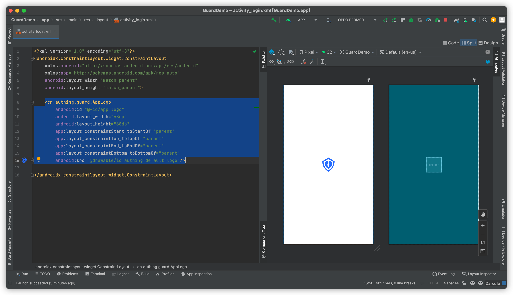
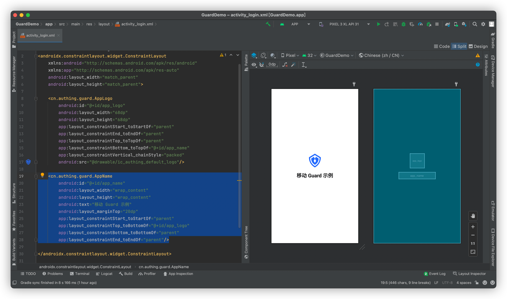

# 入门示例

<LastUpdated/>

## 放置一个 AppLogo



## 再放置一个 AppName



## 完成


## 完整示例代码

```xml
<?xml version="1.0" encoding="utf-8"?>
<androidx.constraintlayout.widget.ConstraintLayout
    xmlns:android="http://schemas.android.com/apk/res/android"
    xmlns:app="http://schemas.android.com/apk/res-auto"
    android:layout_width="match_parent"
    android:layout_height="match_parent">

    <cn.authing.guard.AppLogo
        android:id="@+id/app_logo"
        android:layout_width="68dp"
        android:layout_height="68dp"
        app:layout_constraintStart_toStartOf="parent"
        app:layout_constraintEnd_toEndOf="parent"
        app:layout_constraintTop_toTopOf="parent"
        app:layout_constraintBottom_toTopOf="@+id/app_name"
        app:layout_constraintVertical_chainStyle="packed"
        android:src="@drawable/ic_authing_default_logo"/>

    <cn.authing.guard.AppName
        android:id="@+id/app_name"
        android:layout_width="wrap_content"
        android:layout_height="wrap_content"
        android:text="移动 Guard 示例"
        android:layout_marginTop="20dp"
        app:layout_constraintStart_toStartOf="parent"
        app:layout_constraintTop_toBottomOf="@+id/app_logo"
        app:layout_constraintBottom_toBottomOf="parent"
        app:layout_constraintEnd_toEndOf="parent"/>

</androidx.constraintlayout.widget.ConstraintLayout>
```


此教程展示了 Authing 超组件的力量，如果我们把这个思想拓展到整个认证流程的构建中，将会极大提高开发效率。

接下来，我们看一个稍微复杂一点的例子：如何通过超组件快速实现一个经典的登录界面。


<span style="background-color: #396aff;a:link:color:#FFF;padding:8px;border-radius: 4px;"><a href="./basic-login.html" style="color:#FFF;">基础登录示例 →</a>
</span>