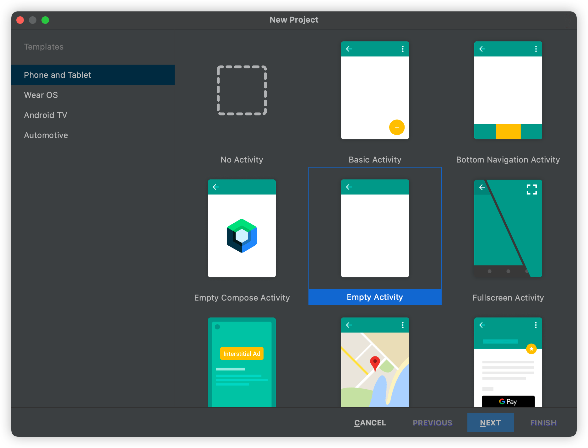
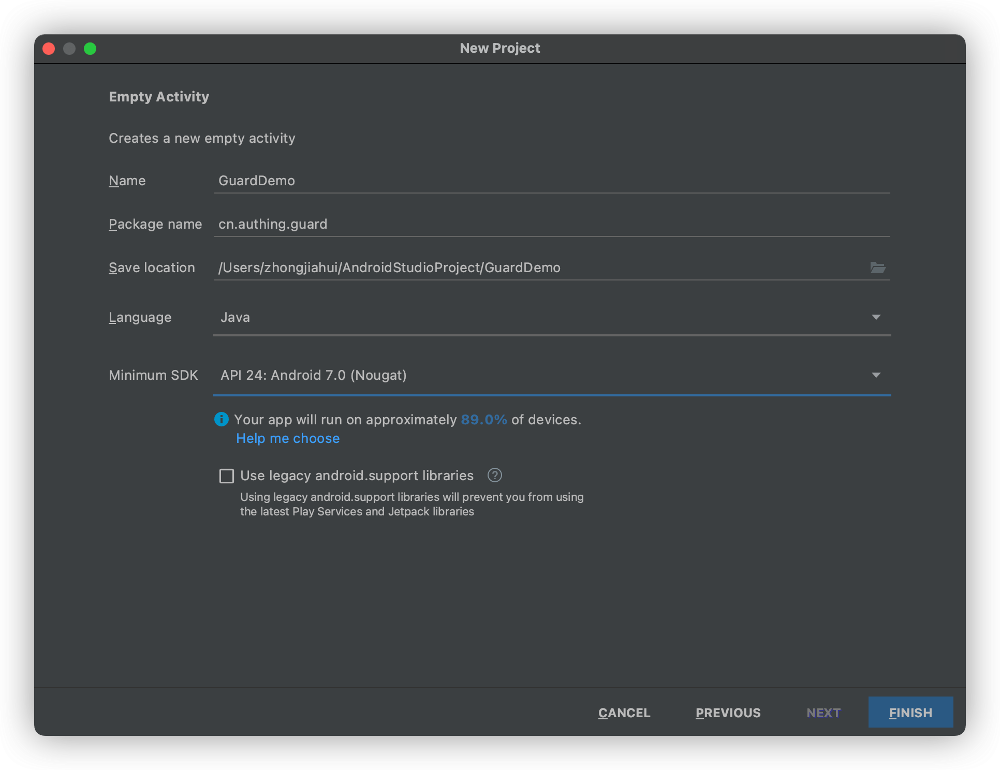

# 开始开发

<LastUpdated/>

## 第一步：新建 Android 工程





> 注意：Minimum SDK 版本 Android 7.0


## 第二步：添加 Guard 依赖

工程 build.gradle 文件里面需包含 mavenCentral

 ```groovy
 buildscript {
    repositories {
        mavenCentral()

        // other repositories
    }
 }
 ```

```groovy
implementation 'cn.authing:guard:+'
```

## 第三步：初始化

在应用启动时调用：

```java
// context is application or initial activity
// ”your_authing_app_id“ is obtained from the Authing console
Authing.init(context, "your_authing_app_id");
```


接下来，应用程序只需要 1 分钟，即可嵌入 Authing 提供的标准认证流程和界面。


<span style="background-color: #215ae5;a:link:color:#FFF;padding:8px;border-radius: 4px;"><a href="./quick.html" style="color:#FFF;">快速接入 →</a>
</span>

