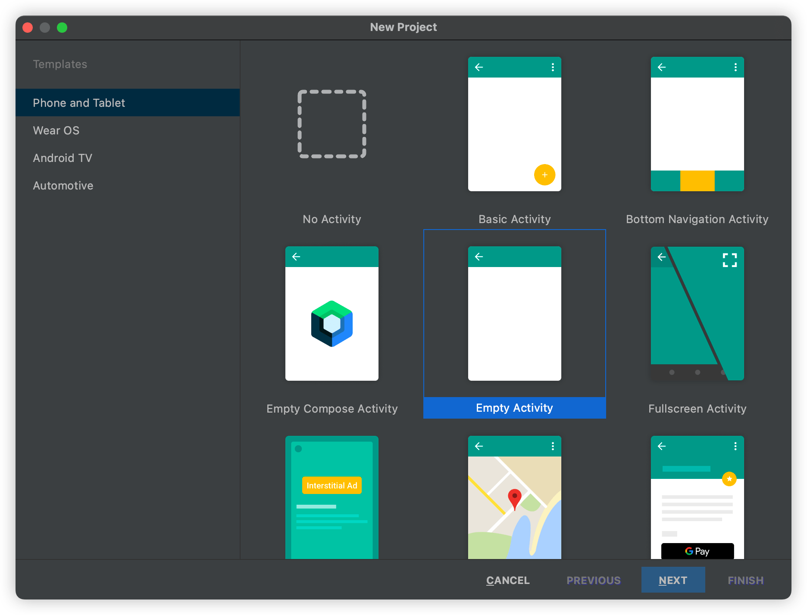
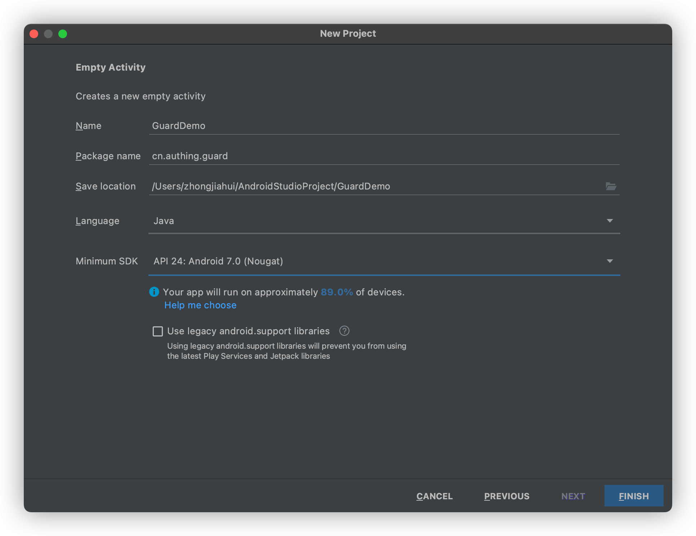

# 快速接入

<LastUpdated/>

## 第一步：新建 Android 工程





> 注意：Minimum SDK 版本 Android 7.0

## 第二步：添加 Guard 依赖

在工程根目录的 build.gradle 文件里面需包含 mavenCentral

 ```groovy
 buildscript {
    repositories {
        mavenCentral()
        // other repositories
    }
 }
 ```

在主工程的 build.gradle 文件里面添加依赖

```groovy
implementation 'cn.authing:guard:+'
```

## 第三步：初始化

在应用启动时调用：

```java
// context is application or initial activity
// ”appId“ is obtained from the Authing console
Authing.init(context, "appId");
```

> 注意：appId 是应用 ID，不是用户池 ID

## 第四步：常用操作

###  1. 注册/登录并获取用户信息

- [使用 SDK 托管页](./develop.md)
- [使用 SDK 超组件](./component/)
- [使用 SDK API](./apis/)

### 2. [第三方身份源登录](./social/)

### 3. [典型场景](./scenario/)

### 4. [私有化部署](./onpremise.md)


