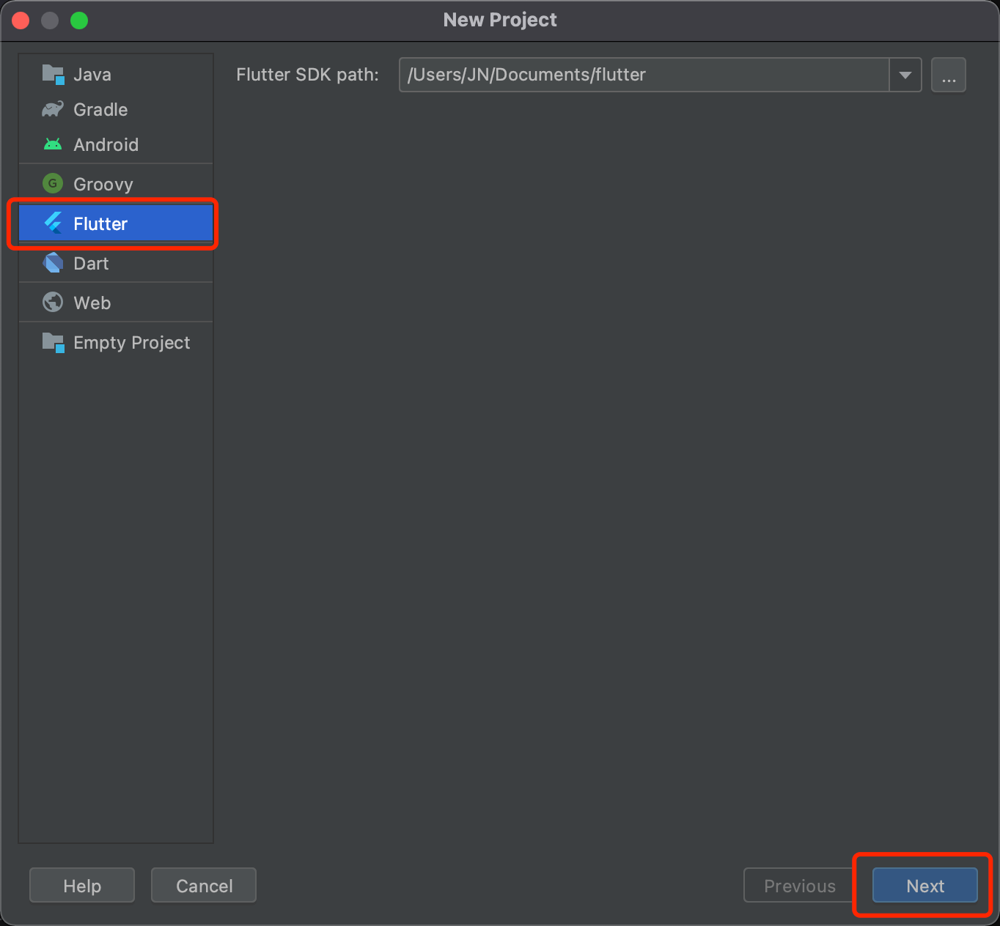
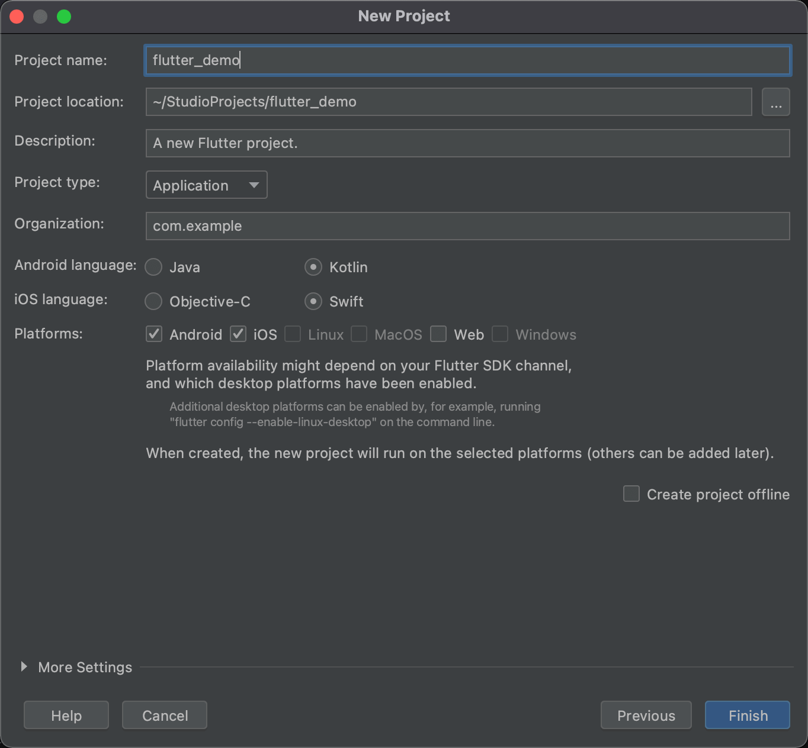

# 开始开发

<LastUpdated/>

## 第一步：新建 Flutter 工程







## 第二步：添加依赖

在工程的 pubspec.yaml 中，添加以下依赖：

```yaml
authing_sdk: ^1.0.0
```


## 第三步：初始化

App 启动时，初始化 Authing Flutter SDK

```dart
import 'package:authing_sdk/authing.dart';

Authing.init(String userPoolId, String appId)
```

`userPoolId` 为 Authing 控制台用户池 ID

 `appId` 为 Authing 控制台应用 ID