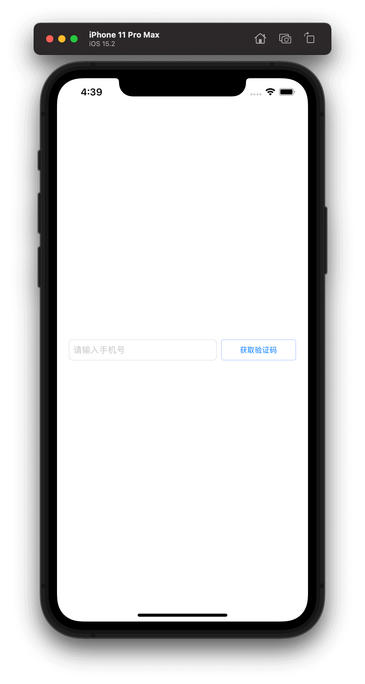
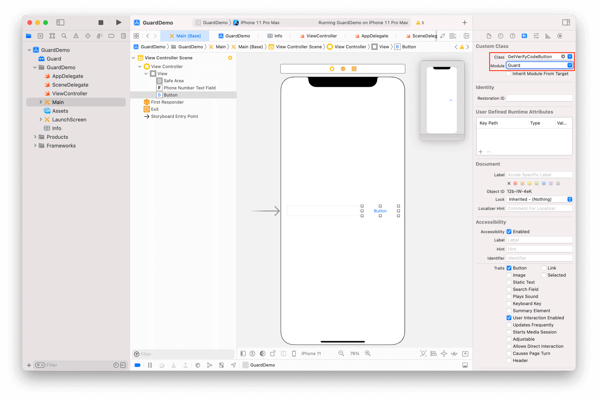

# GetEmailVerifyCodeButton

<LastUpdated/>

此组件将给指定邮箱发送验证码。邮箱获取优先级如下：

EmailTextField 内容 -> AccountTextField 内容 -> 存在于 AuthFlow 中的帐号信息

发送邮箱验证码时，此组件会处于禁用状态并自动播放加载动画

## 示例

## 属性

| 属性名          |  类型   |                            说明                            |      默认值      |
| --------------- | :-----: | :--------------------------------------------------------: | :--------------: |
| loadingColor    | UIColor |                   点击后，旋转动画的颜色                   | Authing 主题蓝色 |
| loadingLocation |   Int   | 旋转动画的位置。0 表示在文字左边旋转；1 表示在文字上方旋转 |        1         |

## 创建

放置一个 Button，并将其类型改为 GetEmailVerifyCodeButton

