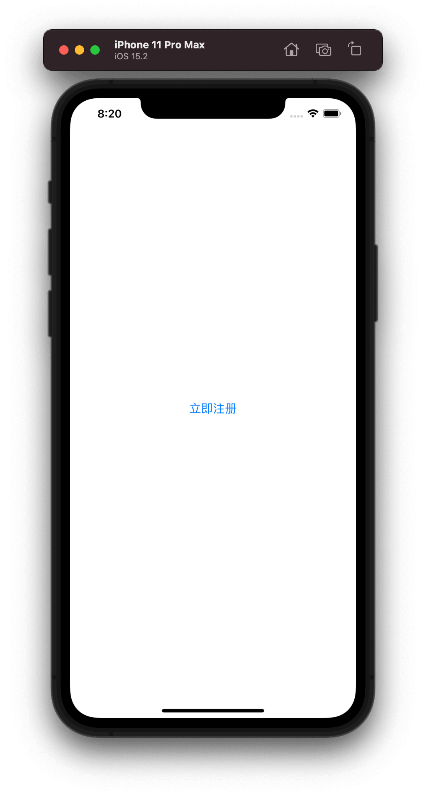
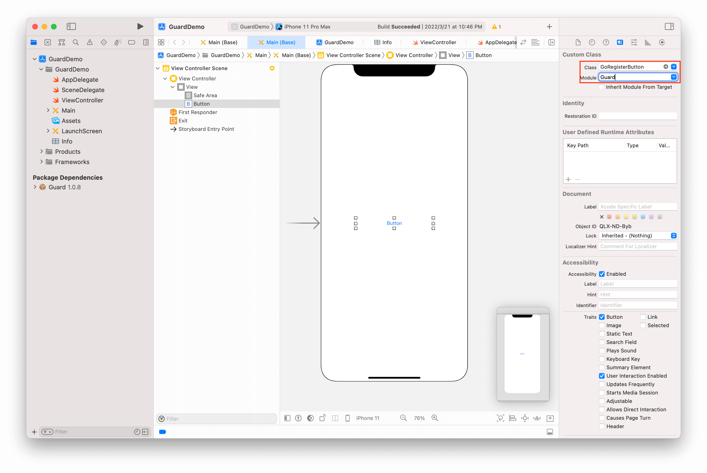
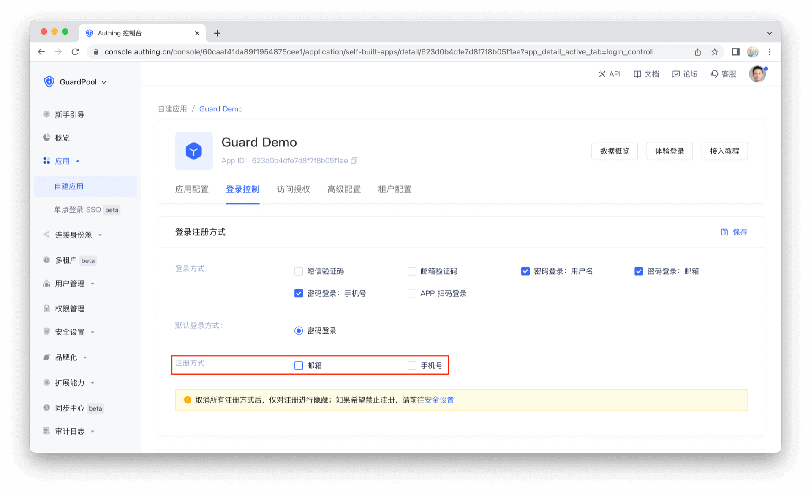

# GoRegisterButton

<LastUpdated/>

此组件提供跳转按钮的样式和国际化文本

## 示例

## 创建

放置一个 Button，并将其类型改为 GoRegisterButton

## 特性

在一些场景下，需要在页面上隐藏注册按钮。我们在控制台做如下修改：

那么该组件就能自动隐藏

> 如果使用 [快速接入](/reference/sdk-for-ios/quick.html) 方式，该组件可以自动跳转至注册页面；如果自定义了认证界面和流程，则需要手动处理点击事件
