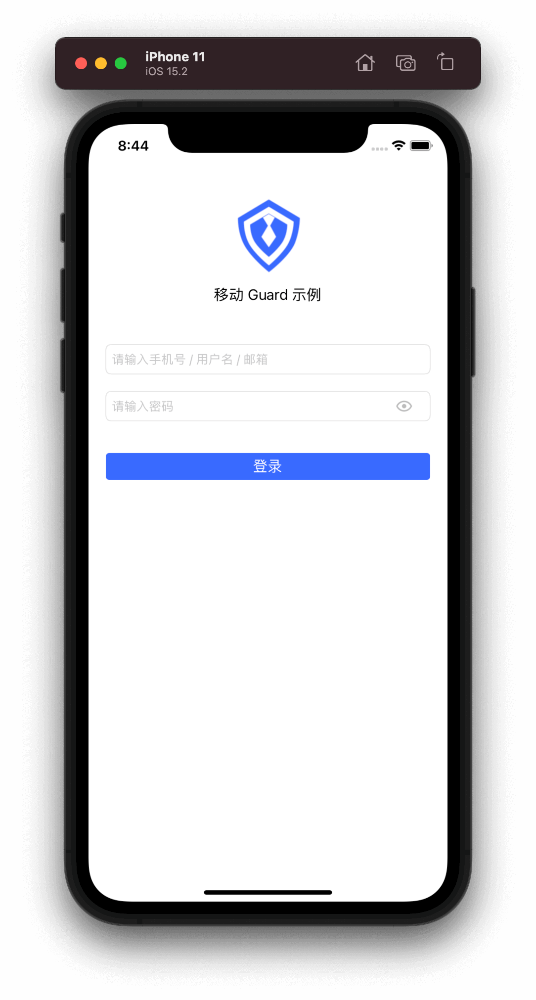
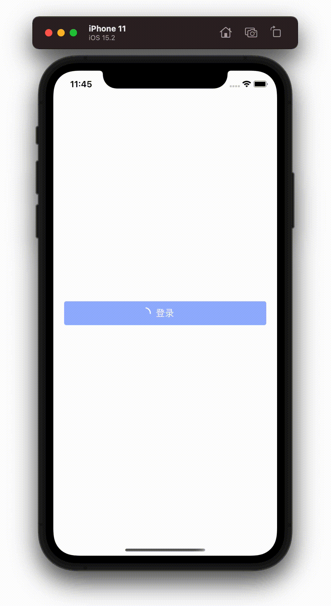
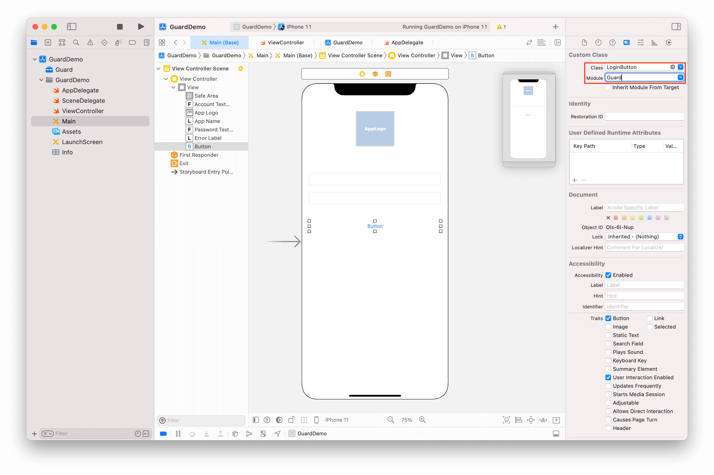

# LoginButton

<LastUpdated/>

当用户点击此组件时，它会根据当前页面的其他 Guard 组件信息来决定发起哪种认证请求。假设当前页面有 AccountTextField 和 PasswordTextField 的组合，该组件就会使用帐号密码进行登录。

## 示例

发起认证时，此组件会处于禁用状态并自动播放加载动画。

 

## 创建

放置一个 Button，并将其类型改为 LoginButton

