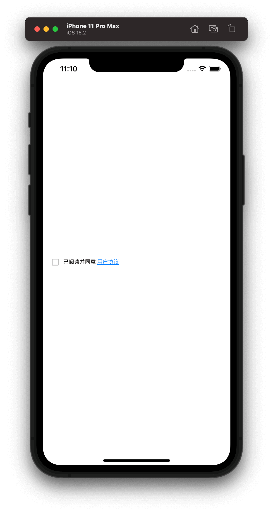
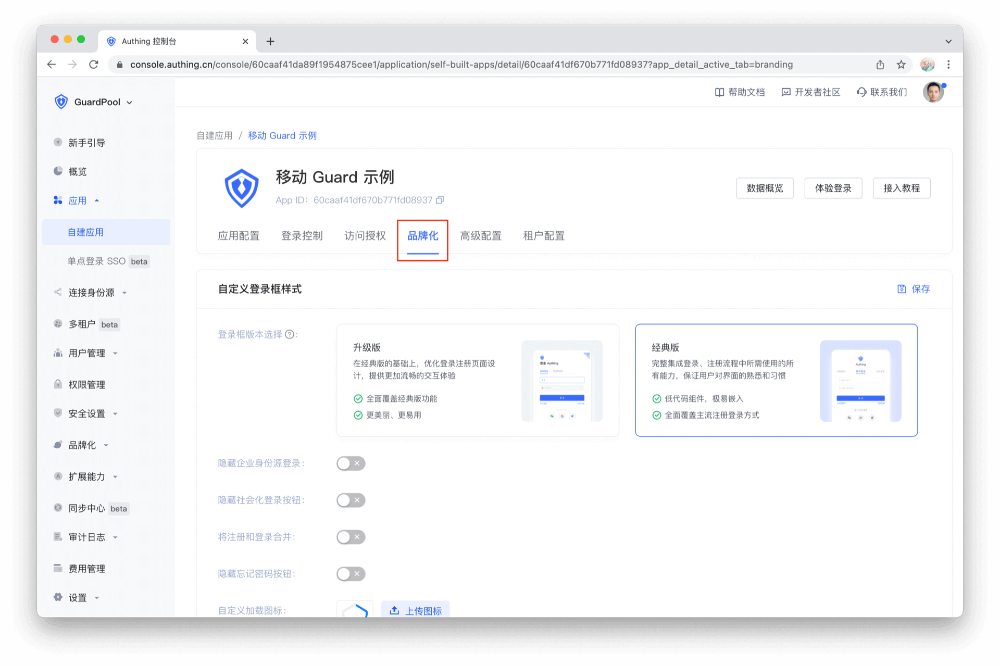
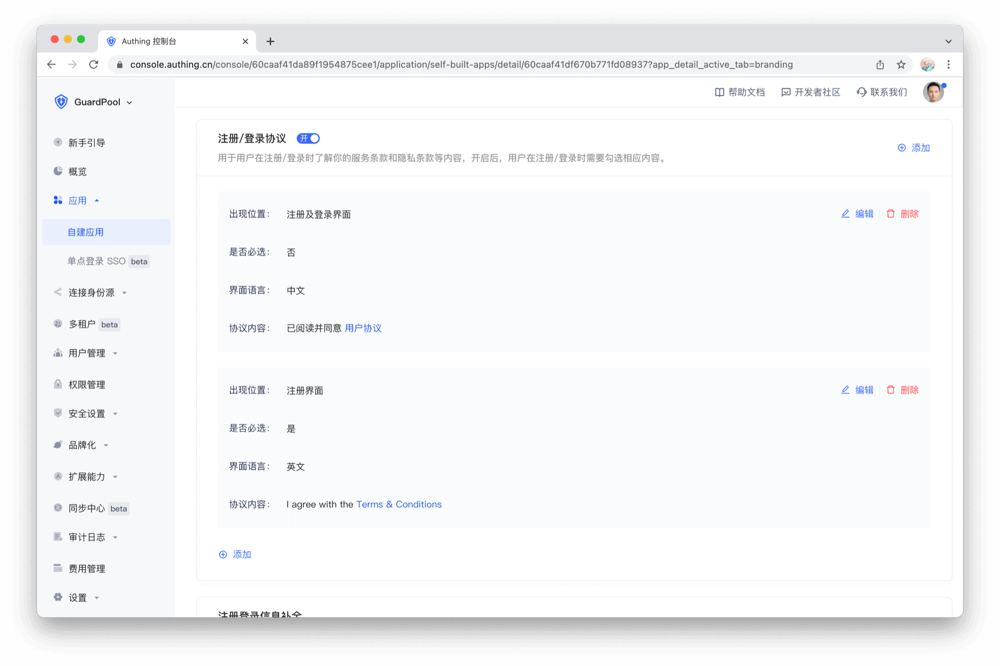
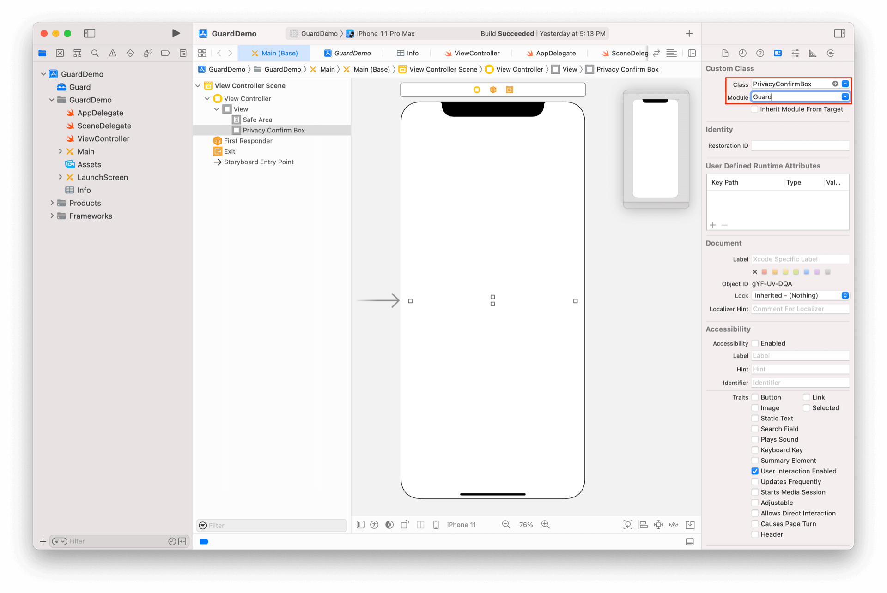

# PrivacyConfirmBox

<LastUpdated/>

此组件根据控制台设置显示隐私协议。点击协议链接，打开系统浏览器展示。

当用户点击 [登录按钮](./login-button.md) / [注册按钮](./register-button.md) 时，Guard 会在当前页面搜索隐私协议控件，并根据控制台配置以及用户是否同意隐私协议决定是否发起登录 / 注册。

即：如果控制台隐私协议设置为 `required`，且用户 `未勾选`，则不发起登录 / 注册请求。

> 字体大小、颜色均通过控制台 HTML 控制

## 示例

## 控制台设置

## 创建

放置一个 UIView，并将其类型改为 PrivacyConfirmBox

