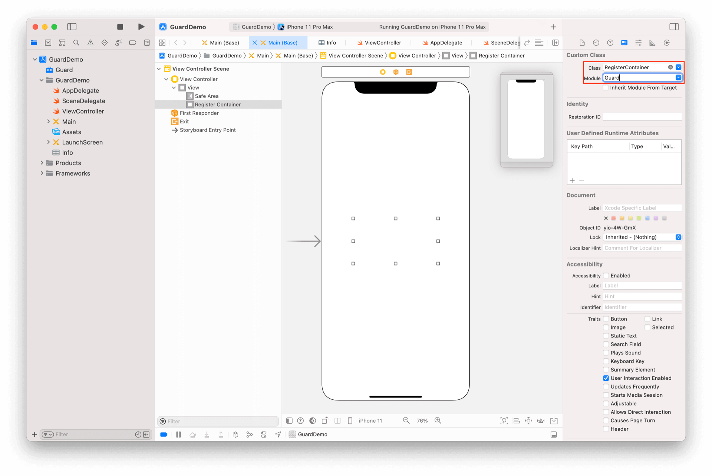

# RegisterContainer

<LastUpdated/>

此组件为辅助类型控件。我们将一组注册控件放置到 RegisterContainer 里面，并设置 RegisterContainer 类型，方便 RegisterMethodTab 完成注册方式切换。

## 属性

| 属性名                     | 类型 | 说明 | 默认值 |
| ----------------------- |:--------:| :------:| :-----: |
|  type     |    Int    |   注册方式类型。0 手机号码+验证码；1 邮箱+密码   |    0   |

## 创建

放置一个 UIView，并将其类型改为 RegisterContainer

