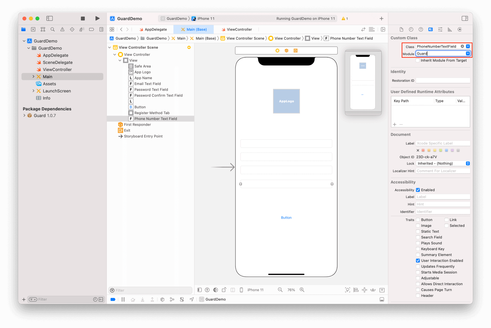
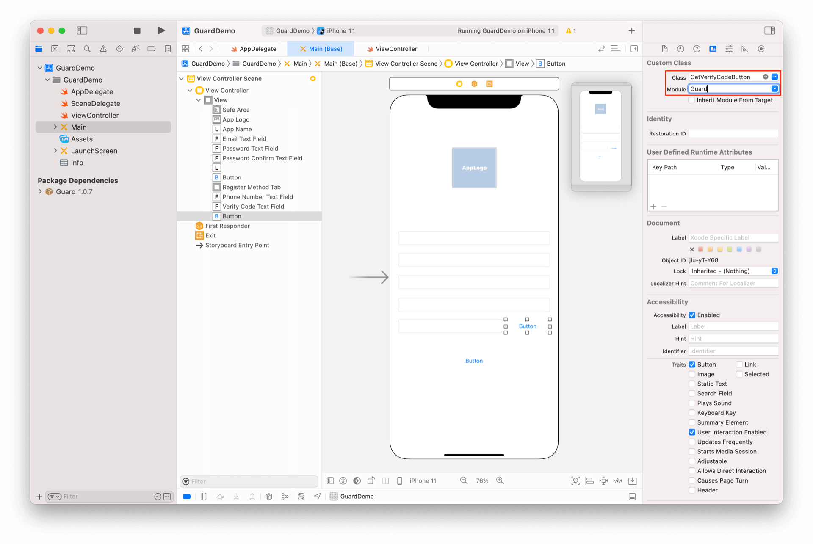
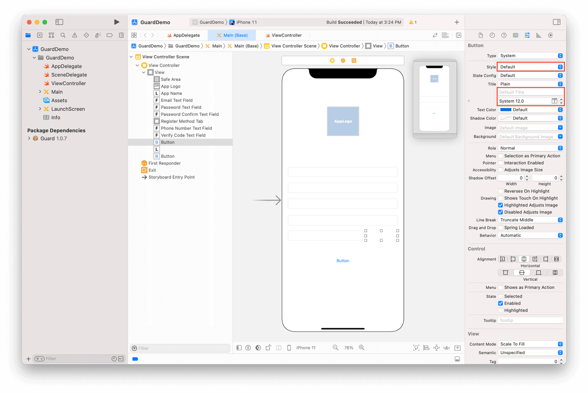
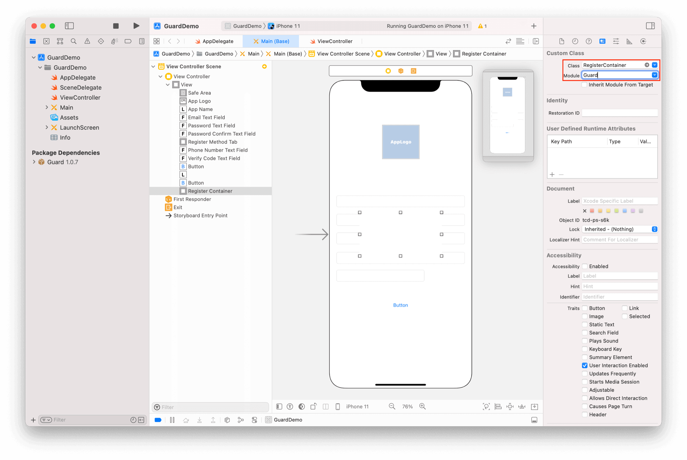
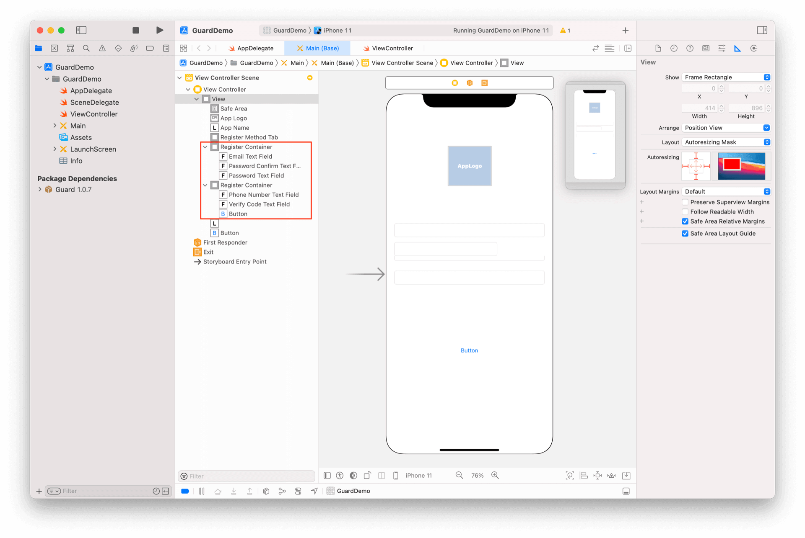
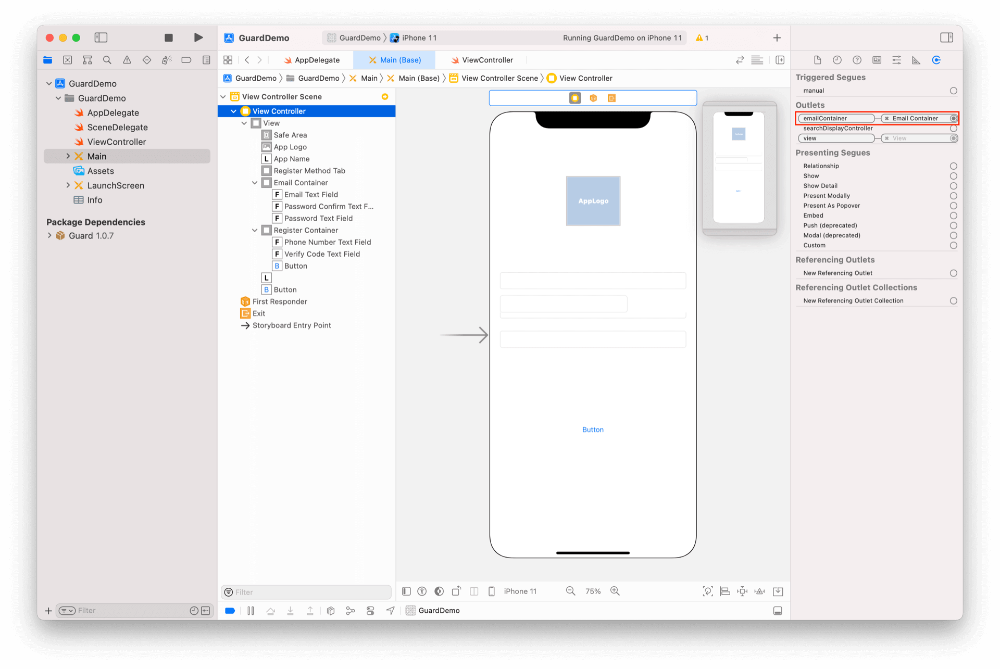

# 复杂注册示例

<LastUpdated/>

阅读此教程之前，确保已经完成了 [开发准备](/reference/sdk-for-ios/develop)

在上一个 [基础注册教程](./basic-register.md) 里面，我们构建了一个简单的注册界面，接下来我们尝试构建一个更为复杂的注册界面，它包含一个可以切换注册方式的 Tab，支持邮箱+密码注册以及电话号码+验证码注册

## 放置 RegisterMethodTab

放置一个 UIView，将其类型改为 RegisterMethodTab


RegisterMethodTab 可以用来切换注册方式，它可以根据控制台设置动态调整显示类容，更多信息请参考 [详细说明](./../basic/register-method-tab.md)

## 放置手机号+验证码登录相关组件

放置一个 TextField，将其类型改为 PhoneNumberTextField



放置一个 TextField，将其类型改为 VerifyCodeTextField


放置一个 Button，将其类型改为 GetVerifyCodeButton



iOS 默认按钮文字较大，我们修改一下 GetVerifyCodeButton 的属性，同时去掉默认的 "Button" 文字



> 更多 GetVerifyCodeButton 属性设置，请参考 [详细说明](./../basic/get-verifycode-button.md)

运行看看效果：


现在可以通过手机号+验证码成功注册！因为 Guard 内部的实现优先选择手机号+验证码的方式。

到目前为止，我们只是简单地将所有控件都放置到了界面上。接下来，我们需要将组件分组，从而实现切换效果。

## 放置 RegisterContainer 并将组件添加到容器里面

放置两个 UIView，将它们的类型改为 RegisterContainer



将 EmailTextField、PasswordTextField、PasswordConfirmTextField 放到第一个 RegisterContainer 里面。

将 PhoneNumberTextField、VerifyCodeTextField、GetVerifyCodeButton 放到第二个 RegisterContainer 里面。

调整位置和间距。可以参考下面布局：



> 小技巧: 在 IB 里面放置重叠的控件时，xcode 会修改层级关系。我们可以先把两个 RegisterContainer 放置在不同的区域，调整好大小以及内部控件位置后，将其中一个拖放至目标位置，再通过手动修改第二控件的 Y 坐标来实现重叠效果。

## 修改邮箱注册 RegisterContainer 类型

这时如果运行应用程序，会发现“邮箱注册”容器里面为空。因为 RegisterContainer 默认类型为 0，表示通过手机号码+验证码注册，因此，我们需要将邮箱注册的 RegisterContainer 的类型改为 1。首先在 ViewController 里面声明一个 @IBOutlet 成员变量

```swift
@IBOutlet weak var emailContainer: RegisterContainer?
```

然后绑定此变量



修改类型

```swift
override func viewDidLoad() {
    super.viewDidLoad()
    emailContainer?.type = 1
}
```

## 完成


