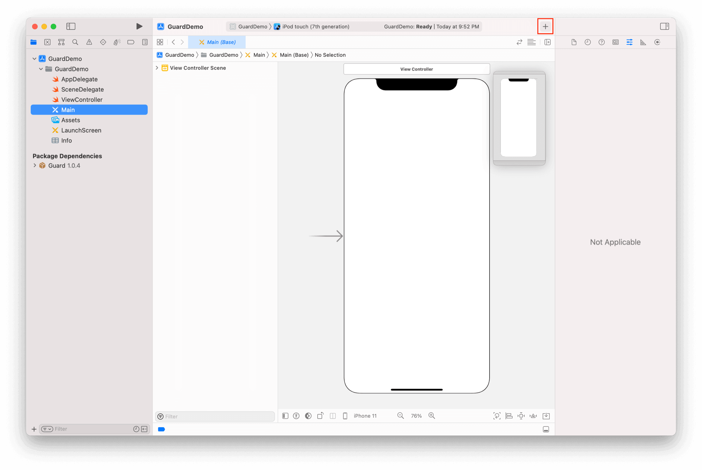
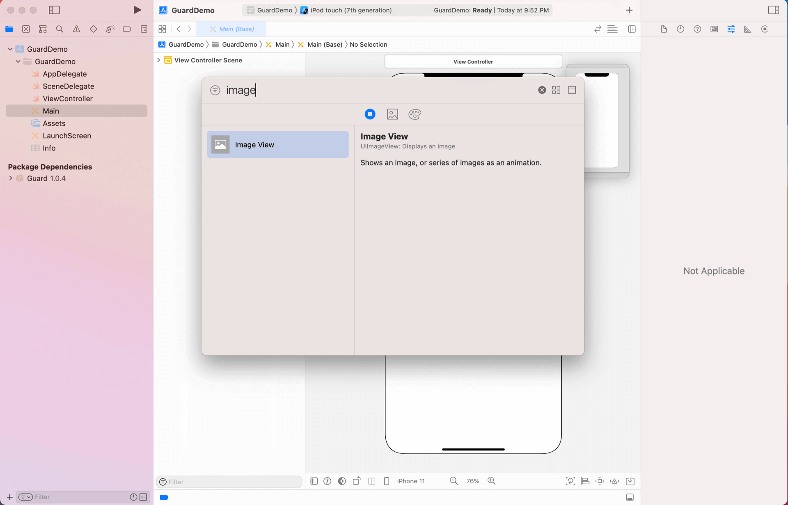
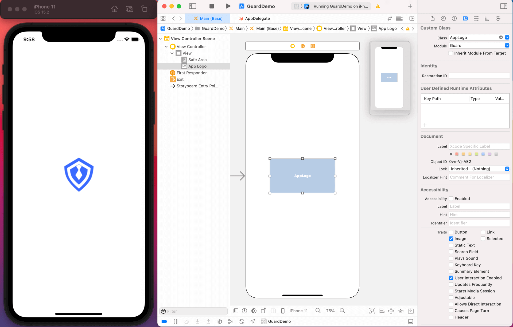
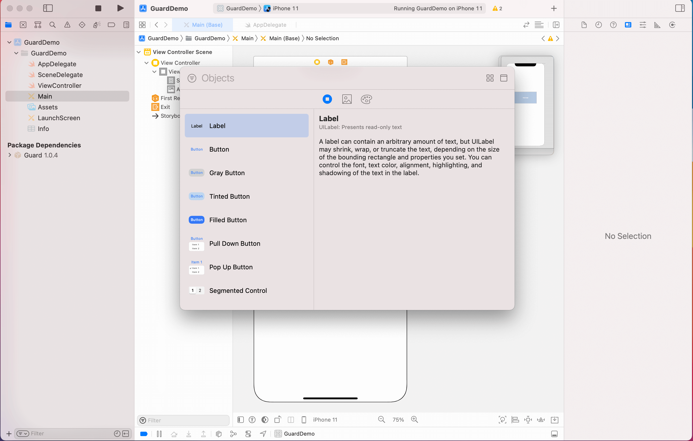
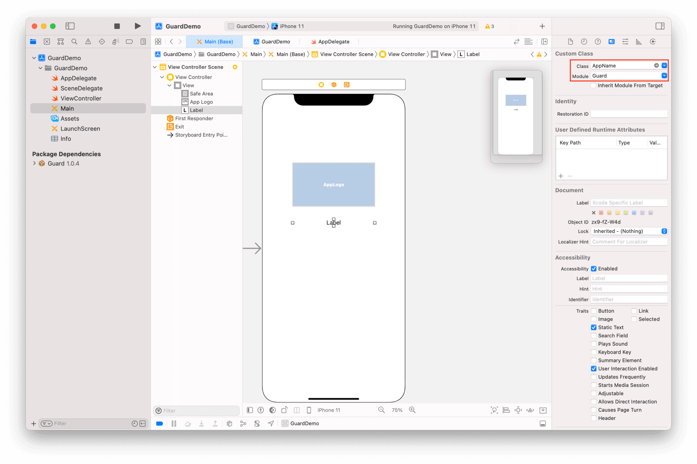
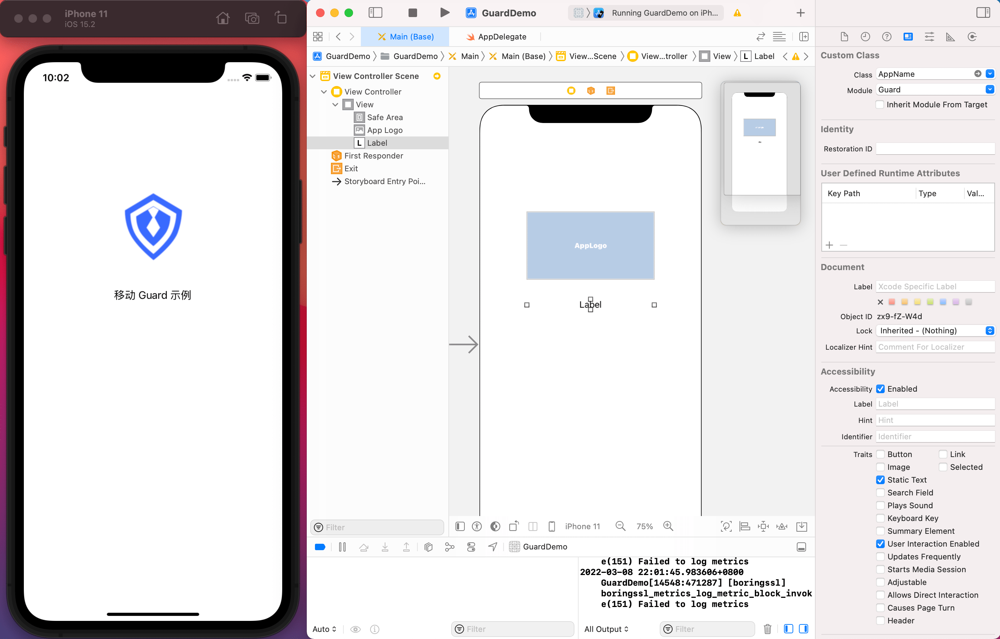

# 入门示例

<LastUpdated/>

## 放置一个 Image View

## 类型改为 AppLogo

>注意 Module 为 Guard。这是 iOS 模块化机制要求的。所有 Authing 提供的超组件都在 Guard 模块里面，后续不再赘述

## 运行看看 AppLogo 效果

## 再放置一个 Label

## 类型改为 AppName

## 完成

此教程展示了 Authing 超组件的力量，如果我们把这个思想拓展到整个认证流程的构建中，将会极大提高开发效率。

接下来，我们看一个稍微复杂一点的例子：如何通过超组件快速实现一个经典的登录界面。

 
<a href="./basic-login.html" style="color:#FFF;">基础登录示例 →</a>
