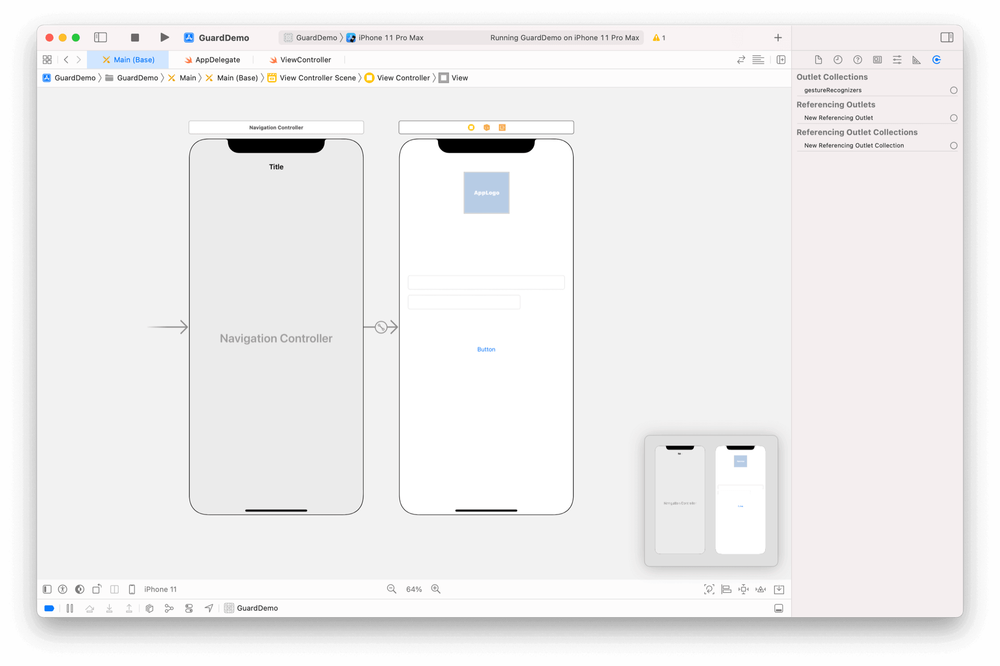
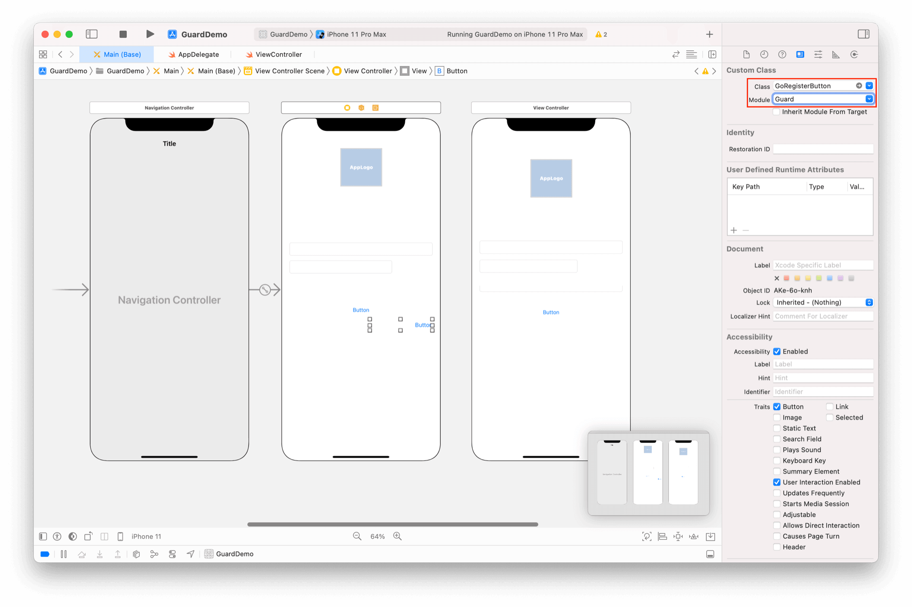
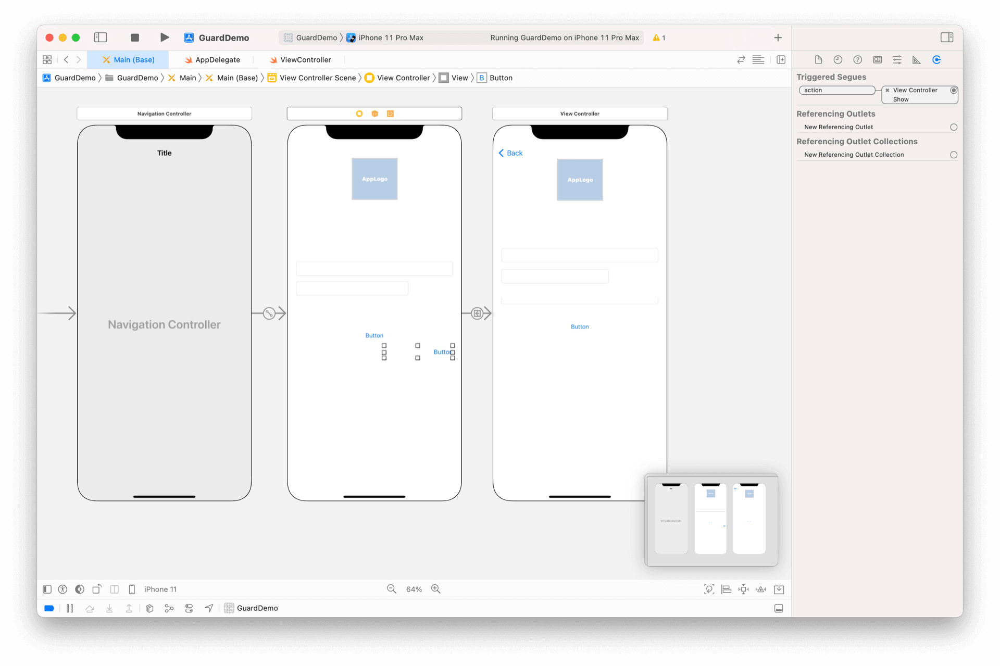

# 登录注册转场

<LastUpdated/>

阅读此教程之前，确保已经完成了 [开发准备](/reference-new/mobile/sdk-for-ios/develop)、[基础登录示例](./basic-login.md)、[基础注册示例](./basic-register.md)

## 修改入口以支持转场

我们以登录示例为基础工程，首先在入口 ViewController 前面增加 NavigationViewController



## 在 ViewController.swift 里面添加 IBOutlet
```swift
@IBOutlet weak var emailContainer: RegisterContainer?
```

## 在 viewDidLoad 里面设置类型
```swift
emailContainer?.type = 1
```

## 拷贝注册示例 ViewController

将注册示例中的 ViewController 复制粘贴过来


>由于两个控制器都是 ViewController 类型，Xcode 能自动找到 IBOutlet，无需手动设置

## 在 xib 上放置超组件

放置一个 Button，将其类型改为 GoRegisterButton



## 设置 Segue

按住 control，鼠标左键从 GoRegisterButton 拖到刚才拷贝的 ViewController 上，在弹出的对话框中选 Action Segue -> Show



## 运行


此教程使用了也许是最简单的转场方式，应用可以根据需要自行设计任意转场效果。

GoRegisterButton 除了提供默认的视觉效果以及国际化的文字，还可以根据控制台设置自动隐藏。[查看详情](./../basic/go-register-button.md)
