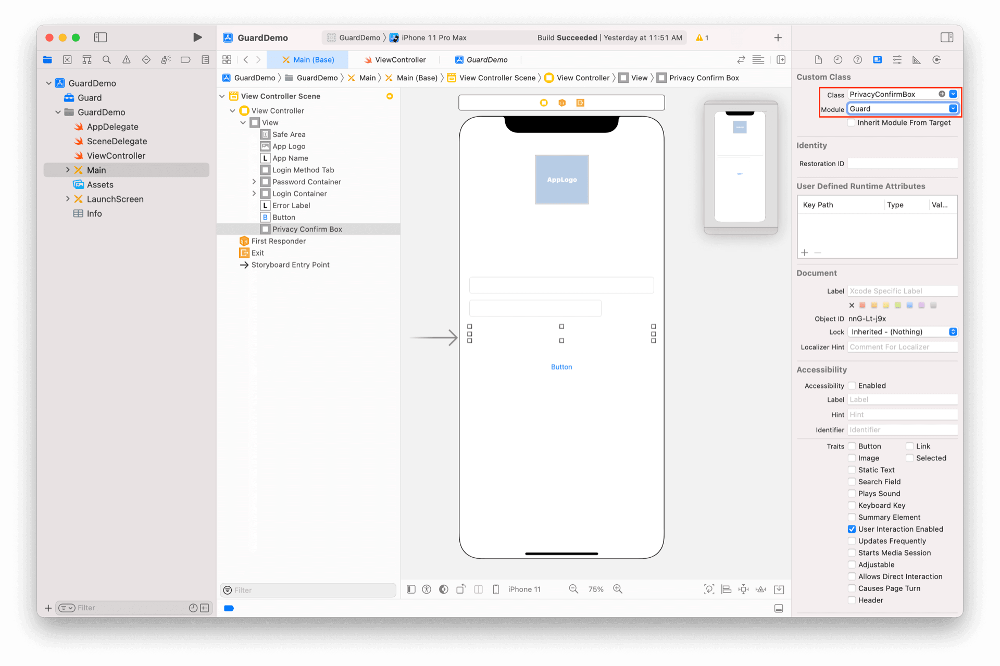

# 完善登录界面

<LastUpdated/>

阅读此教程之前，确保已经完成了 [开发准备](/reference-new/mobile/sdk-for-ios/develop)

在上一个 [复杂登录教程](./advanced-login.md) 里面，我们构建了一个功能相对完善登录界面，接下来我们再补充两个常见功能：隐私协议和社会化登录入口。

## 隐私协议

放置一个 UIView，将其类型改为 PrivacyConfirmBox

PrivacyConfirmBox 可以根据控制台设置动态调整显示类容，更多信息请参考 [详细说明](./../basic/privacy-confirm-box.md)

## 社会化登录入口

放置一个 UIView，将其类型改为 SocialLoginListView

SocialLoginListView 可以根据控制台设置动态调整显示类容，也可以手动设置社会化登录源。更多信息请参考 [详细说明](./../social/social-login-listview.md)

## 完成

此教程再次展示了 Guard 超组件的强大之处。我们仅仅 “放置” 了两个超组件即实现了隐私协议和社会化登录源。