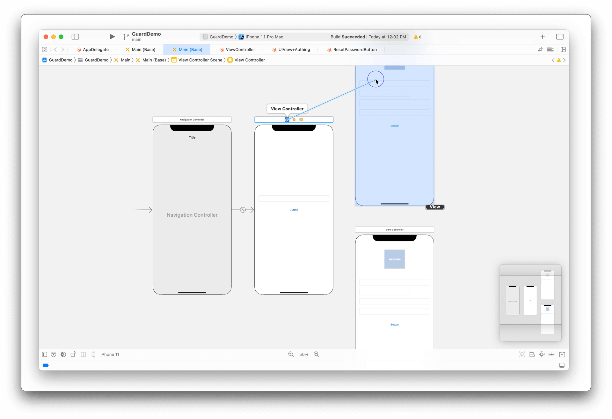
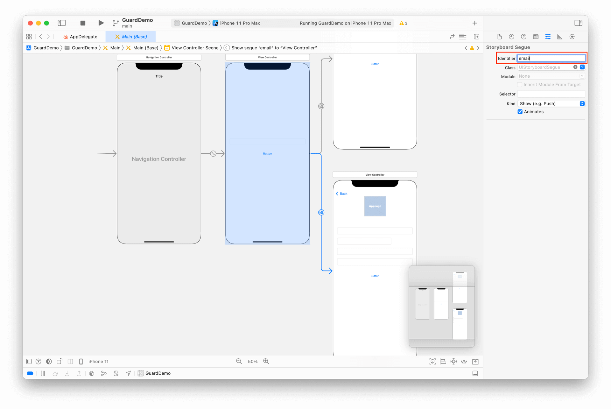

# 动态重置密码

<LastUpdated/>

阅读此教程之前，确保已经完成了 [开发准备](/reference-new/mobile/sdk-for-ios/develop)、[手机号码重置密码](./reset-password-by-phone.md)、[邮箱地址重置密码](./reset-password-by-email.md)

为了方便用户使用，我们设计一个稍微复杂一点的重置密码流程。我们将根据用户的输入动态决定采用哪种方式重置密码。即：

* 如果用户输入了电话号码，则跳转到手机号码重置密码界面
* 如果用户输入了邮箱地址，则跳转到邮箱地址重置密码界面

## 界面设计

新增一个导航入口页面，放置 AccountTextField、ResetPasswordButton，如下图：


将前面两个教程的 ViewController 拷贝过来，如下图：


## 设置 Segue

设置 ViewController 之间的 Segue 为 Show



设置入口页面到手机号码重置密码页面 Segue 的 Identifier 为 phone


同理，再设置入口页面到邮箱地址重置密码页面 Segue 的 Identifier 为 email



## 设置回调

```swift
import Guard
if let button: ResetPasswordButton = Util.findView(view, viewClass: ResetPasswordButton.self) {
    button.setAuthCompletion { code, message, userInfo in
        if (code == 200) {
            
        }
    }
}
```

## 完成

重置密码的流程和界面就开发完了，可以根据用户的输入跳转到不同的页面，入口页面的帐号信息也会被带入到二级页面。

这是一个业务功能相对复杂的例子，通过 Guard 超组件，我们完成了快速构建。