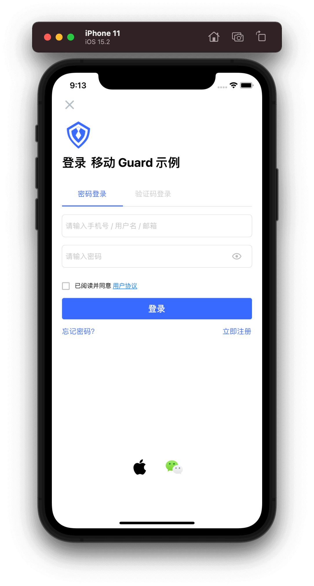

# 托管页

<LastUpdated/>

通过 Authing 提供的标准认证流程和界面，应用程序可以 1 分钟完成接入。

首先确保已经完成了 [开发准备工作](./develop.md)，然后在需要认证的地方调用：

```swift
import Guard
AuthFlow().start { [weak self] code, message, userInfo in
    if code == 200 {
        // userInfo 为用户信息
    }
}
```

效果如下：


