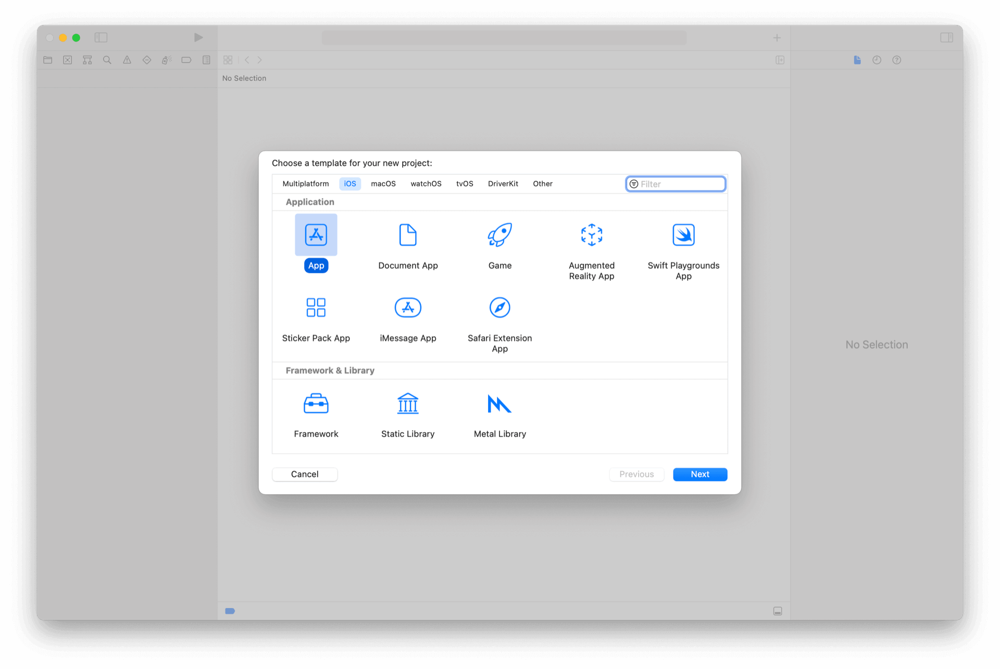
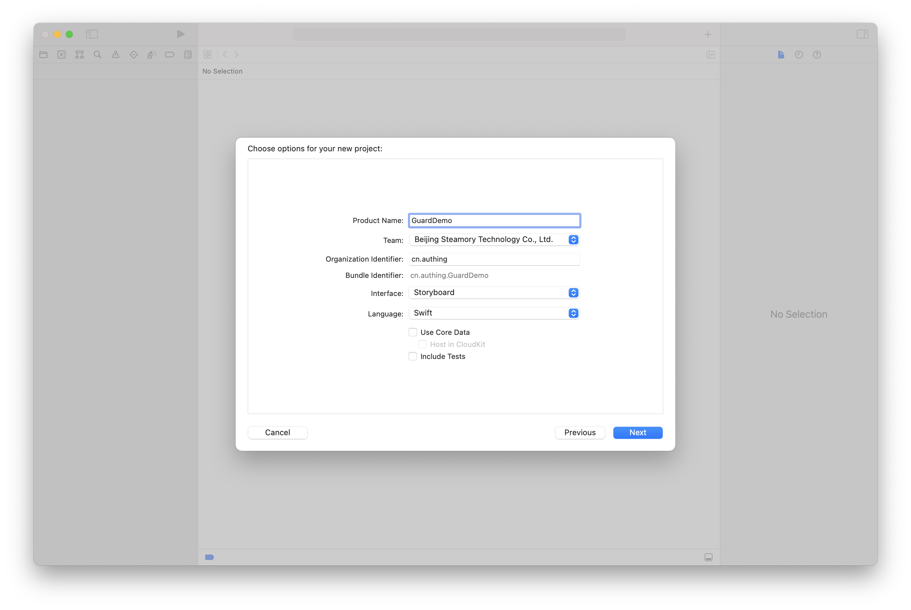
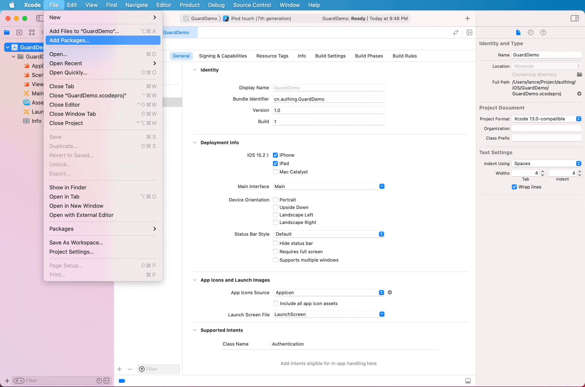
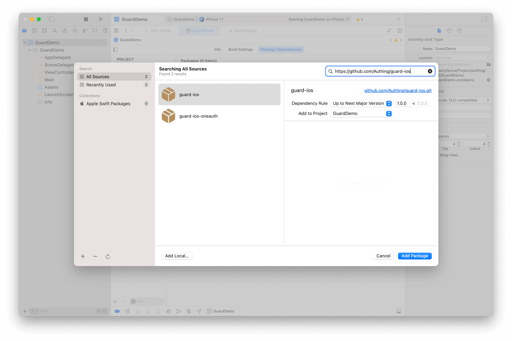
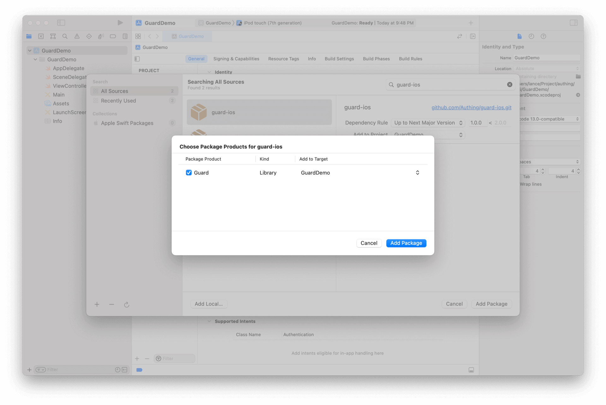
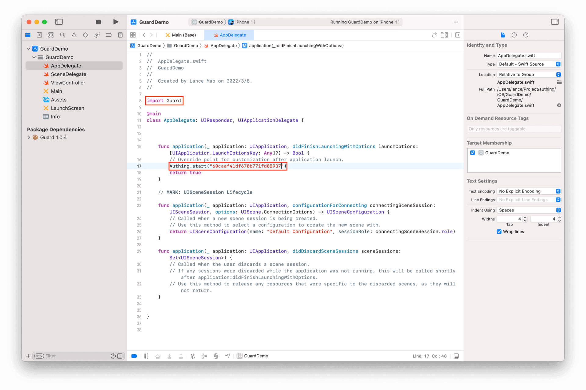

# 快速开始

<LastUpdated/>

## 1. 新建 iOS Swift 工程

## 2. 添加 Guard 依赖

在 Xcode 菜单栏右上角选择 *File* 点击 *Add Packages*

在 Swift Package 搜索栏输入：https://github.com/Authing/guard-ios

依赖规则选择 *Up to Next Major Version 1.0.0*

## 3. 初始化

红色部分是需要改动的地方

## 4. 常用操作

### a. 注册/登录并获取用户信息

- [使用 SDK 托管页](./develop.md)
- [使用 SDK 超组件](./component/)
- [使用 SDK API](./apis/)

### b. [第三方身份源登录](./social/)

### c. [典型场景](./scenario/)

### d. [私有化部署](./onpremise.md)
