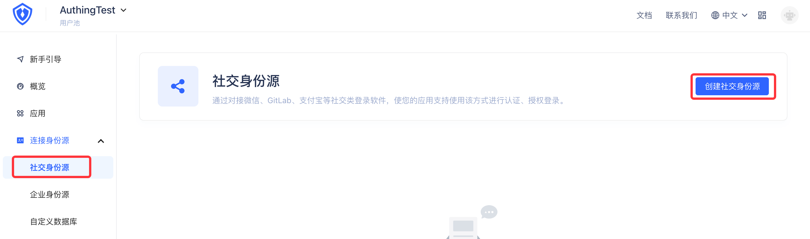
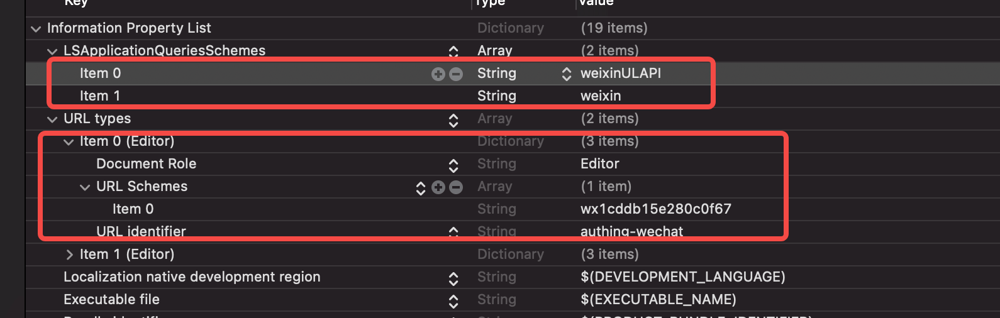
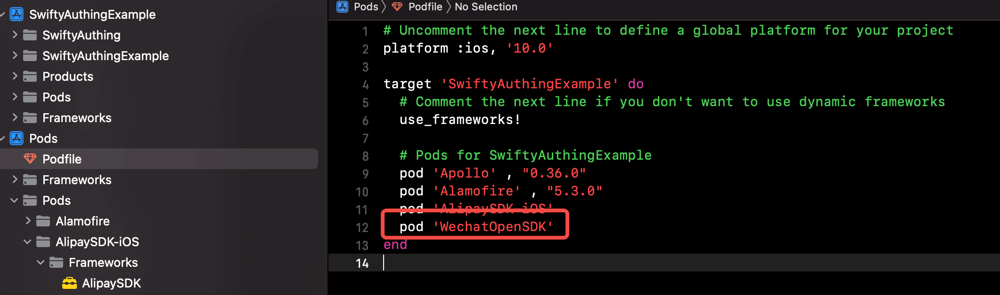

# 微信社会化登录

<LastUpdated/>

- **基础设置-后台**

微信社会化登录同支付宝登录一样，需要在登录 https://console.authing.cn/  后开启功能：



进入创建社交身份源页面后，选择微信移动端选项后，进入微信移动端登录配置页面：


输入从微信开放平台 https://open.weixin.qq.com/ 获取的配置 **AppID** 和 **AppSecret** 后，完成微笑移动端登录 Authing 的关联注册。

- **基础设置-工程**



在接入工程中，找到 Info.plist 文件：增加 **URL types** -> **URL Schemes** -> **Item 0**（如果有 item 0 ，那么新增的就是 Item 1，序号依次顺延），设置 **Item 0** 的 Value 为：**wx1cddb15e280c0f67**，**URL identifier** 为 **authing-wechat**。

同时，增加 **LSApplicationQueriesSchemes** （Array 类型）-> **Item 0** 和 **Item 1**，值分别为 **weixinULAPI** 和 **weixin**。

- **基础设置- Podfile**

在工程的 Podfile 中，增加 **pod 'WechatOpenSDK'** 导入。



 完成后，在项目 podfile 根目录下用 Cocoapods **pod install** 命令后，完成开发环境的基础设置和更新。

- **示例**

```swift
AuthenticationClient.shared.loginByWeChatCodeWithResult(code: code, completion: { result in })
```
