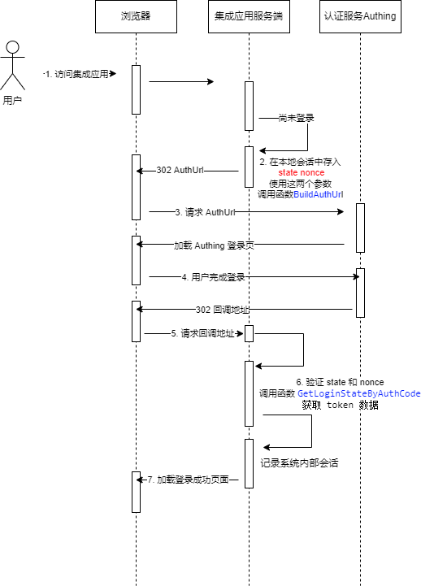

# 认证模块

<LastUpdated/>

## 登录流程

golang SDK 中使用 OIDC 协议的[授权码模式](https://docs.authing.cn/v2/concepts/oidc/choose-flow.html#%E6%8E%88%E6%9D%83%E7%A0%81%E6%A8%A1%E5%BC%8F)进行认证，其使用的时序图如下：



**图 1.1 授权时序图**

## 2. API

> 授权 API 和 管理 API 是同一个 go module，所以通过 `go get -u github.com/Authing/authing-golang-sdk` 安装后可以同时使用管理 API 和 授权 API 。

### 2.1 初始化授权客户端

```go
import (
	"github.com/Authing/authing-golang-sdk/authentication"
)
var authClient *authentication.Client
var err error
authClient, err =  authentication.NewClient(&authentication.AuthenticationClientOptions{
    AppId:       "应用ID",
    AppSecret:   "应用密钥",
    Domain:      "应用域名",
    RedirectUri: "授权回调地址",
    LogoutRedirectUri: "登出回调地址"
    Scope: "令牌具备的资源权限（应用侧向 Authing 请求的权限），以空格分隔"
})
```

其中 AppId AppSecret Domain RedirectUri 是必选参数，LogoutRedirectUri Scope 是可选参数。

Scope 以空格分隔，默认为 `openid profile`，常见 scope 如下：

| 名称           | 说明                                                                    | 必选 |
| -------------- | ----------------------------------------------------------------------- | ---- |
| openid         | OIDC 专用 scope                                                         | 是   |
| profile        | 用户信息                                                                | 否   |
| offline_access | 获取用户的 Refresh Token，可用于调用 refreshLoginState 刷新用户的登录态 | 否   |

更多 scope 定义参见 Authing 相关[文档](https://docs.authing.cn/v2/concepts/oidc-common-questions.html#scope-%E5%8F%82%E6%95%B0%E5%AF%B9%E5%BA%94%E7%9A%84%E7%94%A8%E6%88%B7%E4%BF%A1%E6%81%AF)。

### 2.2 生成授权地址

```go
result, err = authClient.BuildAuthUrl(&authentication.AuthURLParams{
    State: "请求端生成的上下文数据，可以为空，用户防止跨站攻击",
    Scope: "scope参数，可以为空，为空则使用 NewClient 函数中的 Scope 参数",
    Nonce: "请求端生成的上下文数据，可以为空，会在回调返回的 IDToken 中包含此参数",
    RedirectUri: "回调地址，可以为空，默认使用 NewClient 函数中的 RedirectUri 参数",
    Forced: false,//是否强制重新登录，如果为true，Authing将强制用户重新登录,默认为false
})
```

`State` 参数用于记录请求的上下文数据（比如说请求来源、请求设备类型等），由请求端生成，并存储在本地会话中。Authing 在 **图 1.1** 中的第 5 步进行回调时会回传此参数。

`Nonce` 参数由请求端生成，并存储到本地会话，如果传递此参数，Authing 在 **图 1.1** 中的第 5 步进行回调时会将此参数作为 IDToken 的属性返回，请求端在调用 **函数 2.3** 时内部对其进行比对，用来验证当前的 IDToken 是否由当前登录请求触发生成的。

### 2.3 通过 code 换取 token

```go
var loginState *authentication.LoginState
var err error
loginState, err = authClient.GetLoginStateByAuthCode(&authentication.CodeToTokenParams{
    Code: code,
    RedirectUri:"默认为空，如果在函数BuildAuthUrl中使用了自定义回调地址，则需要和调用BuildAuthUrl时传递的保持一致",
    Nonce: "默认为空，如果在调用函数BuildAuthUrl时传递了 Nonce，则需要传递此参数"
})
```

鉴权成功后，会在**图 1.1** 中的第 5 步触发回调，在回调 URL 中会包含以下参数

- code 必传参数，根据这个值来调用函数 `GetLoginStateByAuthCode`

- state 可选参数，在生成授权地址时包含 state 参数才会返回，如果客户端生成授权时传递了此参数，需要从会话中将其读取出并将两者做比对

- nonce 可选参数，如果在生成授权地址时包含 nonce 参数才会返回。如果生成授权地址时传递了 nonce，则此时需要从会话中将其取出，传递到 `GetLoginStateByAuthCode`函数中，`GetLoginStateByAuthCode` 函数内部会将其和返回的 `IDToken` 中的 `Nonce` 字段做比对，如果两者不相等则返回错误。

返回的 `authentication.LoginState` 包含以下参数

| 字段名            | 类型                | 说明                              |
| ----------------- | ------------------- | --------------------------------- |
| AccessToken       | string              | access token 的 base64 格式字符串 |
| IDToken           | string              | id token 的 base64 字符串         |
| RefreshToken      | string              |                                   |
| ExpiresIn         | uint64              | 多长时间后失效，单位为秒          |
| ExpireAt          | time                | 失效时间                          |
| ParsedIDToken     | \*IDTokenClaims     | 解析后的 id token 结构体          |
| ParsedAccessToken | \*AccessTokenClaims | 解析后的 access token 结构体      |

注意 id token 中包含用户字段，字段定义参见 Authing [文档](https://docs.authing.cn/v2/concepts/oidc-common-questions.html#oidc-%E7%94%A8%E6%88%B7%E4%BF%A1%E6%81%AF%E5%AD%97%E6%AE%B5%E5%90%AB%E4%B9%89) 。

### 2.4 根据 access token 换取用户信息

```go
var info *authentication.UserInfo
var err error
info, err = authClient.GetUserInfo(accessTokenStr)
```

通过 **函数 2.3** 中换取完 token 后，不需要再调用此函数，因为 `authentication.LoginState` 中的 IdToken 参数包含完整的用户信息字段。

如果应用接入方通过前端函数直接获取 access token，而不是不通过 **图 1.1** 的流程进行登录的话，才有必要调用此函数。

### 2.5 根据 refresh token 换取新的 token

```go
refreshToken := "refresh token 的字符串"
var loginState *authentication.LoginState
var err error
tokens, err = clientAuth.RefreshLoginState(refreshToken)
```

如果应用接入方在登录成功后记录的会话信息小于等于 `LoginState` 的 `ExpiresIn` 属性值，则没有必要调用此函数。否则应用接入方会话比 token 的时间长，则有必要在 token 到期前，通过 refresh token 重新获取一遍新的 token。

注意如果想使用这个函数必须在 **函数 2.2** 或者 **函数 2.1** 中在 scope 参数中包含 `offline_access`，否则在 **函数 2.3** 中得到的返回数据中不会包含 RefreshToken 字段。

### 2.6 构建退出登录 URL

```go
url, err := clientAuth.BuildLogoutUrl(&LogoutURLParams{
    IDTokenHint: "登录成功后得到的 id token",
    RedirectUri: "退出回调 URL",
    State: "可选参数，为上下文数据，其使用方法和函数 2.2 的 State 参数相同"
})
```

RedirectUri 可以为空，如果为空则会读取函数 2.1 中传递的 LogoutRedirectUri 参数

如果传递了 RedirectUri ， 则必须同时传递 IDTokenHint 参数，否则调用此函数将会报错。

## 示例项目

https://github.com/Authing/golang-sdk-auth-demo
