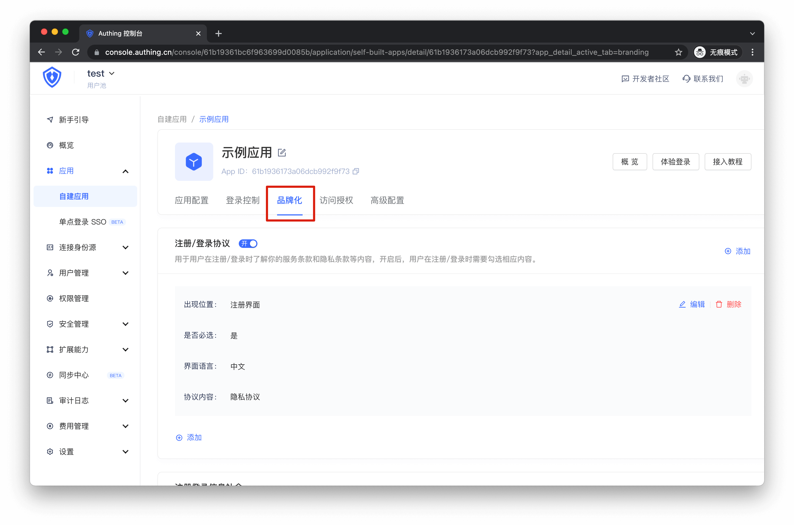
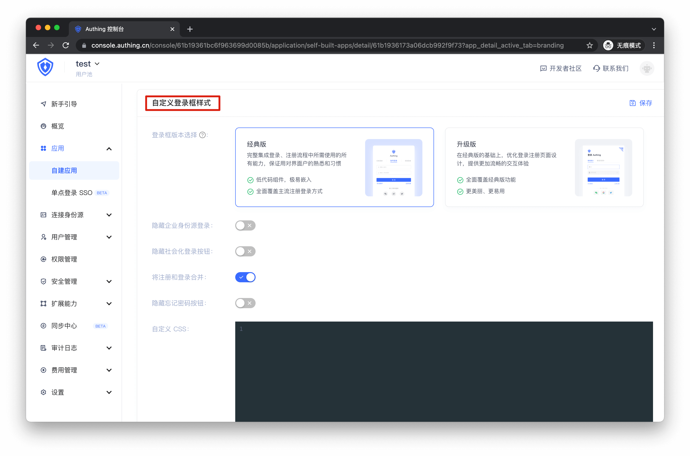
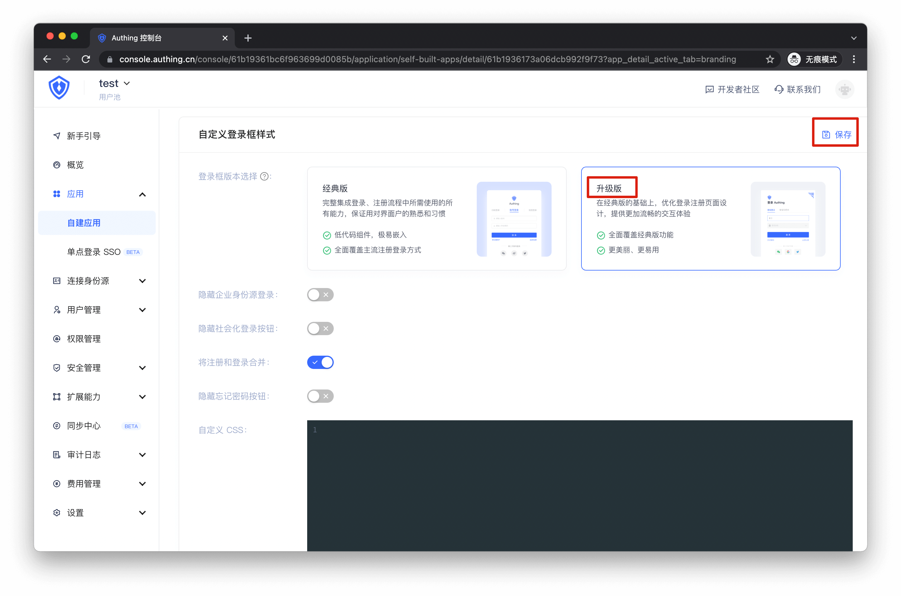

# 如何切换至新版 Guard

<LastUpdated />

Authing Web 端 Guard 3.0 版本已于 2021.12.31 正式上线，关于本次更新主要涉及嵌入式 Guard 组件的 MFA、登录安全策略、自定义 CSS 以及登录注册协议相关功能的实现，同时对嵌入式和托管式 Guard 登录框的 UI 进行了全面翻新。

关于本次更新的详细内容请查看：[从 Guard V1 迁移](/reference/guard/migration.md)

为了避免你的用户对突然的登录界面变化感到陌生，Guard 3.0 上线后并不会直接覆盖你目前使用版本的登录框。
你可以依照如下的步骤，在控制台开启新版登录框的使用体验：

## 自建应用

### 01 进入「品牌化」配置区

### 02 进入「自定义登录框样式」配置区

### 03 将登录框版本切换至「升级版」

在切换版本时，系统会提示切换版本后 CSS 配置项可能会有不适配的风险，你可以根据自己的实际情况进行评估。
切换后，点击功能区右上角「保存」按钮即可完成你的 Guard 版本切换。

## 单点登录 SSO

对于单点登录 SSO 应用的登录面板配置，你可以在「单点登录 SSO 」面板的「配置」功能区下，依照相同方式进行登录框样式的切换。
