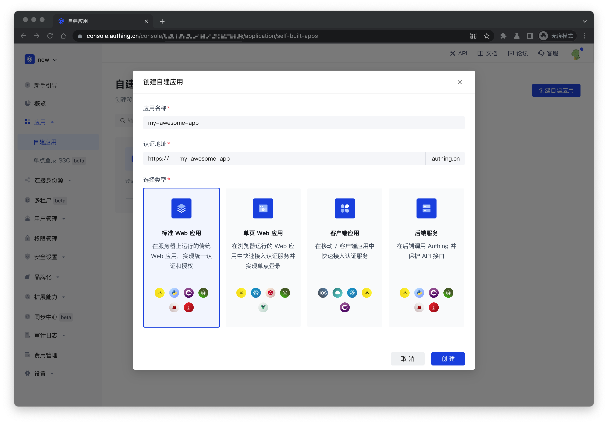

# 将 Guard 接入到 React 项目

<LastUpdated/>

Guard 是 Authing 提供的一种轻便的认证组件，你可以把它嵌入在你任何的单页 Web 应用中，一站式处理复杂的用户认证流程。

准备好你的 React 项目，跟随引导将 Authing Guard 接入到你的 React 项目中吧！

### 开始前的准备

npm：[@authing/react-ui-components](https://www.npmjs.com/package/@authing/react-ui-components)

React 版本：React 16/17

npm：[@authing/react18-ui-components](https://www.npmjs.com/package/@authing/react18-ui-components)

React 版本：React 18

## STEP 1: 在 Authing 控制台创建应用

**首先，你需要将你的应用接入 Authing 控制台**。如果你还没有创建，请先[在 Authing 控制台创建一个应用](/guides/app-new/create-app/create-app.md)。

在 Authing 控制台左侧导航进入「自建应用」功能区，点击右上角的**创建自建应用**按钮，填入以下信息：

- 应用名称: 你的应用名称；
- 认证地址: 选择一个二级域名，必须为合法的域名格式，例如 `my-awesome-app`；



创建完成！接下来你将正式开始 Authing Guard (React) 的接入和配置。

## STEP 2: 安装和初始化

有两种方式可以供你选择：**「安装 Authing library」** 或 **「直接通过浏览器加载」**。

无论使用哪一种安装方式，你都需要用到应用的 `appid` ，请先 [前往控制台获取](https://console.authing.cn)。关于 **APP ID** 所在位置，请参阅 [应用配置](https://docs.authing.cn/v2/guides/app-new/create-app/app-configuration.html)。

### 方法一：安装 Authing library

**首先，通过 npm/yarn/cnpm 安装 Authing library.**

推荐使用 npm （稳定版本 v3.1.21）或 yarn，它们能更好的和 [webpack](https://webpack.js.org/) 打包工具进行配合，也可放心地在生产环境打包部署使用，享受整个生态圈和工具链带来的诸多好处。
如果你的网络环境不佳，也可使用 [cnpm](https://github.com/cnpm/cnpm) 。

运行下列命令行安装 Authing React.JS library：

```sh
# React 16/17
$ yarn add @authing/react-ui-components
# OR
$ npm install @authing/react-ui-components --save

# React 18
$ yarn add @authing/react18-ui-components
# OR
$ npm install @authing/react18-ui-components --save
```

**然后，在你的 React 应用中完成配置：**

```js
// React 16/17
import ReactDOM from "react-dom";
import { Guard } from "@authing/react-ui-components";
// 引入 css 文件
import "@authing/react-ui-components/lib/index.min.css";

// React 18
// import { createRoot } from 'react-dom/client'
// import { Guard } from "@authing/react18-ui-components";
// import "@authing/react18-ui-components/lib/index.min.css";

import React from "react";

const App = () => {
  // 替换你的 AppId
  const appId = "your_appId_at_authing_console";

  const onLogin = (userInfo) => {
    console.log(userInfo);
  };

  return <Guard appId={appId} onLogin={onLogin} />;
};

// React 16/17
ReactDOM.render(<App />, document.getElementById("root"));

// React 18
// createRoot(document.getElementById('root')).render(<App />);
```

### 方法二：直接通过浏览器加载

**首先，在你的 HTML 文件中使用 `script` 和 `link` 标签直接引入文件，并使用全局变量 `AuthingReactUIComponents`。**

:::: tabs :options="{ useUrlFragment: false }"

::: tab React
Authing npm 发布包内的 `@authing/react-ui-components/lib` 目录下提供了 `index.min.css` 以及 `index.min.js`，你可以直接调用，也可以通过 [jsdelivr](https://www.jsdelivr.com/package/npm/@authing/react-ui-components) 或者 [unpkg](https://unpkg.com/@authing/react-ui-components/lib/index.min.js) 下载）。


```html
<html lang="en">

<head>
  <meta charset="utf-8" />
  <!-- 引入 babel，支持 jsx -->
  <script src="https://cdn.jsdelivr.net/npm/babel-standalone@6.26.0/babel.min.js"></script>

  <!-- 引入 React -->
  <script src="https://cdn.jsdelivr.net/npm/react@16.14.0/umd/react.production.min.js" crossorigin></script>
  <script src="https://cdn.jsdelivr.net/npm/react-dom@16.14.0/umd/react-dom.production.min.js" crossorigin></script>

  <!-- JavaScript 代码 -->
  <script>
    window.react = React
    window['react-dom'] = ReactDOM
  </script>
  <script src="https://cdn.jsdelivr.net/npm/@authing/react-ui-components"></script>

  <!-- CSS 文件 -->
  <link href="https://cdn.jsdelivr.net/npm/@authing/react-ui-components/lib/index.min.css" rel="stylesheet">
  </link>
</head>

<body>
  <div id="root"></div>
  <script>
    var App = () => {
      const appId = "AUTHING_APP_ID";
      const onLogin = userInfo => {
        console.log(userInfo);
      };
      return React.createElement(
        AuthingReactUIComponents.Guard, {
          appId: appId,
          onLogin: onLogin,
        },
      )
    };
    ReactDOM.render(React.createElement(App), document.getElementById("root"));
  </script>
</body>

</html>
```

:::

::: tab React18
Authing npm 发布包内的 `@authing/react18-ui-components/lib` 目录下提供了 `index.min.css` 以及 `index.min.js`，你可以直接调用，也可以通过 [jsdelivr](https://www.jsdelivr.com/package/npm/@authing/react18-ui-components) 或者 [unpkg](https://unpkg.com/@authing/react18-ui-components/lib/index.min.js) 下载）。

```html
<html lang="en">

<head>
  <meta charset="utf-8" />
  <!-- 引入 babel，支持 jsx -->
  <script src="https://cdn.jsdelivr.net/npm/babel-standalone@6.26.0/babel.min.js"></script>

  <!-- 引入 React -->
  <script src="https://cdn.jsdelivr.net/npm/react@18.2.0/umd/react.production.min.js" crossorigin></script>
  <script src="https://cdn.jsdelivr.net/npm/react-dom@18.2.0/umd/react-dom.production.min.js" crossorigin></script>

  <!-- JavaScript 代码 -->
  <script>
    window.react = React
    window['react-dom'] = ReactDOM
  </script>
  <script src="https://cdn.jsdelivr.net/npm/@authing/react18-ui-components"></script>

  <!-- CSS 文件 -->
  <link href="https://cdn.jsdelivr.net/npm/@authing/react18-ui-components/lib/index.min.css" rel="stylesheet">
  </link>
</head>

<body>
  <div id="root"></div>
  <script>
    var App = () => {
      const appId = "AUTHING_APP_ID";
      const onLogin = userInfo => {
        console.log(userInfo);
      };
      return React.createElement(
        AuthingReactUIComponents.Guard, {
          appId: appId,
          onLogin: onLogin,
        },
      )
    };
    ReactDOM.createRoot(document.getElementById('root')).render(React.createElement(App));
  </script>
</body>

</html>
```

:::

::::

**无论通过哪一种方式，你都可以完成 Authing Guard 在你项目中的安装和初始化。**

接下来，你可以根据实际的需要，直接阅读对应的使用指南和代码示例。

## STPE 3: 常用操作

我们为你整理了所有在配置 Guard 时常用的操作和代码示例，你可以直接点击跳到相应位置：

- [登录并获取用户信息](#_1-登录并获取用户信息)
- [判断用户登录状态](#_2-判断用户登录状态)
- [退出登录](#_3-退出登录)
- [用户注册](#_4-用户注册)
- [第三方身份源登录](#_5-第三方身份源登录)
- [实现单点登录](#_6-实现单点登录)
- [多语言能力](#_7-多语言能力)
- [自定义样式](#_8-自定义样式)
- [使用弹窗形式的登录框](#_9-使用弹窗形式的登录框)
- [使用 AuthClientProvider 管理用户登录态](#_10-使用-authclientprovider-管理用户登录态)
- [私有化部署](#_11-私有化部署)
- [高级功能（以刷新 Token 为例）](#_12-高级功能)

### 1. 登录并获取用户信息

用户在登录成功后会触发 `onLogin` 事件，并且在事件中会返回用户的详细信息。`onLogin` 具体的使用方法如下：

```js
// React 16/17
import ReactDOM from "react-dom";
import { Guard } from "@authing/react-ui-components";
// 引入 css 文件
import "@authing/react-ui-components/lib/index.min.css";

// React 18
// import { createRoot } from 'react-dom/client'
// import { Guard } from "@authing/react18-ui-components";
// import "@authing/react18-ui-components/lib/index.min.css";

import React from "react";

const App = () => {
  // 替换你的 AppId
  const appId = "your_appId_at_authing_console";

  const onLogin = (userInfo) => {
    console.log(userInfo);
  };

  return <Guard appId={appId} onLogin={onLogin} />;
};

// React 16/17
ReactDOM.render(<App />, document.getElementById("root"));

// React 18
// createRoot(document.getElementById('root')).render(<App />);
```

### 2. 判断用户登录状态

用户登录成功后，在二次会话的时候，我们之前已经将 token 进行了缓存。在判断用户登录状态时，首先需要对这个 token 进行登录状态校验，校验成功后在进行用户详细信息的获取。

你可以使用 `authClient` 中的 `checkLoginStatus` 方法检测 token 登录状态。下方代码是优先检测登录态，如果用户处于登录态，则显示用户的头像。

```JS
// React 16/17
import ReactDOM from "react-dom";
import {
  AuthClientProvider,
  Guard,
  GuardMode,
  User,
} from "@authing/react-ui-components";
// 引入 css 文件
import "@authing/react-ui-components/lib/index.min.css";

// React 18
// import { createRoot } from 'react-dom/client'
// import { AuthClientProvider, Guard, GuardMode, User, } from "@authing/react18-ui-components";
// import "@authing/react18-ui-components/lib/index.min.css";

import React from "react";
import { AuthenticationClient } from "authing-js-sdk";

const authClient = new AuthenticationClient({
  // 替换你的 AppId
  appId: "your_appId_at_authing_console",
});

const App = () => {
  const [user, setUser] = React.useState<User>();
  const [visible, setVisible] = React.useState<boolean>(false);

  const onLogin = (userInfo) => {
    setUser(userInfo);
    setVisible(false);
  };

  const onClose = () => {
    setVisible(false);
  };

  const showGuard = () => {
    setVisible(true);
  };

  const config = {
    mode: GuardMode.Modal,
  };

  const style = {
    width: "100px",
    height: "100px",
    borderRadius: "50%",
    display: "flex",
    alignItems: "center",
    justifyContent: "center",
    border: "1px solid #ccc",
  };

  // 检查用户是否有登录态
  const checkLoginStatus = React.useCallback(async () => {
    // authClient 登录成功时 会将用户相关信息存储在 localStorage 中
    const user = await authClient.getCurrentUser();

    const token = user.token;

    // 检查当前用户是否有登录态
    const { status } = await authClient.checkLoginStatus(token);

    if (status) setUser(user);
  }, []);

  React.useEffect(() => {
    checkLoginStatus();
  }, [checkLoginStatus]);

  return (
    <>
      <AuthClientProvider client={authClient}>
        <Guard
          onLogin={onLogin}
          onClose={onClose}
          visible={visible}
          config={config}
        />
        {user ? (
          // 如果拥有登录态 就显示登录用户的头像
          
        ) : (
          <div style={{ ...style, cursor: "pointer" }} onClick={showGuard}>
            登录
          </div>
        )}
      </AuthClientProvider>
    </>
  );
};

// React 16/17
ReactDOM.render(<App />, document.getElementById("root"));

// React 18
// createRoot(document.getElementById('root')).render(<App />);
```

### 3. 退出登录

你可以使用 `authClient` 中的 `logout` 方法完成退出登录的操作：

```js
// React 16/17
import ReactDOM from "react-dom";
import {
  AuthClientProvider,
  Guard,
  GuardMode,
  User,
} from "@authing/react-ui-components";
// 引入 css 文件
import "@authing/react-ui-components/lib/index.min.css";

// React 18
// import { createRoot } from 'react-dom/client'
// import { AuthClientProvider, Guard, GuardMode, User, } from "@authing/react18-ui-components";
// import "@authing/react18-ui-components/lib/index.min.css";

import React from "react";
import { AuthenticationClient } from "authing-js-sdk";

const authClient = new AuthenticationClient({
  // 替换你的 AppId
  appId: "your_appId_at_authing_console",
});

const App = () => {
  const [user, setUser] = React.useState<User>();
  const [visible, setVisible] = React.useState<boolean>(false);

  const onLogin = (userInfo) => {
    setUser(userInfo);
    setVisible(false);
  };

  const onClose = () => {
    setVisible(false);
  };

  const showGuard = () => {
    setVisible(true);
  };

  const onLogout = async () => {
    const user = await authClient.getCurrentUser();

    if (!user) {
      alert("你还没有登录，请先登录！");
    }

    await authClient.logout();

    setUser(null);

    alert("登出成功！");
  };

  const config = {
    mode: GuardMode.Modal,
  };

  const style = {
    width: "100px",
    height: "100px",
    borderRadius: "50%",
    display: "flex",
    alignItems: "center",
    justifyContent: "center",
    border: "1px solid #ccc",
  };

  // 检查用户是否有登录态
  const checkLoginStatus = React.useCallback(async () => {
    // authClient 登录成功时 会将用户相关信息存储在 localStorage 中
    const user = await authClient.getCurrentUser();

    const token = user.token;

    // 检查当前用户是否有登录态
    const { status } = await authClient.checkLoginStatus(token);

    if (status) setUser(user);
  }, []);

  React.useEffect(() => {
    checkLoginStatus();
  }, [checkLoginStatus]);

  return (
    <>
      <AuthClientProvider client={authClient}>
        <Guard
          onLogin={onLogin}
          onClose={onClose}
          visible={visible}
          config={config}
        />
        {user ? (
          <>
            
            <p
              style={{ width: "100px", textAlign: "center", cursor: "pointer" }}
              onClick={onLogout}
            >
              退出登录
            </p>
          </>
        ) : (
          <div style={{ ...style, cursor: "pointer" }} onClick={showGuard}>
            登录
          </div>
        )}
      </AuthClientProvider>
    </>
  );
};

// React 16/17
ReactDOM.render(<App />, document.getElementById("root"));

// React 18
// createRoot(document.getElementById('root')).render(<App />);
```

### 4. 用户注册

Guard 初始化参数 `config` 字段，主要用于控制 Guard 具体渲染的配置。可以在 `config` 中传入 `defaultScenes` 字段，来控制 Guard 渲染的默认场景。如果只使用注册场景的话，传入 `GuardModuleType.REGISTER` 即可。具体的使用方法如下：

```js
// React 16/17
import ReactDOM from "react-dom";
import { Guard, GuardModuleType } from "@authing/react-ui-components";
// 引入 css 文件
import "@authing/react-ui-components/lib/index.min.css";

// React 18
// import { createRoot } from 'react-dom/client'
// import { Guard, GuardModuleType } from "@authing/react18-ui-components";
// import "@authing/react18-ui-components/lib/index.min.css";

import React from "react";

const App = () => {
  // 替换你的 AppId
  const appId = "your_appId_at_authing_console";

  const onRegister = (userInfo) => {
    console.log(userInfo);
  };

  const config = {
    // 场景值设置为 注册
    defaultScenes: GuardModuleType.REGISTER,
  };

  return <Guard appId={appId} onRegister={onRegister} config={config} />;
};

// React 16/17
ReactDOM.render(<App />, document.getElementById("root"));

// React 18
// createRoot(document.getElementById('root')).render(<App />);
```

### 5. 第三方身份源登录

**Authing 目前支持 20+ 种第三方身份源登录方式，基本囊括所有常用的身份源：**

- [**社会化身份源**](/guides/authentication/social/)： Google、GitHub、微信、QQ、微博、 飞书、企业微信、钉钉、AD、Azure AD...

- [**基于认证协议的身份服务**](/connections/custom-social-provider/)： OIDC、OAuth2.0、SAML、CAS...

你可以点击上面的链接查看 Authing 支持的所有第三方身份源，并根据你的实际需要进行选择。选好你需要使用的身份源后，请根据下面的引导完成接入。

**首先**，你需要根据在 Authing 控制台完成你所需的身份源的配置。

**然后**，使用下面的方法来控制配置完成的身份源的展示与隐藏。

此处以 Github 身份源为例：

```js
// React 16/17
import ReactDOM from "react-dom";
import { Guard } from "@authing/react-ui-components";
// 引入 css 文件
import "@authing/react-ui-components/lib/index.min.css";

// React 18
// import { createRoot } from 'react-dom/client'
// import { Guard } from "@authing/react18-ui-components";
// import "@authing/react18-ui-components/lib/index.min.css";

import React from "react";
import { SocialConnectionProvider } from "authing-js-sdk";

const App = () => {
  // 替换你的 AppId
  const appId = "your_appId_at_authing_console";

  const onLogin = (userInfo) => {
    console.log(userInfo);
  };

  const config = {
    // 设置需要显示的 第三方身份源
    socialConnections: [SocialConnectionProvider.GITHUB],
  };

  return <Guard appId={appId} onLogin={onLogin} config={config} />;
};

// React 16/17
ReactDOM.render(<App />, document.getElementById("root"));

// React 18
// createRoot(document.getElementById('root')).render(<App />);
```

### 6. 实现单点登录

为你的 Guard 设置 `isSSO` 参数，让用户能够在所有接入 Authing 的应用之间单点登录，即：一次登录，即可使用所有应用。具体实现方法如下：

```js
// React 16/17
import ReactDOM from "react-dom";
import { Guard } from "@authing/react-ui-components";
// 引入 css 文件
import "@authing/react-ui-components/lib/index.min.css";

// React 18
// import { createRoot } from 'react-dom/client'
// import { Guard } from "@authing/react18-ui-components";
// import "@authing/react18-ui-components/lib/index.min.css";

import React from "react";

const App = () => {
  // 替换你的 AppId
  const appId = "your_appId_at_authing_console";

  const onLogin = (userInfo) => {
    console.log(userInfo);
  };

  const config = {
    isSSO: true,
  };

  return <Guard appId={appId} onLogin={onLogin} config={config} />;
};

// React 16/17
ReactDOM.render(<App />, document.getElementById("root"));

// React 18
// createRoot(document.getElementById('root')).render(<App />);
```

### 7. 多语言能力

你可以通过下面的方法为 Guard 增加「切换语言」按钮，目前支持中/英切换。如果你的 Guard 并未配置「切换语言」按钮，界面语言将会默认采用浏览器语言。特别的，如果用户的浏览器语言并非中/英，Guard 界面将会展示为中文。

```js
// React 16/17
import ReactDOM from "react-dom";
import { Guard } from "@authing/react-ui-components";
import "@authing/react-ui-components/lib/index.min.css";

// React 18
// import { createRoot } from 'react-dom/client'
// import { Guard } from "@authing/react18-ui-components";
// import "@authing/react18-ui-components/lib/index.min.css";

import React from "react";

const App = () => {
  // 替换你的 AppId
  const appId = "your_appId_at_authing_console";

  const [lang, setLang] = React.useState("en-US");

  const onLogin = (userInfo) => {
    console.log(userInfo);
  };

  const onLangChange = (lang) => {
    setLang(lang);
  };

  const config = React.useMemo(
    () => ({
      // lang 可选值 ['zh-CN', 'en-US']
      lang: lang,
    }),
    [lang]
  );

  return (
    <>
      <p>当前语言：{lang === "zh-CN" ? "中文" : "英文"}</p>
      <button
        onClick={() => onLangChange(lang === "zh-CN" ? "en-US" : "zh-CN")}
      >
        切换语言
      </button>
      <Guard
        appId={appId}
        onLogin={onLogin}
        config={config}
        onLangChange={onLangChange}
      />
    </>
  );
};

// React 16/17
ReactDOM.render(<App />, document.getElementById("root"));

// React 18
// createRoot(document.getElementById('root')).render(<App />);
```

### 8. 自定义样式

Guard 默认水平垂直居中，你可以通过编写 CSS 代码注入到 Guard，原理是改变 `config` 中的 `contentCss` 属性，以此实现更个性化的登录框样式。

在这里以 「隐藏应用 Logo」为例：

```js
// React 16/17
import ReactDOM from "react-dom";
import { Guard } from "@authing/react-ui-components";
// 引入 css 文件
import "@authing/react-ui-components/lib/index.min.css";

// React 18
// import { createRoot } from 'react-dom/client'
// import { Guard } from "@authing/react18-ui-components";
// import "@authing/react18-ui-components/lib/index.min.css";

import React from "react";

const App = () => {
  // 替换你的 AppId
  const appId = "your_appId_at_authing_console";

  const config = {
    contentCss: ".g2-view-header > img { display: none; }",
  };

  const onLogin = (userInfo) => {
    console.log(userInfo);
  };

  return <Guard appId={appId} onLogin={onLogin} config={config} />;
};

// React 16/17
ReactDOM.render(<App />, document.getElementById("root"));

// React 18
// createRoot(document.getElementById('root')).render(<App />);
```

### 9. 使用弹窗形式的登录框

Authing 提供的默认的 Guard 是独立页面。如果你需要使用弹窗形式的登录框，请参考下面的代码示例：

```js
// React 16/17
import ReactDOM from "react-dom";
import { Guard, GuardMode } from "@authing/react-ui-components";
// 引入 css 文件
import "@authing/react-ui-components/lib/index.min.css";

// React 18
// import { Guard } from "@authing/react18-ui-components";
// import "@authing/react18-ui-components/lib/index.min.css";

import React from "react";

const App = () => {
  // 替换你的 AppId
  const appId = "your_appId_at_authing_console";

  const [visible, setVisible] = React.useState(false);

  const onLogin = (userInfo) => {
    console.log(userInfo);
  };

  const onClose = () => {
    setVisible(false);
  };

  const showGuard = () => {
    setVisible(true);
  };

  const config = {
    mode: GuardMode.Modal,
  };

  return (
    <>
      <Guard
        visible={visible}
        appId={appId}
        config={config}
        onLogin={onLogin}
        onClose={onClose}
      />
      <p>弹窗状态：{visible ? "显示" : "隐藏"}</p>
      <button onClick={showGuard}>显示登录弹窗</button>
    </>
  );
};
```

### 10. 使用 AuthClientProvider 管理用户登录态

`AuthClientProvider` 可以帮助你更加方便的管理已经登录成功的用户，比如判断 **用户登录状态、退出登录、刷新用户 Token** 等。在使用 `AuthClientProvider` 管理用户登录态时， 你在初始化时可以不用传入 `appId`。

我们目前支持通过两种方式使用 `AuthClientProvider` ：

**第一种方式：** 通过 `AuthClientProvider` 在 Guard 外部初始化，并在 `AuthClientProvider` 下直接使用 `useGlobalAuthClient`， 即可获取初始化完成的 `AuthClient。`

具体代码示例如下：

```js
// React 16/17
import ReactDOM from "react-dom";
import {
  AuthClientProvider,
  Guard,
  useGlobalAuthClient,
} from "@authing/react-ui-components";
// 引入 css 文件
import "@authing/react-ui-components/lib/index.min.css";

// React 18
// import { createRoot } from 'react-dom/client'
// import { AuthClientProvider, Guard, useGlobalAuthClient } from "@authing/react18-ui-components";
// import "@authing/react18-ui-components/lib/index.min.css";

import React from "react";
import { AuthenticationClient } from "authing-js-sdk";

// 初始化 AuthenticationClient
const authClient = new AuthenticationClient({
  // 替换你的 AppId
  appId: "your_appId_at_authing_console",
});

const Login = () => {
  const authClient = useGlobalAuthClient();

  const onLogin = (userInfo) => {
    console.log(userInfo);
  };

  const onLogout = async () => {
    const user = await authClient.getCurrentUser();

    if (!user) {
      alert("你还没有登录，请先登录！");
    }

    await authClient.logout();

    alert("登出成功！");
  };

  return (
    <>
      <Guard onLogin={onLogin} />
      <button onClick={onLogout}>登出</button>
    </>
  );
};

const App = () => {
  return (
    <AuthClientProvider client={authClient}>
      <Login />
    </AuthClientProvider>
  );
};

// React 16/17
ReactDOM.render(<App />, document.getElementById("root"));

// React 18
// createRoot(document.getElementById('root')).render(<App />);
```

**第二种方式：** 在使用 Guard 组件时，通过 Props 传入初始化完成的 `AuthClient`，使用需要你单独进行维护。

代码示例如下：

```js
// React 16/17
import ReactDOM from "react-dom";
import { Guard } from "@authing/react-ui-components";
// 引入 css 文件
import "@authing/react-ui-components/lib/index.min.css";

// React 18
// import { createRoot } from 'react-dom/client'
// import { Guard } from "@authing/react18-ui-components";
// import "@authing/react18-ui-components/lib/index.min.css";

import React from "react";
import { AuthenticationClient } from "authing-js-sdk";

const App = () => {
  // 初始化 AuthenticationClient
  const authClient = new AuthenticationClient({
    // 替换你的 AppId
    appId: "your_appId_at_authing_console",
  });

  const onLogin = (userInfo) => {
    console.log(userInfo);
  };

  const onLogout = async () => {
    const user = await authClient.getCurrentUser();

    if (!user) {
      alert("你还没有登录，请先登录！");
    }

    await authClient.logout();

    alert("登出成功！");
  };

  return (
    <>
      <Guard onLogin={onLogin} authClient={authClient} />
      <button onClick={onLogout}>登出</button>
    </>
  );
};

// React 16/17
ReactDOM.render(<App />, document.getElementById("root"));

// React 18
// createRoot(document.getElementById('root')).render(<App />);
```

### 11. 私有化部署

如果你是通过「私有化部署」的方式使用 Authing 服务，需要指定你私有化的端点（**不带 Path**），具体方式如下：

```js
// React 16/17
import ReactDOM from "react-dom";
import { Guard } from "@authing/react-ui-components";
// 引入 css 文件
import "@authing/react-ui-components/lib/index.min.css";

// React 18
// import { createRoot } from 'react-dom/client'
// import { Guard } from "@authing/react18-ui-components";
// import "@authing/react18-ui-components/lib/index.min.css";

import React from "react";

const App = () => {
  // 替换你的 AppId
  const appId = "your_appId_at_authing_console";

  const config = {
    host: "https://core.authing.cn",
  };

  const onLogin = (userInfo) => {
    console.log(userInfo);
  };

  return <Guard appId={appId} onLogin={onLogin} config={config} />;
};

// React 16/17
ReactDOM.render(<App />, document.getElementById("root"));

// React 18
// createRoot(document.getElementById('root')).render(<App />);
```

如果你不清楚具体的操作方式，请直接在你的**私有化服务群**中联系相应的 Authing 工作人员，他们将为你提供直接支持。

### 12. 高级功能

除上述常用操作外，Guard 还支持一些更高级的操作（**如管理用户自定义数据、退出登录、刷新 Token**）。

以**刷新 Token** 为例：

```js
// React 16/17
import ReactDOM from "react-dom";
import { AuthClientProvider, Guard } from "@authing/react-ui-components";
// 引入 css 文件
import "@authing/react-ui-components/lib/index.min.css";

// React 18
// import { createRoot } from 'react-dom/client'
// import { AuthClientProvider, Guard } from "@authing/react18-ui-components";
// import "@authing/react18-ui-components/lib/index.min.css";

import React from "react";
import { AuthenticationClient } from "authing-js-sdk";

const App = () => {
  // 替换你的 AppId
  const appId = "your_appId_at_authing_console";

  const authClient = new AuthenticationClient({
    appId,
  });

  const onLogin = (userInfo) => {
    console.log(userInfo);
  };

  const refreshToken = async () => {
    await authClient.refreshToken();

    console.log(userUDF);
  };

  return (
    <>
      <AuthClientProvider client={authClient}>
        <Guard onLogin={onLogin} />
        <button onClick={refreshToken}>刷新用户 Token</button>
      </AuthClientProvider>
    </>
  );
};

// React 16/17
ReactDOM.render(<App />, document.getElementById("root"));

// React 18
// createRoot(document.getElementById('root')).render(<App />);
```

## 附录：常用的事件及参数列表

### 1. 常用事件列表

| 名称            | 描述                           | 参数       | 参数描述                                                                         |
| :-------------- | :----------------------------- | :--------- | :------------------------------------------------------------------------------- |
| onLoad          | Guard 初始化完成，开始渲染页面 | authClient | AuthenticationClient 对象，详情请查看 [authing-js-sdk](/reference/sdk-for-node/) |
| onLoadError     | Guard 初始化失败               | error      | 错误信息                                                                         |
| onLogin         | 用户登录成功                   | user       | 用户信息                                                                         |
| onLoginError    | 用户登录失败                   | error      | 错误信息，包含字段缺失／非法或服务器错误等信息                                   |
| onRegister      | 用户注册成功                   | user       | 用户信息                                                                         |
| onRegisterError | 用户注册失败                   | error      | 错误信息，包含字段缺失／非法或服务器错误等信息                                   |
| onClose         | modal 模式中 guard 关闭事件    | -          | -                                                                                |

### 2. Config 参数列表

| 名称                  | 类型                                                      | 描述                                                                                                                                                                                                                              | 默认值                 |
| :-------------------- | :-------------------------------------------------------- | :-------------------------------------------------------------------------------------------------------------------------------------------------------------------------------------------------------------------------------- | :--------------------- |
| target                | String                                                    | 指定 Guard 表单的挂载点，接受 [querySelector (opens new window)](https://developer.mozilla.org/en-US/docs/Web/API/Document/querySelector)能接受的所有参数或者 dom 元素，若未传入，Guard 会自动生成一个 div 标签放入 body 的最后面 | -                      |
| mode                  | [GuardMode](../parameters.md#guardmode)                   | Guard 展示模式                                                                                                                                                                                                                    | GuardMode.Normal       |
| title                 | String                                                    | 产品名称                                                                                                                                                                                                                          | Authing 控制台中的配置 |
| logo                  | String                                                    | 产品 logo                                                                                                                                                                                                                         | Authing 控制台中的配置 |
| contentCss            | String                                                    | **自定义 CSS 样式**，如果指定了，会在 DOM 的 head 中插入一个 节点。如 body {background:#6699 !important;}                                                                                                                         | -                      |
| loginMethods          | [LoginMethods](../parameters.md#loginmethods)[]           | 需要使用的普通登录(包括 LDAP)方式列表                                                                                                                                                                                             | Authing 控制台中的配置 |
| registerMethods       | [RegisterMethods](../parameters.md#registermethods)[]     | 需要使用的注册方式                                                                                                                                                                                                                | Authing 控制台中的配置 |
| defaultRegisterMethod | [RegisterMethods](../parameters.md#registermethods)       | 默认展示的注册方式                                                                                                                                                                                                                | Authing 控制台中的配置 |
| defaultScenes         | GuardModuleType                                           | 打开组件时展示的界面                                                                                                                                                                                                              | GuardModuleType.LOGIN  |
| socialConnections     | [SocialConnections](../parameters.md#socialconnections)[] | 需要使用的社会化登录列表，**如果在 Authing 控制台中没有配置，则不会显示**                                                                                                                                                         | Authing 控制台中的配置 |
| enterpriseConnections | Array                                                     | **需要使用的企业身份源列表(不包括 LDAP)**，列表项值为配置的企业身份源唯一标识符，注意：企业身份源需要传入对应 appId 才能使用，**如果在 Authing 控制台中没有配置，则不会显示**                                                     | Authing 控制台中的配置 |
| defaultLoginMethod    | String                                                    | **默认显示的登录方式**。可选值为 options.loginMethods 中的某一项                                                                                                                                                                  | Authing 控制台中的配置 |
| autoRegister          | Boolean                                                   | **是否将注册和登录合并**，合并后如果用户不存在将自动注册                                                                                                                                                                          | Authing 控制台中的配置 |
| disableRegister       | Boolean                                                   | **是否禁止注册**，禁止的话会隐藏「注册」入口                                                                                                                                                                                      | Authing 控制台中的配置 |
| disableResetPwd       | Boolean                                                   | **是否禁止重置密码**，禁止的话会隐藏「忘记密码」入口                                                                                                                                                                              | Authing 控制台中的配置 |
| clickCloseable        | Boolean                                                   | **Modal 模式时是否隐藏登录框右上角的关闭按钮**，如果隐藏，用户将不能通过点击按钮关闭登录框                                                                                                                                        | Authing 控制台中的配置 |
| escCloseable          | Boolean                                                   | **Modal 模式时是否可以通过键盘 ESC 键关闭登录框**                                                                                                                                                                                 | Authing 控制台中的配置 |
| isSSO                 | Boolean                                                   | 是否是单点登录                                                                                                                                                                                                                    | Authing 控制台中的配置 |
| lang                  | 'zh-CN'                                                   | 使用语言，可选值为 zh-CN、en-US                                                                                                                                                                                                   | 'en-US'                |
| langRange             | ('zh-CN'｜ 'en-US')[]                                     | 语言切换可选的范围，如果填入空数组 或 一个项时，则不会显示语言切换按钮                                                                                                                                                            | ['zh-CN', 'en-US']     |
| host                  | String                                                    | 自建应用的「认证地址」，如果是开启了单点登录，则应填写单点登录的「应用面板地址」                                                                                                                                                                                                         | -                      |

#### GuardMode

| 键     | 值       | 说明       |
| :----- | :------- | :--------- |
| Modal  | 'modal'  | 模态框模式 |
| Normal | 'normal' | 正常模式   |

#### LoginMethods

| 键        | 值                          | 说明                                                                                     |
| :-------- | :-------------------------- | :--------------------------------------------------------------------------------------- |
| LDAP      | 'ldap'                      | LDAP 身份目录登录(需要[配置 LDAP 服务](/connections/ldap/))                              |
| AppQr     | 'app-qrcode'                | APP 扫码登录(需要接入 [APP 扫码登录](/guides/authentication/qrcode/use-self-build-app/)) |
| Password  | 'password'                  | 账号密码登录(包括手机号 + 密码、邮箱 + 密码、用户名 + 密码。)                            |
| PhoneCode | 'phone-code'                | 手机验证码登录                                                                           |
| WxMinQr   | 'wechat-miniprogram-qrcode' | 微信 PC 小程序扫码登录                                                                   |
| AD        | 'ad'                        | AD 用户目录登录                                                                          |

#### RegisterMethods

| 键    | 值      | 说明           |
| :---- | :------ | :------------- |
| Email | 'email' | 邮箱注册       |
| Phone | 'phone' | 手机验证码注册 |

#### GuardModuleType

| 键       | 值         | 说明     |
| :------- | :--------- | :------- |
| LOGIN    | 'login'    | 登录界面 |
| REGISTER | 'register' | 注册界面 |

#### SocialConnections

| 键                        | 值                             | 说明                 |
| :------------------------ | :----------------------------- | :------------------- |
| ALIPAY                    | 'alipay'                       | 支付宝登录           |
| GOOGLE                    | 'google'                       | 谷歌登录             |
| WECHATPC                  | 'wechat:pc'                    | 微信 PC 登录         |
| WECHATMP                  | 'wechat:webpage-authorization' | 微信网页授权         |
| WECHATMOBILE              | 'wechat:mobile'                | 微信移动端扫码登录   |
| WECHATWORK_ADDRESS_BOOK   | 'wechatwork:addressbook'       | 企业微信通讯录       |
| WECHATWORK_CORP_QRCONNECT | 'wechatwork:corp:qrconnect'    | 企业微信内部应用     |
| DINGTALK                  | 'dingtalk'                     | 钉钉登录             |
| WEIBO                     | 'weibo'                        | 微博登录             |
| APPLE                     | 'apple'                        | Apple 登录           |
| LARK_PUBLIC               | 'lark-public'                  | 飞书应用商店登录     |
| LARK_INTERNAL             | 'lark-internal'                | 飞书企业自建应用登录 |
| BAIDU                     | 'baidu'                        | 百度登录             |
| LINKEDIN                  | 'linkedin'                     | 领英登录             |
| SLACK                     | 'slack'                        | Slack 登录           |
| YIDUN                     | 'yidun'                        | 网易易盾登录         |
| QINGCLOUD                 | 'qingcloud'                    | 青云 QingCloud 登录  |
| FACEBOOK                  | 'facebook'                     | FaceBook 登录        |
