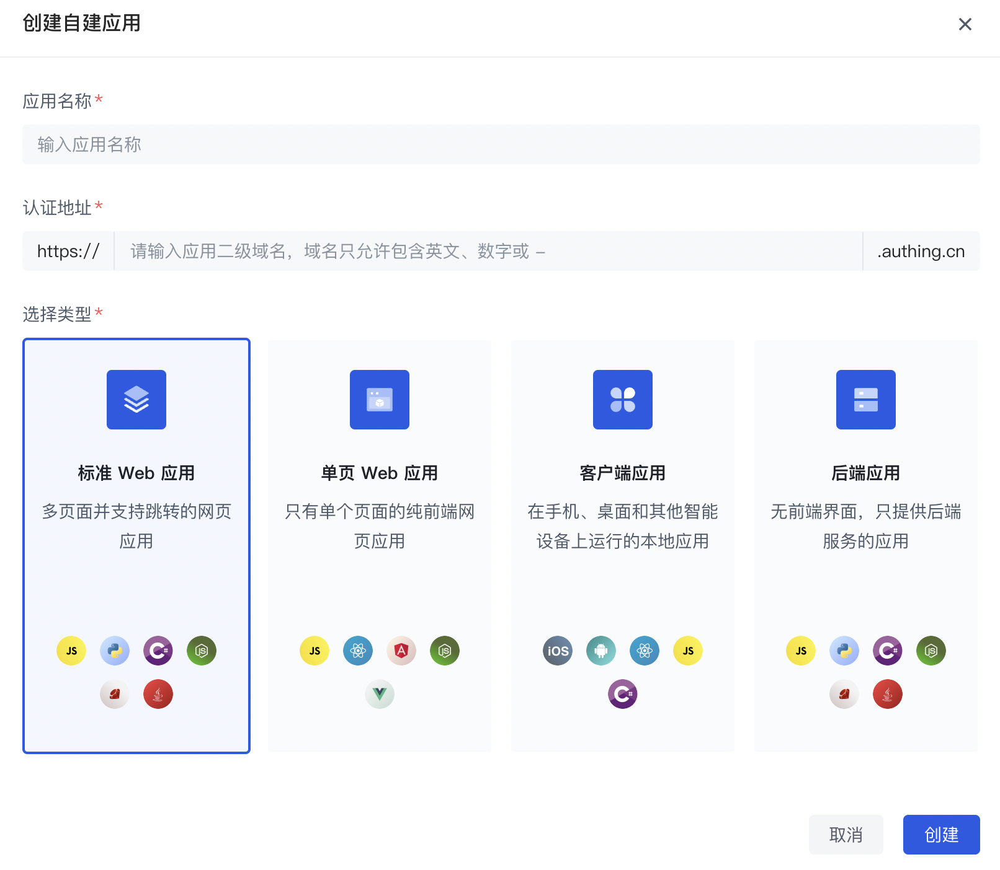
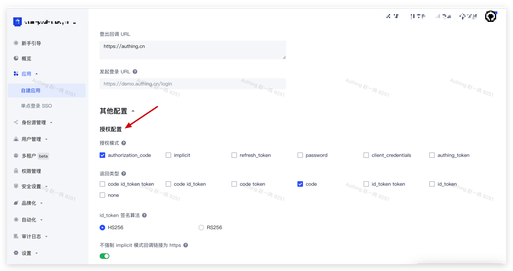
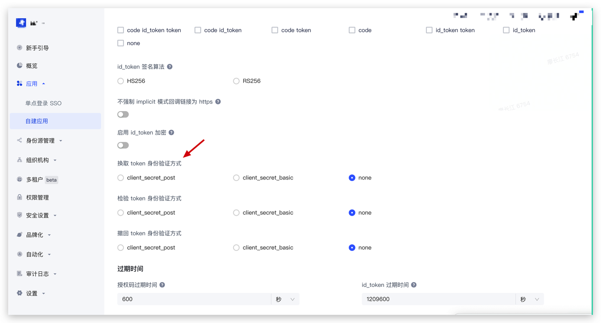
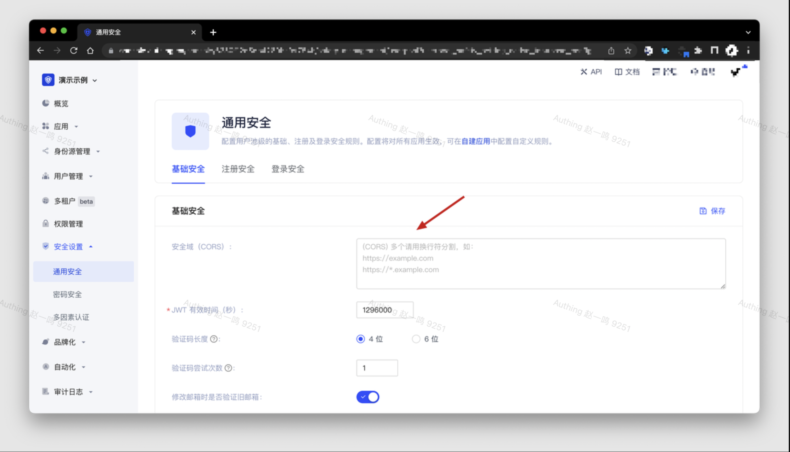

# 将 Guard 接入到 WEB 应用

## 说明

[Guard 5.0](https://github.com/authing/guard) 于 2022 年 8 月 17 日发布，推荐使用 Guard 5.0 及以上版本，低于 5.0 的版本将不再维护！

如果你正在使用之前的版本 [Guard 3.x](https://github.com/Authing/authing-ui-components/tree/v3.1.25) 或 [Guard 4.x](https://github.com/authing/authing-ui-components)，仍然可以参考：

- [将 Guard 接入到 React 项目(4.x)](https://docs.authing.cn/v2/reference/guard/v2/react.html)
- [将 Guard 接入到 Vue 项目(4.x)](https://docs.authing.cn/v2/reference/guard/v2/vue.html)
- [将 Guard 接入到 Angular 项目(4.x)](https://docs.authing.cn/v2/reference/guard/v2/angular.html)
- [将 Guard 接入到原生 JS 项目(4.x)](https://docs.authing.cn/v2/reference/guard/v2/native-javascript.html)

Guard 是 Authing 提供的一种轻便的认证组件，你可以把它嵌入在你任何的通过浏览器进行用户交互的应用中，一站式处理复杂的用户认证流程。

现在开始跟随引导将 Authing Guard 接入到你的项目中吧！

## 第一步：在 Authing 控制台创建应用

**首先，你需要将你的应用接入 Authing 控制台**。如果你还没有创建，请先[在 Authing 控制台创建一个应用](https://docs.authing.cn/v2/guides/app-new/create-app/create-app.html)。

从 Authing 控制台左侧导航进入「自建应用」功能区，点击右上角的 **创建自建应用** 按钮，填入以下信息：

- 应用名称：填入你的应用名称；
- 认证地址：选择一个二级域名，必须为合法的域名格式，例如 `my-awesome-app`；
- 应用类型：选择 **标准 Web 应用** 或 **单页 Web 应用**。



创建完成！接下来你将正式开始 Authing Guard (v5.0） 的接入和配置。

## 第二步：安装、初始化并获取 Guard 实例

### 安装并初始化

有两种方式可以供你选择：**安装 Authing library** 或 **直接通过浏览器加载**。

无论使用哪一种安装方式，你都需要用到应用的 **APP ID**，请先[前往控制台获取](https://docs.authing.cn/v2/guides/app-new/create-app/app-configuration.html)。

#### 方法一：安装 Authing library

::: hint-info
推荐使用 npm 或 yarn，它们能更好的和 webpack 打包工具进行配合，也可放心地在生产环境打包部署使用，享受整个生态圈和工具链带来的诸多好处。
:::

首先，通过 npm / yarn 安装 Authing library。

:::: tabs :options="{ useUrlFragment: false }"
::: tab React

```shell
# 兼容 React 16 / 17
npm install --save @authing/guard-react
```

:::

::: tab Vue2

```shell
# 兼容 Vue 2
npm install --save @authing/guard-vue2
```

:::

::: tab Vue3

```shell
# 兼容 Vue 3
npm install --save @authing/guard-vue3
```

:::

::: tab Angular

```shell
# 兼容 Angular 14
npm install --save @authing/guard-angular
```

:::
::::

:::: tabs :options="{ useUrlFragment: false }"
::: tab React

```tsx
// App.tsx
import React from "react";
import { GuardProvider } from "@authing/guard-react";
import "@authing/guard-react/dist/esm/guard.min.css";
// 你的业务代码根组件
import RouterComponent from "./router";

function App() {
  return (
    <GuardProvider
      appId="AUTHING_APP_ID"
      // 如果你使用的是私有化部署的 Authing 服务，需要传入自定义 host，如
      // host="https://my-authing-app.example.com"
    >
      <RouterComponent></RouterComponent>
    </GuardProvider>
  );
}
```

:::

::: tab Vue2

```javascript
// main.js
import Vue from "vue";
import { GuardPlugin } from "@authing/guard-vue2";
import "@authing/guard-vue2/dist/esm/guard.min.css";

Vue.use(GuardPlugin, {
  appId: "AUTHING_APP_ID",
  // 如果你使用的是私有化部署的 Authing 服务，需要传入自定义 host，如
  // host: 'https://my-authing-app.example.com'
});
```

:::

::: tab Vue3

```typescript
// main.ts
import { createApp } from "vue";
import { createGuard } from "@authing/guard-vue3";
import "@authing/guard-vue3/dist/esm/guard.min.css";
// 你的业务代码根组件
import App from "./App.vue";

const app = createApp(App);

app.use(
  createGuard({
    appId: "AUTHING_APP_ID",
    // 如果你使用的是私有化部署的 Authing 服务，需要传入自定义 host，如
    // host: 'https://my-authing-app.example.com'
  })
);
```

:::

::: tab Angular

```json
// angular.json
{
  "projects": {
    "architect": {
      "build": {
        "styles": ["node_modules/@authing/guard-angular/dist/guard.min.css"]
      }
    }
  }
}
```

```typescript
// app.module.ts
import { NgModule } from "@angular/core";
import { BrowserModule } from "@angular/platform-browser";
import { AppRoutingModule } from "./app-routing.module";
import { AppComponent } from "./app.component";
import { GuardModule } from "@authing/guard-angular";

@NgModule({
  declarations: [AppComponent],
  imports: [
    BrowserModule,
    AppRoutingModule,
    GuardModule.forRoot({
      appId: "AUTHING_APP_ID",
      // 如果你使用的是私有化部署的 Authing 服务，需要传入自定义 host，如
      // host: 'https://my-authing-app.example.com'
    }),
  ],
  providers: [],
  bootstrap: [AppComponent],
})
export class AppModule {}
```

:::
::::

调试成功后，即完成 Authing library 的初始化加载。

#### 方法二：直接通过浏览器加载

首先，在你的 HTML 文件中使用 `script` 和 `link` 标签直接引入文件，并使用全局变量 `GuardFactory`。

```html
<!DOCTYPE html>
<html lang="en">
  <head>
    <meta charset="UTF-8" />
    <meta http-equiv="X-UA-Compatible" content="IE=edge" />
    <meta name="viewport" content="width=device-width, initial-scale=1.0" />
    <title>Authing Guard Demo</title>
    <script src="https://cdn.authing.co/packages/guard/5.0.5/guard.min.js"></script>
    <link
      rel="stylesheet"
      href="https://cdn.authing.co/packages/guard/5.0.5/guard.min.css"
    />
  </head>
  <body>
    <div id="authing-guard-container"></div>

    <script>
      const guard = new GuardFactory.Guard({
        // 你可以前往 Authing 控制台的本应用详情页查看你的 APP ID
        appId: "AUTHING_APP_ID",

        // 如果你使用的是私有化部署的 Authing 服务，需要传入自定义 host，如
        // host: 'https://my-authing-app.example.com'
      });

      // 挂载 Authing Guard
      guard.start("#authing-guard-container");
    </script>
  </body>
</html>
```

无论通过哪一种方式，你都可以完成 Authing Guard 在你项目中的安装和初始化。

接下来，你可以根据实际的需要，直接阅读对应的使用指南和代码示例。

### 获取 Guard 实例

:::: tabs :options="{ useUrlFragment: false }"
::: tab CDN

```javascript
const guard = new GuardFactory.Guard({
  // 你可以前往 Authing 控制台的本应用详情页查看你的 App ID
  appId: "AUTHING_APP_ID",

  // 如果你使用的是私有化部署的 Authing 服务，需要传入自定义 host，如
  // host: 'https://my-authing-app.example.com'
});

console.log("guard instance: ", guard);
```

::: tab React

```tsx
import { useGuard } from "@authing/guard-react";

export default function Login() {
  const guard = useGuard();

  console.log("guard instance: ", guard);

  return <div></div>;
}
```

:::

::: tab Vue2

```javascript
export default {
  created() {
    console.log("guard instance: ", this.$guard);
  },
};
```

:::

::: tab Vue3

```javascript
import { useGuard } from "@authing/guard-vue3";

const guard = useGuard();

console.log("guard instance: ", guard);
```

:::

::: tab Angular

```typescript
// Angular 组件中使用 Guard API
import { Component } from "@angular/core";
import { GuardService } from "@authing/guard-angular";

@Component({
  selector: "home-container",
  templateUrl: "./home.component.html",
  styleUrls: ["./home.component.css"],
})
export class HomeComponent {
  constructor(
    // 使用 Angular 依赖注入，获取 Guard 实例
    private guard: GuardService
  ) {}

  ngOnInit() {
    console.log("guard instance: ", this.guard.client);
  }
}
```

:::
::::

## 第三步：常见操作

### 托管模式 & 内嵌模式

**托管模式：** 指跳转到 Authing 提供的托管登录页。Authing 默认使用 OIDC 标准协议认证，你的用户在登录时将始终由 Authing 提供的认证最佳实践保驾护航。

- 安全性：你的业务系统将用户重定向到 Authing，用户在此进行身份验证，然后重定向回在控制台配置的应用回调连接。
- 样式丰富性：托管模式提供了登录注册表单自定义配置，可通过控制台配置和 CSS 进行界面自定义。
- 集成便利性：你不需要额外运维登录页面，Authing 将负责此页面的维护和升级，当 Authing 有新功能发布之后，你不需要做任何操作即可获取最新能力。

**内嵌模式：** 指的是将 Authing 提供的登录组件（Guard）嵌入到你的 Web 应用中。仅需要几行 JavaScript 代码即可，该模式包含两种形态：

- 普通形态：样式与托管模式一致，但灵活之处在于你可以将它嵌入到你的任意的 DOM 节点。
- 模态框形态：和普通形态类似，只不过通过模态框（Modal）的样式进行展示。

**对于大多数登录认证场景，我们推荐使用「托管模式」进行集成。这是最简便、安全、通用的 Authing 认证最佳实践。**

### 使用托管模式

托管模式将跳转到 Authing 提供的托管登录页。由于此模式 Authing 默认使用 OIDC 标准协议认证，你需要进行以下额外配置：

- 在 [Authing 控制台](https://console.authing.cn) 的 <strong>应用 -> 自建应用 -> 应用详情</strong> 中配置 <strong>登录回调 URL</strong>，回调地址为下述示例代码中 Callback 页面地址，此处以 `http://localhost:3000/callback` 为例：


- 在应用详情的 <strong>应用配置 -> 其他配置 -> 授权配置</strong> 中，<strong>授权模式</strong> 选择      <strong>authentication_code</strong>，<strong>返回类型</strong> 选择 <strong>code</strong>:



- 如果是标准 Web 应用，请在应用详情的 <strong>应用配置 -> 其他配置 -> 授权配置</strong> 中，请确保应用的「换取 token 身份验证方式」设置为了 <strong>none</strong>。

::: hint-info
如果你的应用类型为单页 Web 应用，此次选项会被隐藏，为正常情况。
:::



:::: tabs :options="{ useUrlFragment: false }"
::: tab CDN

```javascript
const guard = new GuardFactory.Guard({
  // 你可以前往 Authing 控制台的本应用详情页查看你的 App ID
  appId: "AUTHING_APP_ID",

  // 如果你使用的是私有化部署的 Authing 服务，需要传入自定义 host，如
  // host: 'https://my-authing-app.example.com'
});

function startWithRedirect() {
  // 跳转到 Authing 托管页面登录
  guard.startWithRedirect();
}
```

:::

::: tab React

```tsx
import { useGuard } from "@authing/guard-react";

export default function Jump() {
  const guard = useGuard();

  // 跳转到 Authing 托管页面登录
  const startWithRedirect = () => guard.startWithRedirect();

  return (
    <div>
      <div>
        <button className="authing-button" onClick={startWithRedirect}>
          Start With Redirect
        </button>
      </div>
    </div>
  );
}
```

:::

::: tab Vue2

```javascript
export default {
  methods: {
    startWithRedirect() {
      // 跳转到 Authing 托管页面登录
      this.$guard.startWithRedirect();
    },
  },
};
```

:::

::: tab Vue3

```javascript
import { useGuard } from "@authing/guard-vue3";

const guard = useGuard();

const startWithRedirect = () => {
  // 跳转到 Authing 托管页面登录
  guard.startWithRedirect();
};
```

:::

::: tab Angular

```typescript
// Angular 组件中使用 Guard API
import { Component } from "@angular/core";
import { GuardService } from "@authing/guard-angular";

@Component({
  selector: "home-container",
  templateUrl: "./home.component.html",
  styleUrls: ["./home.component.css"],
})
export class HomeComponent {
  constructor(
    // 使用 Angular 依赖注入，获取 Guard 实例
    private guard: GuardService
  ) {}

  startWithRedirect() {
    // 跳转到 Authing 托管页面登录
    this.guard.client.startWithRedirect();
  }
}
```

:::
::::

此外，`startWithRedirect` 函数还可以自定义传入一个对象，具体参数如下：

| 名称                | 类型                                        | 默认值                               | 必传 | 描述                                                                                                                                                                                                                                                         |
| ------------------- | ------------------------------------------- | ------------------------------------ | ---- | ------------------------------------------------------------------------------------------------------------------------------------------------------------------------------------------------------------------------------------------------------------ |
| codeChallengeMethod | [CodeChallengeMethod](#CodeChallengeMethod) | S256                                 | 否   | <p>表示计算 `code_challenge` 时使用的摘要算法：</p><p>`plain` 表示不用任何算法；</p><p>`S256` 表示 `code_challenge` 是使用 `SHA256` 计算的。</p>                                                                         |
| scope               | String                                      | "openid profile email phone address" | 否   | OIDC scope，用空格分割，默认为 "openid profile email phone address"。完整的 scope 列表请见[OIDC 常见问题](https://docs.authing.co/v2/concepts/oidc-common-questions.html#scope-%E5%8F%82%E6%95%B0%E5%AF%B9%E5%BA%94%E7%9A%84%E7%94%A8%E6%88%B7%E4%BF%A1%E6%81%AF)。 |
| redirectUri         | String                                      | -                                    | 否   | 登录回调地址，可在 Console 控制台配置                                                                                                                                                                                                                        |
| state               | String                                      | 自动生成的随机数                     | 否   | 随机字符串，选填，默认自动生成。                                                                                                                                                                                                                             |
| nonce               | String                                      | 自动生成的随机数                     | 否   | 随机字符串，选填，默认自动生成。                                                                                                                                                                                                                             |
| responseMode        | String                                      | query                                | 否   | 响应类型，可选值为 query、fragment、form_post；默认为 query，即通过浏览器重定向发送 code 到回调地址。                                                                                                                                                        |
| responseType        | String                                      | code                                 | 否   | 响应类型，选填，可选值为 code、code id_token token、code id_token、code id_token、code token、id_token token、id_token、none；默认为 code，授权码模式。                                                                                                      |

::: hint-info
接下来 `startWithRedirect` 将支持传入以下两个参数（暂不支持）：
- forced（即便已登录，也强制用户再次登录）。
- useImplicitMode（是否使用 OIDC implicit 模式替代默认的 PKCE 模式，安全性较低，不推荐使用）。
:::

<p id="CodeChallengeMethod">CodeChallengeMethod</p>

| 名称  | 描述                              |
| ----- | --------------------------------- |
| S256  | code_challenge 是使用 SHA256 计算 |
| plain | 不使用任何算法计算                |

### 使用内嵌模式

#### 普通形态

:::: tabs :options="{ useUrlFragment: false }"
::: tab CDN

```html
<div id="authing-guard-container"></div>
```

```javascript
// 获取 Guard 实例
const guard = new GuardFactory.Guard({
  // 你可以前往 Authing 控制台的本应用详情页查看你的 App ID
  appId: "AUTHING_APP_ID",

  // 如果你使用的是私有化部署的 Authing 服务，需要传入自定义 host，如
  // host: 'https://my-authing-app.example.com'
});

// 使用 start 方法挂载 Guard 组件到你指定的 DOM 节点，登录成功后返回 userInfo
guard.start("#authing-guard-container").then((userInfo) => {
  console.log("userInfo: ", userInfo);
});
```

:::

::: tab React

```tsx
import React, { useEffect } from "react";

import { useGuard, User } from "@authing/guard-react";

export default function Login() {
  // 获取 Guard 实例
  const guard = useGuard();

  useEffect(() => {
    // 使用 start 方法挂载 Guard 组件到你指定的 DOM 节点，登录成功后返回 userInfo
    guard.start("#authing-guard-container").then((userInfo: User) => {
      console.log("userInfo: ", userInfo);
    });
  }, []);

  return (
    <div>
      <div id="authing-guard-container"></div>
    </div>
  );
}
```

:::

::: tab Vue2

```vue
<template>
  <div id="authing-guard-container"></div>
</template>
<script>
export default {
  mounted() {
    // 使用 start 方法挂载 Guard 组件到你指定的 DOM 节点，登录成功后返回 userInfo
    this.$guard.start("#authing-guard-container").then((userInfo) => {
      console.log("userInfo: ", userInfo);
    });
  },
};
</script>
```

:::

::: tab Vue3

```vue
<template>
  <div id="authing-guard-container"></div>
</template>

<script lang="ts" setup>
import { onMounted } from "vue";
import { useGuard } from "@authing/guard-vue3";
import type { User } from "@authing/guard-vue3";

const guard = useGuard();

onMounted(() => {
  // 使用 start 方法挂载 Guard 组件到你指定的 DOM 节点，登录成功后返回 userInfo
  guard.start("#authing-guard-container").then((userInfo: User) => {
    console.log("userInfo: ", userInfo);
  });
});
</script>
```

:::

::: tab Angular

```typescript
import { Component } from "@angular/core";
import { GuardService, User } from "@authing/guard-angular";

@Component({
  selector: "login-container",
  templateUrl: "./login.component.html",
  styleUrls: ["./login.component.css"],
})
export class LoginComponent {
  constructor(private guard: GuardService) {}

  ngOnInit() {
    // 使用 start 方法挂载 Guard 组件到你指定的 DOM 节点，登录成功后返回 userInfo
    this.guard.client
      .start("#authing-guard-container")
      .then((userInfo: User) => {
        console.log("userInfo: ", userInfo);
      });
  }
}
```

:::
::::

#### 模态框形态

初始化时，你需要将初始化参数的 `mode` 设置成 `modal`。

你可以通过 `guard` 实例 `start` 方法对 **模态框** 进行渲染，同时可以通过 `show` 和 `hide` 控制 **模态框** 的显示和隐藏：

:::: tabs :options="{ useUrlFragment: false }"
::: tab CDN

```html
<button onclick="showGuard()">Show Guard</button>

<div>
  模态窗口打开并登录成功后会在 2 秒内调用 hide 方法关闭模态窗口，用于展示 hide
  方法的效果
</div>
<div>模态框自动关闭后，可以点击 Show Guard 按钮再次显示</div>

<div id="authing-guard-container"></div>
```

```javascript
const guard = new GuardFactory.Guard({
  appId: "AUTHING_APP_ID",
  mode: "modal",
  // 如果你使用的是私有化部署的 Authing 服务，需要传入自定义 host，如
  // host: 'https://my-authing-app.example.com'
});

guard.start("#authing-guard-container").then((userInfo) => {
  // 登录成功后将在 then 回调中获取到 userInfo
  console.log("userInfo: ", userInfo);

  setTimeout(() => {
    guard.hide();
  }, 2000);
});

function showGuard() {
  guard.show();
}
```

:::

::: tab React

```tsx
// App.tsx
import React from "react";
import { GuardProvider } from "@authing/guard-react";
import "@authing/guard-react/dist/esm/guard.min.css";
import RouterComponent from "./router";

function App() {
  return (
    <GuardProvider
      appId="AUTHING_APP_ID"
      mode="modal"
      // 如果你使用的是私有化部署的 Authing 服务，需要传入自定义 host，如
      // host="https://my-authing-app.example.com"
    >
      <RouterComponent></RouterComponent>
    </GuardProvider>
  );
}
```

```tsx
// Embed.tsx
import { useGuard, User } from "@authing/guard-react";

export default function Embed() {
  const guard = useGuard();

  const showGuard = () => guard.show();

  useEffect(() => {
    // 挂载模态框，当用户完成登录之后，你可以获取到用户信息
    guard.start("#authing-guard-container").then((userInfo: User) => {
      console.log("userInfo: ", userInfo);

      setTimeout(() => {
        guard.hide();
      }, 2000);
    });
  }, []);

  return (
    <div>
      <button className="authing-button" onClick={showGuard}>
        Show Guard
      </button>

      <div>
        模态窗口打开并登录成功后会在 2 秒内调用 hide 方法关闭模态窗口，用于展示
        hide 方法的效果
      </div>
      <div>模态框自动关闭后，可以点击 Show Guard 按钮再次显示</div>

      <div id="authing-guard-container"></div>
    </div>
  );
}
```

:::

::: tab Vue2

```javascript
// main.js
import Vue from "vue";
import { GuardPlugin } from "@authing/guard-vue2";
import "@authing/guard-vue2/dist/esm/guard.min.css";

Vue.use(GuardPlugin, {
  appId: "AUTHING_APP_ID",
  mode: "modal",
  // 如果你使用的是私有化部署的 Authing 服务，需要传入自定义 host，如
  // host: 'https://my-authing-app.example.com'
});
```

```html
<!-- Embed.vue -->
<template>
  <div class="embed-container">
    <button class="authing-button" @click="showGuard">Show Guard</button>

    <div>
      模态窗口打开并登录成功后会在 2 秒内调用 hide 方法关闭模态窗口，用于展示
      hide 方法的效果
    </div>
    <div>模态框自动关闭后，可以点击 Show Guard 按钮再次显示</div>

    <div id="authing-guard-container"></div>
  </div>
</template>

<script>
  export default {
    mounted() {
      // 使用 start 方法挂载 Guard 组件到你指定的 DOM 节点，登录成功后返回 userInfo
      this.$guard.start("#authing-guard-container").then((userInfo) => {
        console.log("userInfo: ", userInfo);

        setTimeout(() => {
          this.$guard.hide();
        }, 2000);
      });
    },
    methods: {
      showGuard() {
        this.$guard.show();
      },
    },
  };
</script>
```

:::

::: tab Vue3

```javascript
// main.ts
import { createApp } from "vue";
import App from "./App.vue";
import { createGuard } from "@authing/guard-vue3";
import "@authing/guard-vue3/dist/esm/guard.min.css";

const app = createApp(App);

app.use(
  createGuard({
    appId: "AUTHING_APP_ID",
    mode: "modal",
    // 如果你使用的是私有化部署的 Authing 服务，需要传入自定义 host，如
    // host: 'https://my-authing-app.example.com'
  })
);
```

```html
<!-- Embed.vue -->
<template>
  <div class="embed-container">
    <button class="authing-button" @click="showGuard">Show Guard</button>

    <div>
      模态窗口打开并登录成功后会在 2 秒内调用 hide 方法关闭模态窗口，用于展示
      hide 方法的效果
    </div>
    <div>模态框自动关闭后，可以点击 Show Guard 按钮再次显示</div>

    <div id="authing-guard-container"></div>
  </div>
</template>

<script lang="ts" setup>
  import { onMounted } from "vue";

  import { useGuard } from "@authing/guard-vue3";

  const guard = useGuard();

  const showGuard = () => guard.show();

  onMounted(() => {
    // 使用 start 方法挂载 Guard 组件到你指定的 DOM 节点，登录成功后返回 userInfo
    guard.start("#authing-guard-container").then((userInfo) => {
      console.log("userInfo: ", userInfo);

      setTimeout(() => {
        guard.hide();
      }, 2000);
    });
  });
</script>
```

:::

::: tab Angular

```typescript
// app.module.ts
import { NgModule } from "@angular/core";
import { BrowserModule } from "@angular/platform-browser";
import { AppRoutingModule } from "./app-routing.module";
import { AppComponent } from "./app.component";
import { GuardModule } from "@authing/guard-angular";
@NgModule({
  declarations: [AppComponent],
  imports: [
    BrowserModule,
    AppRoutingModule,
    GuardModule.forRoot({
      appId: "AUTHING_APP_ID",
      mode: "modal",
      // 如果你使用的是私有化部署的 Authing 服务，需要传入自定义 host，如
      // host: 'https://my-authing-app.example.com'
    }),
  ],
  providers: [],
  bootstrap: [AppComponent],
})
export class AppModule {}
```

```typescript
// embed.component.ts
import { Component } from "@angular/core";

import { GuardService, User } from "@authing/guard-angular";

@Component({
  selector: "embed-container",
  templateUrl: "./embed.component.html",
  styleUrls: ["./embed.component.css"],
})
export class EmbedComponent {
  constructor(private guard: GuardService) {}

  ngOnInit() {
    this.guard.client
      .start("#authing-guard-container")
      .then((userInfo: User) => {
        console.log("userInfo: ", userInfo);

        setTimeout(() => {
          this.guard.client.hide();
        }, 2000);
      });
  }

  showGuard() {
    this.guard.client.show();
  }
}
```

:::
::::

### 实现单点登录

单点登录能让用户在所有接入 Authing 的应用之间实现一次登录，即可使用所有应用。

想要实现单点登录，你需要先将此应用 **添加到单点登录**：


之后在初始化 Authing Guard 时，需要将 `isSSO` 设置为 `true`。

具体详情请参考：[单点登录（SSO）](https://docs.authing.co/v2/reference/sdk-for-sso-spa.html)。

:::: tabs :options="{ useUrlFragment: false }"
::: tab CDN

```javascript
const guard = new GuardFactory.Guard({
  appId: "AUTHING_APP_ID",
  // 如果你使用的是私有化部署的 Authing 服务，需要传入自定义 host，如
  // host: 'https://my-authing-app.example.com',
  isSSO: true,
});
```

:::

::: tab React

```tsx
import React from "react";
import { GuardProvider } from "@authing/guard-react";
import "@authing/guard-react/dist/esm/guard.min.css";
// 项目根组件
import RouterComponent from "./router";

function App() {
  return (
    <GuardProvider
      appId="AUTHING_APP_ID"
      // 如果你使用的是私有化部署的 Authing 服务，需要传入自定义 host，如
      // host="https://my-authing-app.example.com",
      isSSO={true}
    >
      <RouterComponent></RouterComponent>
    </GuardProvider>
  );
}
```

:::

::: tab Vue2

```javascript
import Vue from "vue";
import { GuardPlugin } from "@authing/guard-vue2";
import "@authing/guard-vue2/dist/esm/guard.min.css";

Vue.use(GuardPlugin, {
  appId: "AUTHING_APP_ID",
  // 如果你使用的是私有化部署的 Authing 服务，需要传入自定义 host，如
  // host: 'https://my-authing-app.example.com',
  isSSO: true,
});
```

:::

::: tab Vue3

```javascript
import { createApp } from "vue";
import App from "./App.vue";
import { createGuard } from "@authing/guard-vue3";
import "@authing/guard-vue3/dist/esm/guard.min.css";

const app = createApp(App);

app.use(
  createGuard({
    appId: "AUTHING_APP_ID",
    // 如果你使用的是私有化部署的 Authing 服务，需要传入自定义 host，如
    // host: 'https://my-authing-app.example.com',
    isSSO: true,
  })
);
```

:::

::: tab Angular

```typescript
import { NgModule } from "@angular/core";
import { BrowserModule } from "@angular/platform-browser";

import { AppRoutingModule } from "./app-routing.module";
import { AppComponent } from "./app.component";

import { GuardModule } from "@authing/guard-angular";

@NgModule({
  declarations: [AppComponent],
  imports: [
    BrowserModule,
    AppRoutingModule,
    GuardModule.forRoot({
      appId: "AUTHING_APP_ID",
      // 如果你使用的是私有化部署的 Authing 服务，需要传入自定义 host，如
      // host: 'https://my-authing-app.example.com',
      isSSO: true,
    }),
  ],
  providers: [],
  bootstrap: [AppComponent],
})
export class AppModule {}
```

:::
::::

### 登出

根据你的具体使用场景，退出登录分为 **单应用登出** 和 **SSO 单点登出** 两种。

#### 单应用登出

:::: tabs :options="{ useUrlFragment: false }"
::: tab CDN

```javascript
const guard = new GuardFactory.Guard({
  appId: "AUTHING_APP_ID",
  // 如果你使用的是私有化部署的 Authing 服务，需要传入自定义 host，如
  // host: 'https://my-authing-app.example.com'
});

function Logout() {
  // 登出后的回调地址请在 Authing 控制台应用 -> 自建应用 -> 应用详情 -> 应用配置 -> 登出回调 URL 中配置
  const onLogout = () => guard.logout();
}
```

:::

::: tab React

```tsx
import React from "react";
import { useGuard } from "@authing/guard-react";

export default function Logout() {
  const guard = useGuard();

  // 登出后的回调地址请在 Authing 控制台应用 -> 自建应用 -> 应用详情 -> 应用配置 -> 登出回调 URL 中配置
  const onLogout = () => guard.logout();

  return (
    <div>
      <button onClick={onLogout}>Logout</button>
    </div>
  );
}
```

:::

::: tab Vue2

```javascript
export default {
  methods: {
    // 登出后的回调地址请在 Authing 控制台应用 -> 自建应用 -> 应用详情 -> 应用配置 -> 登出回调 URL 中配置
    logout() {
      this.$guard.logout();
    },
  },
};
```

:::

::: tab Vue3

```typescript
import { useGuard } from "@authing/guard-vue3";

const guard = useGuard();

// 登出后的回调地址请在 Authing 控制台应用 -> 自建应用 -> 应用详情 -> 应用配置 -> 登出回调 URL 中配置
const logout = () => guard.logout();
```

:::

::: tab Angular

```typescript
import { Component } from "@angular/core";
import { GuardService } from "@authing/guard-angular";

@Component({
  selector: "login-container",
  templateUrl: "./login.component.html",
  styleUrls: ["./login.component.css"],
})
export class LoginComponent {
  constructor(private guard: GuardService) {}

  onLogout() {
    // 登出后的回调地址请在 Authing 控制台应用 -> 自建应用 -> 应用详情 -> 应用配置 -> 登出回调 URL 中配置
    this.guard.client.logout();
  }
}
```

:::
::::

#### SSO 单点登出

要实现单点登出，只需在初始化 Authing Guard 时，设置 `isSSO` 为 `true` 即可：

:::: tabs :options="{ useUrlFragment: false }"
::: tab CDN

```javascript
const guard = new GuardFactory.Guard({
  appId: "AUTHING_APP_ID",
  // 如果你使用的是私有化部署的 Authing 服务，需要传入自定义 host，如
  // host: 'https://my-authing-app.example.com',
  isSSO: true,
});

function Logout() {
  // 登出后的回调地址请在 Authing 控制台 -> 应用详情 -> 应用配置 -> 登出回调 URL 中配置
  const onLogout = () => guard.logout();
}
```

::: tab React

```tsx
// App.tsx
import React from "react";
import { GuardProvider } from "@authing/guard-react";
import "@authing/guard-react/dist/esm/guard.min.css";
// 项目根组件
import RouterComponent from "./router";

function App() {
  return (
    <GuardProvider
      appId="AUTHING_APP_ID"
      // 如果你使用的是私有化部署的 Authing 服务，需要传入自定义 host，如
      // host="https://my-authing-app.example.com"
      isSSO={true}
    >
      <RouterComponent></RouterComponent>
    </GuardProvider>
  );
}
```

```tsx
// Logout.tsx
import React from "react";
import { useGuard } from "@authing/guard-react";

export default function Logout() {
  const guard = useGuard();

  // 登出后的回调地址请在 Authing 控制台 -> 应用详情 -> 应用配置 -> 登出回调 URL 中配置
  const onLogout = () => guard.logout();

  return (
    <div>
      <button onClick={onLogout}>Logout</button>
    </div>
  );
}
```

:::

::: tab Vue2

```javascript
// main.js
import Vue from "vue";
import { GuardPlugin } from "@authing/guard-vue2";
import "@authing/guard-vue2/dist/esm/guard.min.css";

Vue.use(GuardPlugin, {
  appId: "AUTHING_APP_ID",
  // 如果你使用的是私有化部署的 Authing 服务，需要传入自定义 host，如
  // host: 'https://my-authing-app.example.com',
  isSSO: true,
});
```

```javascript
// Logout.vue
export default {
  methods: {
    logout() {
      // 登出后的回调地址请在 Authing 控制台 -> 应用详情 -> 应用配置 -> 登出回调 URL 中配置
      this.$guard.logout();
    },
  },
};
```

:::

::: tab Vue3

```typescript
// main.ts
import { createApp } from "vue";
import { createGuard } from "@authing/guard-vue3";
import "@authing/guard-vue3/dist/esm/guard.min.css";

const app = createApp(App);

app.use(
  createGuard({
    appId: "AUTHING_APP_ID",
    // 如果你使用的是私有化部署的 Authing 服务，需要传入自定义 host，如
    // host: 'https://my-authing-app.example.com',
    isSSO: true,
  })
);
```

```typescript
// Logout.vue
import { useGuard } from "@authing/guard-vue3";

const guard = useGuard();

// 登出后的回调地址请在 Authing 控制台 -> 应用详情 -> 应用配置 -> 登出回调 URL 中配置
const logout = () => guard.logout();
```

:::

::: tab Angular

```typescript
// app.module.ts
import { NgModule } from "@angular/core";
import { BrowserModule } from "@angular/platform-browser";

import { AppRoutingModule } from "./app-routing.module";
import { AppComponent } from "./app.component";

import { GuardModule } from "@authing/guard-angular";

@NgModule({
  declarations: [AppComponent],
  imports: [
    BrowserModule,
    AppRoutingModule,
    GuardModule.forRoot({
      appId: "AUTHING_APP_ID",
      // 如果你使用的是私有化部署的 Authing 服务，需要传入自定义 host，如
      // host: 'https://my-authing-app.example.com',
      isSSO: true,
    }),
  ],
  providers: [],
  bootstrap: [AppComponent],
})
export class AppModule {}
```

```typescript
// logout.component.ts
import { Component } from "@angular/core";
import { GuardService } from "@authing/guard-angular";

@Component({
  selector: "logout-container",
  templateUrl: "./logout.component.html",
  styleUrls: ["./logout.component.css"],
})
export class LoginComponent {
  constructor(private guard: GuardService) {}

  onLogout() {
    this.guard.client.logout();
  }
}
```

:::
::::

### 注册

你可以通过 `startRegister` 方法将 Authing Guard 切换到注册 Tab 页：

:::: tabs :options="{ useUrlFragment: false }"
::: tab CDN

```javascript
function startRegister() {
  guard.startRegister();
}
```

:::
::: tab React

```tsx
import React from "react";
import { useGuard } from "@authing/guard-react";

export default function Register() {
  const guard = useGuard();
  const startRegister = () => guard.startRegister();

  return (
    <div>
      <button onClick={startRegister}>Start Register</button>
    </div>
  );
}
```

:::

::: tab Vue2

```javascript
export default {
  methods: {
    startRegister() {
      this.$guard.startRegister();
    },
  },
};
```

:::

::: tab Vue3

```typescript
import { useGuard } from "@authing/guard-vue3";

const guard = useGuard();

const startRegister = () => guard.startRegister();
```

:::

::: tab Angular

```typescript
import { Component } from "@angular/core";
import { GuardService } from "@authing/guard-angular";

@Component({
  selector: "register-container",
  templateUrl: "./register.component.html",
  styleUrls: ["./register.component.css"],
})
export class LoginComponent {
  constructor(private guard: GuardService) {}

  startRegister() {
    this.guard.client.startRegister();
  }
}
```

:::
::::

### 第三方身份源登录

**Authing 目前支持 20+ 种第三方身份源登录方式，基本囊括所有常用的身份源：**

- [社会化身份源](https://docs.authing.cn/v2/guides/authentication/social/)： Google、GitHub、微信、QQ、微博、飞书、企业微信、钉钉、AD、Azure AD...
- [基于认证协议的身份服务](https://docs.authing.cn/v2/connections/custom-social-provider/)： OIDC、OAuth2.0、SAML、CAS...

你可以点击上面的链接查看 Authing 支持的所有第三方身份源，并根据你的实际需要进行选择。选好你需要使用的身份源后，请根据下面的引导完成接入：

1. 你需要在 Authing 控制台完成所需身份源的配置。

2. 使用下面的方法来控制配置完成的身份源的展示与隐藏。

此处以 Github 身份源为例：

:::: tabs :options="{ useUrlFragment: false }"
::: tab CDN

```javascript
const guard = new GuardFactory.Guard({
  appId: "AUTHING_APP_ID",
  // 如果你使用的是私有化部署的 Authing 服务，需要传入自定义 host，如
  // host: 'https://my-authing-app.example.com',
  config: {
    socialConnectionList: ["github"],
  },
});
```

:::

::: tab React

```tsx
import React from "react";

import { GuardProvider } from "@authing/guard-react";

import "@authing/guard-react/dist/esm/guard.min.css";

// 用户业务根组件
import RouterComponent from "./router";

export default function App() {
  return (
    <GuardProvider
      appId="AUTHING_APP_ID"
      // 如果你使用的是私有化部署的 Authing 服务，需要传入自定义 host，如
      // host="https://my-authing-app.example.com",
      config={{
        socialConnectionList: ["github"],
      }}
    >
      <RouterComponent></RouterComponent>
    </GuardProvider>
  );
}
```

:::

::: tab Vue2

```javascript
import Vue from "vue";
import { GuardPlugin } from "@authing/guard-vue2";
import "@authing/guard-vue2/dist/esm/guard.min.css";

Vue.use(GuardPlugin, {
  appId: "AUTHING_APP_ID",
  // 如果你使用的是私有化部署的 Authing 服务，需要传入自定义 host，如
  // host: 'https://my-authing-app.example.com',
  config: {
    socialConnectionList: ["github"],
  },
});
```

:::

::: tab Vue3

```typescript
import { createApp } from "vue";
import { createGuard } from "@authing/guard-vue3";
import "@authing/guard-vue3/dist/esm/guard.min.css";

const app = createApp(App);

app.use(
  createGuard({
    appId: "AUTHING_APP_ID",
    // 如果你使用的是私有化部署的 Authing 服务，需要传入自定义 host，如
    // host: 'https://my-authing-app.example.com',
    config: {
      socialConnectionList: ["github"],
    },
  })
);
```

:::

::: tab Angular

```typescript
// app.module.ts
import { NgModule } from "@angular/core";
import { BrowserModule } from "@angular/platform-browser";

import { AppRoutingModule } from "./app-routing.module";
import { AppComponent } from "./app.component";

import { GuardModule } from "@authing/guard-angular";

@NgModule({
  declarations: [AppComponent],
  imports: [
    BrowserModule,
    AppRoutingModule,
    GuardModule.forRoot({
      appId: "AUTHING_APP_ID",
      // 如果你使用的是私有化部署的 Authing 服务，需要传入自定义 host，如
      // host: 'https://my-authing-app.example.com',
      config: {
        socialConnectionList: ["github"],
      },
    }),
  ],
  providers: [],
  bootstrap: [AppComponent],
})
export class AppModule {}
```

:::
::::

社会化登录全部有效值请参考：[ISocialConnectionProvider](#ISocialConnectionProvider)

### 获取用户信息

你也可以通过 `trackSession` 方法获取用户信息：

:::: tabs :options="{ useUrlFragment: false }"
::: tab CDN

```javascript
async function getUserInfo() {
  // 获取用户信息
  const userInfo = await guard.trackSession();
  console.log(userInfo);
}
```

:::

::: tab React

```tsx
import React from "react";
import { useGuard, User } from "@authing/guard-react";

export default function GetUserInfo() {
  const guard = useGuard();

  const getUserInfo = async () => {
    // 获取用户信息
    const userInfo: User | null = await guard.trackSession();
    console.log("userInfo: ", userInfo);
  };

  return (
    <div>
      <button onClick={getUserInfo}>Get User Info</button>
    </div>
  );
}
```

:::

::: tab Vue2

```javascript
export default {
  methods: {
    async getUserInfo() {
      // 获取用户信息
      const userInfo = await this.$guard.trackSession();
      console.log("userInfo: ", userInfo);
    },
  },
};
```

:::

::: tab Vue3

```html
<script lang="ts" setup>
  import { useGuard } from "@authing/guard-vue3";

  import type { User } from "@authing/guard-vue3";

  const guard = useGuard();

  const getUserInfo = async () => {
    // 获取用户信息
    const userInfo: User | null = await guard.trackSession();
    console.log("userInfo: ", userInfo);
  };
</script>
```

:::

::: tab Angular

```typescript
import { Component } from "@angular/core";
import { GuardService, User } from "@authing/guard-angular";

@Component({
  selector: "get-user-info-container",
  templateUrl: "./get-user-info.component.html",
  styleUrls: ["./get-user-info.component.css"],
})
export class GetUserInfoComponent {
  constructor(private guard: GuardService) {}

  async getUserInfo() {
    // 获取用户信息
    const userInfo: User | null = await this.guard.client.trackSession();
    console.log("userInfo: ", userInfo);
  }
}
```

:::
::::

### 切换语言

<p id="changeLang"></p>

默认情况下，Guard 会展示你在 Authing 控制台中配置的默认语言，你也可以通过 `changeLang` 修改 Authing Gaurd 显示的语言，目前共支持以下四种：

- zh-CN：中文简体
- zh-TW：中文繁体
- en-US：英文
- ja-JP：日文

如果 Authing Guard 暂未支持用户的浏览器语言，Guard 会展示配置的默认语言。

Authing Guard 会持续新增对不同语言的支持，详情请参见 [Authing 目前支持的语言列表](#Lang)。

:::: tabs :options="{ useUrlFragment: false }"
::: tab CDN

```html
<select onchange="changeLang(event)">
  <option value="zh-CN">zh-CN</option>
  <option value="zh-TW">zh-TW</option>
  <option value="en-US">en-US</option>
  <option value="ja-JP">ja-JP</option>
</select>
```

```javascript
function changeLang(event) {
  guard.changeLang(event.target.value);
}
```

:::

::: tab React

```tsx
import React, { useEffect, useState } from "react";

import { useGuard, User } from "@authing/guard-react";

export default function ChangeLanguage() {
  const [langCache, setLangCache] = useState("");

  const guard = useGuard();

  useEffect(() => {
    // 使用 start 方法挂载 Guard 组件到你指定的 DOM 节点，登录成功后返回 userInfo
    guard.start("#authing-guard-container").then((userInfo: User) => {
      console.log("userInfo: ", userInfo);
    });

    guard.on("load", () => {
      const langCache = localStorage.getItem("_guard_i18nextLng") || "zh-CN";
      setLangCache(langCache);
    });
  }, []);

  const changeLang = (event: any) => {
    guard.changeLang(event.target.value);
    setLangCache(event.target.value);
  };

  return (
    <div>
      <select value={langCache} onChange={changeLang}>
        <option value="zh-CN">zh-CN</option>
        <option value="en-US">en-US</option>
        <option value="zh-TW">zh-TW</option>
        <option value="ja-JP">ja-JP</option>
      </select>
      <div id="authing-guard-container"></div>
    </div>
  );
}
```

:::

::: tab Vue2

```vue
<template>
  <div class="embed-container">
    <select v-model="langCache" @change="changeLang">
      <option value="zh-CN">zh-CN</option>
      <option value="zh-TW">zh-TW</option>
      <option value="en-US">en-US</option>
      <option value="ja-JP">ja-JP</option>
    </select>
    <div id="authing-guard-container"></div>
  </div>
</template>

<script>
export default {
  data() {
    return {
      langCache: "",
    };
  },
  mounted() {
    // 使用 start 方法挂载 Guard 组件到你指定的 DOM 节点，登录成功后返回 userInfo
    this.$guard.start("#authing-guard-container").then((userInfo) => {
      console.log("userInfo: ", userInfo);
    });

    this.$guard.on("load", () => {
      this.langCache = localStorage.getItem("_guard_i18nextLng");
    });
  },
  methods: {
    changeLang(event) {
      this.$guard.changeLang(event.target.value);
      this.langCache = event.target.value;
    },
  },
};
</script>
```

:::

::: tab Vue3

```vue
<template>
  <div class="embed-container">
    <select v-model="langCache" @change="changeLang">
      <option value="zh-CN">zh-CN</option>
      <option value="zh-TW">zh-TW</option>
      <option value="en-US">en-US</option>
      <option value="ja-JP">ja-JP</option>
    </select>
    <div id="authing-guard-container"></div>
  </div>
</template>
<script setup lang="ts">
import { ref, onMounted } from "vue";
import { useGuard } from "@authing/guard-vue3";
import type { User } from "@authing/guard-vue3";

const langCache = ref("");
const guard = useGuard();

onMounted(() => {
  // 使用 start 方法挂载 Guard 组件到你指定的 DOM 节点，登录成功后返回 userInfo
  guard.start("#authing-guard-container").then((userInfo: User) => {
    console.log("userInfo: ", userInfo);
  });

  guard.on("load", () => {
    langCache.value = localStorage.getItem("_guard_i18nextLng");
  });
});

const changeLang = (event) => {
  guard.changeLang(event.target.value);
  langCache.value = event.target.value;
};
</script>
```

:::

::: tab Angular

```typescript
import { Component } from "@angular/core";
import { GuardService } from "@authing/guard-angular";

@Component({
  selector: "change-lang-container",
  templateUrl: "./change-lang.component.html",
  styleUrls: ["./change-lang.component.css"],
})
export class GetUserInfoComponent {
  constructor(private guard: GuardService) {}

  langCache = "";

  changeLang(event: any) {
    this.langCache = event?.target?.value;
    this.guard.client.changeLang(event?.target?.value);
  }
}
```

```html
<div class="change-lang-container">
  <select ng-model="langCache" (change)="changeLang($event)">
    <option ngValue="zh-CN">zh-CN</option>
    <option ngValue="zh-TW">zh-TW</option>
    <option ngValue="en-US">en-US</option>
    <option ngValue="ja-JP">ja-JP</option>
  </select>
  <div id="authing-guard-container"></div>
</div>
```

:::
::::

### 自定义样式

默认情况下，Guard 会使用你在 Authing 控制台中配置的自定义 CSS 内容，你也可以通过 `changeContentCSS` 方法手动设置自定义 CSS 样式：

> 注：此方法只应该被调用一次，多次调用会覆盖之前设置的 CSS 内容。

:::: tabs :options="{ useUrlFragment: false }"
::: tab CDN

```javascript
function changeContentCSS() {
  guard.changeContentCSS(`
    #authing-guard-container {
      display: flex;
      align-items: center;
      justify-content: center;
    }
  `);
}
```
:::

::: tab React

```tsx
import React, { useEffect } from "react";
import { useGuard, User } from "@authing/guard-react";

export default function ChangeContentCSS() {
  const guard = useGuard();

  useEffect(() => {
    guard.start("#authing-guard-container").then((userInfo: User) => {
      console.log("userInfo: ", userInfo);
    });
  }, []);

  // 设置自定义样式
  const changeContentCSS = () => {
    guard.changeContentCSS(`
      #authing-guard-container {
        display: flex;
        align-items: center;
        justify-content: center;
      }
    `);
  }

  return (
    <div>
      <button onClick={changeContentCSS}>Change Content CSS</button>
      <div id="authing-guard-container"></div>
    </div>
  );
}
```

:::

::: tab Vue2

```vue
<template>
  <div class="embed-container">
    <button class="authing-button" @click="changeContentCSS">
      Change Content CSS
    </button>
    <div id="authing-guard-container"></div>
  </div>
</template>

<script>
export default {
  mounted() {
    // 使用 start 方法挂载 Guard 组件到你指定的 DOM 节点，登录成功后返回 userInfo
    this.$guard.start("#authing-guard-container").then((userInfo) => {
      console.log("userInfo: ", userInfo);
    });
  },
  methods: {
    changeContentCSS() {
      this.$guard.changeContentCSS(`
        #authing-guard-container {
          display: flex;
          align-items: center;
          justify-content: center;
        }
      `);
    },
  },
};
</script>
```

:::

::: tab Vue3

```vue
<template>
  <div class="embed-container">
    <button @click="changeContentCSS">Change Content CSS</button>
    <div id="authing-guard-container"></div>
  </div>
</template>

<script setup lang="ts">
import { ref, onMounted } from "vue";
import { useGuard } from "@authing/guard-vue3";
import type { User } from "@authing/guard-vue3";

const guard = useGuard();

onMounted(() => {
  // 使用 start 方法挂载 Guard 组件到你指定的 DOM 节点，登录成功后返回 userInfo
  guard.start("#authing-guard-container").then((userInfo: User) => {
    console.log("userInfo: ", userInfo);
  });
});

const changeContentCSS = () =>
  guard.changeContentCSS(`
    #authing-guard-container {
      display: flex;
      align-items: center;
      justify-content: center;
    }
  `);
</script>
```
:::

::: tab Angular

```typescript
import { Component } from "@angular/core";
import { GuardService, User } from "@authing/guard-angular";

@Component({
  selector: "change-content-css-container",
  templateUrl: "./change-content-css.component.html",
  styleUrls: ["./change-content-css.component.css"],
})
export class GetUserInfoComponent {
  constructor(private guard: GuardService) {}

  ngOnInit() {
    // 使用 start 方法挂载 Guard 组件到你指定的 DOM 节点，登录成功后返回 userInfo
    this.guard.client
      .start("#authing-guard-container")
      .then((userInfo: User) => {
        console.log("userInfo: ", userInfo);
      });
  }

  changeContentCSS() {
    this.guard.client.changeContentCSS(`
      #authing-guard-container {
        display: flex;
        align-items: center;
        justify-content: center;
      }
    `);
  }
}
```

```html
<div class="change-content-css-container">
  <button (click)="changeContentCSS()">Change Content CSS</button>
  <div id="authing-guard-container"></div>
</div>
```

:::
::::

### Guard 内置 Authing JS SDK

Authing Guard 集成了 [authing-js-sdk 的 AuthenticationClient](https://docs.authing.cn/v2/reference/sdk-for-node/authentication/)（`AuthenticationClient` 以终端用户（End User）的身份进行请求，提供了登录、注册、登出、管理用户资料、获取授权资源等所有管理用户身份的方法；此模块还提供了各种身份协议的 SDK，如 [OpenID Connect](https://docs.authing.cn/v2/guides/federation/oidc.html)、[OAuth 2.0](https://docs.authing.cn/v2/guides/federation/oauth.html)、[SAML](https://docs.authing.cn/v2/guides/federation/saml.html)、[CAS](https://docs.authing.cn/v2/guides/federation/cas.html)）。

你可以通过 `getAuthClient` 获取 `AuthenticationClient` 实例，之后可调用 `AuthenticationClient` 的所有方法。

:::: tabs :options="{ useUrlFragment: false }"
::: tab CDN

```javascript
async function updateProfile() {
  const authenticationClient = await guard.getAuthClient();

  // 获取到 AuthenticationClient 实例之后，可以调用其提供的所有方法
  // 比如更新用户昵称
  const userProfile = await authenticationClient.updateProfile({
    nickname: "Nick",
  });

  console.log("userProfile: ", userProfile);

  // 更多 AuthenticationClient 的方法，请见 authing-js-sdk 文档介绍。
  // https://docs.authing.cn/v2/reference/sdk-for-node/authentication/
}
```

:::

::: tab React

```tsx
import React, { useEffect } from "react";
import { useGuard, AuthenticationClient, User } from "@authing/guard-react";

export default function Personal() {
  const guard = useGuard();

  const updateProfile = async () => {
    const authenticationClient: AuthenticationClient = await guard.getAuthClient();

    // 获取到 AuthenticationClient 实例之后，可以调用其提供的所有方法
    // 比如更新用户昵称
    const userProfile: User = await authenticationClient.updateProfile({
      nickname: "Nick",
    });

    console.log("userProfile: ", userProfile);

    // 更多 AuthenticationClient 的方法，请见 authing-js-sdk 文档介绍。
    // https://docs.authing.cn/v2/reference/sdk-for-node/authentication/
  };

  return (
    <div>
      <button className="authing-button" onClick={updateProfile}>
        Update Profile
      </button>
    </div>
  );
}
```

:::

::: tab Vue2

```vue
<template>
  <div class="personal-container">
    <button class="authing-button" @click="updateProfile">
      Update Profile
    </button>
  </div>
</template>

<script>
export default {
  methods: {
    async updateProfile() {
      const authenticationClient = await this.$guard.getAuthClient();

      // 获取到 AuthenticationClient 实例之后，可以调用其提供的所有方法
      // 比如更新用户昵称
      const userProfile = await authenticationClient.updateProfile({
        nickname: "Nick"
      });

      console.log(userProfile);

      // 更多 AuthenticationClient 的方法，请见 authing-js-sdk 文档介绍。
      // https://docs.authing.cn/v2/reference/sdk-for-node/authentication/
    },
  },
};
</script>
```

:::

::: tab Vue3

```vue
<template>
  <div class="personal-container">
    <button @click="updateProfile">Update Profile</button>
  </div>
</template>

<script setup lang="ts">
import { useGuard } from "@authing/guard-vue3";

const guard = useGuard();

import type { User, AuthenticationClient } from "@authing/guard-vue3";

const updateProfile = async () => {
  const authenticationClient: AuthenticationClient = await guard.getAuthClient();

  // 获取到 AuthenticationClient 实例之后，可以调用其提供的所有方法
  // 比如更新用户昵称
  const userProfile: User = await authenticationClient.updateProfile({
    nickname: "Nick",
  });

  console.log(userProfile);

  // 更多 AuthenticationClient 的方法，请见 authing-js-sdk 文档介绍。
  // https://docs.authing.cn/v2/reference/sdk-for-node/authentication/
};
</script>
```

:::

::: tab Angular

```typescript
import { Component } from "@angular/core";
import {
  AuthenticationClient,
  GuardService,
  User,
} from "@authing/guard-angular";

@Component({
  selector: "personal-container",
  templateUrl: "./personal.component.html",
  styleUrls: ["./personal.component.css"],
})
export class PersonalComponent {
  constructor(private guard: GuardService) {}

  async updateProfile() {
    const authenticationClient: AuthenticationClient = await this.guard.client.getAuthClient();

    // 获取到 AuthenticationClient 实例之后，可以调用其提供的所有方法
    // 比如更新用户昵称
    const userProfile: User = await authenticationClient.updateProfile({
      nickname: "Nick",
    });

    console.log("userProfile: ", userProfile);

    // 更多 AuthenticationClient 的方法，请见 authing-js-sdk 文档介绍。
    // https://docs.authing.cn/v2/reference/sdk-for-node/authentication/
  }
}
```

:::
::::

### 私有化部署

如果你是通过 **私有化部署** 的方式使用 Authing 服务，需要指定你私有化的端点（不带 Path），具体方式如下：

:::: tabs :options="{ useUrlFragment: false }"
::: tab CDN

```javascript
const guard = new GuardFactory.Guard({
  appId: "AUTHING_APP_ID",
  // 如果你使用的是私有化部署的 Authing 服务，需要传入自定义 host，如
  host: "https://my-authing-app.example.com",
});
```

:::

::: tab React

```tsx
// App.tsx
import React from "react";

import { GuardProvider } from "@authing/guard-react";

import "@authing/guard-react/dist/esm/guard.min.css";

// 用户业务根组件
import RouterComponent from "./router";

export default function App() {
  return (
    <GuardProvider
      appId="AUTHING_APP_ID"
      // 如果你使用的是私有化部署的 Authing 服务，需要传入自定义 host，如
      host="https://my-authing-app.example.com"
    >
      <RouterComponent></RouterComponent>
    </GuardProvider>
  );
}
```

:::

::: tab Vue2

```javascript
// main.js
import Vue from "vue";
import { GuardPlugin } from "@authing/guard-vue2";
import "@authing/guard-vue2/dist/esm/guard.min.css";

Vue.use(GuardPlugin, {
  appId: "AUTHING_APP_ID",
  // 如果你使用的是私有化部署的 Authing 服务，需要传入自定义 host，如
  host: "https://my-authing-app.example.com",
});
```

:::

::: tab Vue3

```typescript
// main.ts
import { createApp } from "vue";
import { createGuard } from "@authing/guard-vue3";
import "@authing/guard-vue3/dist/esm/guard.min.css";

const app = createApp(App);

app.use(
  createGuard({
    appId: "AUTHING_APP_ID",
    // 如果你使用的是私有化部署的 Authing 服务，需要传入自定义 host，如
    host: "https://my-authing-app.example.com",
  })
);
```

:::

::: tab Angular

```typescript
// app.module.ts
import { NgModule } from "@angular/core";
import { BrowserModule } from "@angular/platform-browser";

import { AppRoutingModule } from "./app-routing.module";
import { AppComponent } from "./app.component";

import { GuardModule } from "@authing/guard-angular";

@NgModule({
  declarations: [AppComponent],
  imports: [
    BrowserModule,
    AppRoutingModule,
    GuardModule.forRoot({
      appId: "AUTHING_APP_ID",
      // 如果你使用的是私有化部署的 Authing 服务，需要传入自定义 host，如
      host: "https://my-authing-app.example.com",
    }),
  ],
  providers: [],
  bootstrap: [AppComponent],
})
export class AppModule {}
```

:::
::::

如果你不清楚具体的操作方式，请直接在你的私有化服务群中联系相应的 Authing 工作人员，他们将为你提供直接支持。

### 高级功能

除上述常用操作外，Guard 还支持一些更高级的操作（如管理用户自定义数据、退出登录、刷新 Token）。

以 **刷新 Token** 为例：

:::: tabs :options="{ useUrlFragment: false }"
::: tab CDN

```javascript
async function refreshToken() {
  const authenticationClient = await guard.getAuthClient();
  const refreshedToken = await authenticationClient.refreshToken();
  console.log(refreshedToken);
}
```

:::

::: tab React

```tsx
import {
  AuthenticationClient,
  RefreshToken,
  useGuard,
} from "@authing/guard-react";

export default function Login() {
  const guard = useGuard();

  const refreshToken = async () => {
    const authenticationClient: AuthenticationClient = await guard.getAuthClient();
    const refreshedToken: RefreshToken = await authenticationClient.refreshToken();
    console.log(refreshedToken);
  };

  return (
    <div>
      <button className="authing-button" onClick={refreshToken}>
        Refresh Token
      </button>
    </div>
  );
}
```

:::

::: tab Vue2

```javascript
export default {
  methods: {
    async refreshToken() {
      const authenticationClient = await this.$guard.getAuthClient();
      const refreshedToken = await authenticationClient.refreshToken();
      console.log(refreshedToken);
    },
  },
};
```

:::

::: tab Vue3

```html
<script lang="ts" setup>
  import { useGuard } from "@authing/guard-vue3";

  import type { RefreshToken, AuthenticationClient } from "@authing/guard-vue3";

  const guard = useGuard();

  const refreshToken = async () => {
    const authenticationClient: AuthenticationClient = await guard.getAuthClient();
    const refreshedToken: RefreshToken = await authenticationClient.refreshToken();
    console.log(refreshedToken);
  };
</script>
```

:::

::: tab Angular

```typescript
// Angular 组件中使用 Guard API
import { Component } from "@angular/core";
import {
  AuthenticationClient,
  GuardService,
  RefreshToken,
} from "@authing/guard-angular";

@Component({
  selector: "home-container",
  templateUrl: "./home.component.html",
  styleUrls: ["./home.component.css"],
})
export class HomeComponent {
  constructor(
    // 使用 Angular 依赖注入，获取 Guard 实例
    private guard: GuardService
  ) {}

  async refreshToken() {
    const authenticationClient: AuthenticationClient = await this.guard.client.getAuthClient();
    const refreshedToken: RefreshToken = await authenticationClient.refreshToken();
    console.log(refreshedToken);
  }
}
```

:::
::::

## 附录

此附录中的 **初始化参数列表** 和 **Config 参数列表** 都会作为 Guard 初始化的配置项，例如：

:::: tabs :options="{ useUrlFragment: false }"
::: tab CDN

```javascript
const guard = new GuardFactory.Guard({
  appId: "AUTHING_APP_ID",

  // 如果此应用没有开启单点登录，需要填写自建应用的「认证地址」；
  // 如果开启了单点登录，则应填写单点登录的「应用面板地址」;
  // 如果是私有化部署，填写私有化部署对应的「认证地址」或「应用面板地址」即可。
  host: "https://my-authing-app.example.com",

  // 控制台登录回调 URL
  redirectUri: "https://my-authing-app.example.com/callback",

  // modal 弹框模式
  // normal 内嵌模式
  mode: "normal",

  // 默认展示页面，具体值参考附录中的 IGuardModuleType
  defaultScene: "login",

  tenantId: "AUTHING_TENANT_ID",

  // 显示语言，可用值参考附录中的 Lang
  lang: "zh-CN",

  // 是否开启单点登录
  isSSO: false,

  // Guard 详细配置，具体值参考附录中的Config 参数列表
  config: {},
});
```

:::

::: tab React

```tsx
// App.tsx
import React from "react";
import { GuardProvider } from "@authing/guard-react";
import "@authing/guard-react/dist/esm/guard.min.css";
// 你的业务代码根组件
import RouterComponent from "./router";

function App() {
  return (
    <GuardProvider
      appId="AUTHING_APP_ID"

      // 如果此应用没有开启单点登录，需要填写自建应用的「认证地址」；
      // 如果开启了单点登录，则应填写单点登录的「应用面板地址」;
      // 如果是私有化部署，填写私有化部署对应的「认证地址」或「应用面板地址」即可。
      host="https://my-authing-app.example.com"

      // 控制台登录回调 URL
      redirectUri="https://my-authing-app.example.com/callback"

      // modal 弹框模式
      // normal 内嵌模式
      mode="normal"

      // 默认展示页面，具体值参考附录中的 IGuardModuleType
      defaultScene="login"

      tenantId="AUTHING_TENANT_ID"

      // 显示语言，可用值参考附录中的 Lang
      lang="zh-CN"

      // 是否开启单点登录
      isSSO={false}
      
      // Guard 详细配置，具体值参考附录中的 Config 参数列表
      config={{}}
    >
      <RouterComponent></RouterComponent>
    </GuardProvider>
  );
}
```

:::

::: tab Vue2

```javascript
// main.js
import Vue from "vue";
import App from "./App.vue";
import { GuardPlugin } from "@authing/guard-vue2";
import "@authing/guard-vue2/dist/esm/guard.min.css";

Vue.use(GuardPlugin, {
  appId: "AUTHING_APP_ID",

  // 如果此应用没有开启单点登录，需要填写自建应用的「认证地址」；
  // 如果开启了单点登录，则应填写单点登录的「应用面板地址」;
  // 如果是私有化部署，填写私有化部署对应的「认证地址」或「应用面板地址」即可。
  host: "https://my-authing-app.example.com",

  // 控制台登录回调 URL
  redirectUri: "https://my-authing-app.example.com/callback",

  // modal 弹框模式
  // normal 内嵌模式
  mode: "normal",

  // 默认展示页面，具体值参考附录中的 IGuardModuleType
  defaultScene: "login",

  tenantId: "AUTHING_TENANT_ID",

  // 显示语言，可用值参考附录中的 Lang
  lang: "zh-CN",

  // 是否开启单点登录
  isSSO: false,

  // Guard 详细配置，具体值参考附录中的 Config 参数列表
  config: {},
});
```

:::

::: tab Vue3

```typescript
// main.ts
import { createApp } from "vue";
import App from "./App.vue";
import { createGuard } from "@authing/guard-vue3";
import "@authing/guard-vue3/dist/esm/guard.min.css";

const app = createApp(App);

app.use(
  createGuard({
    appId: "AUTHING_APP_ID",

    // 如果此应用没有开启单点登录，需要填写自建应用的「认证地址」；
    // 如果开启了单点登录，则应填写单点登录的「应用面板地址」;
    // 如果是私有化部署，填写私有化部署对应的「认证地址」或「应用面板地址」即可。
    host: "https://my-authing-app.example.com",

    // 控制台登录回调 URL
    redirectUri: "https://my-authing-app.example.com/callback",

    // modal 弹框模式
    // normal 内嵌模式
    mode: "normal",

    // 默认展示页面，具体值参考附录中的 IGuardModuleType
    defaultScene: "login",

    tenantId: "AUTHING_TENANT_ID",

    // 显示语言，可用值参考附录中的 Lang
    lang: "zh-CN",

    // 是否开启单点登录
    isSSO: false,

    // Guard 详细配置，具体值参考附录中的 Config 参数列表
    config: {},
  })
);
```

:::

::: tab Angular

```json
// angular.json
{
  "projects": {
    "architect": {
      "build": {
        "styles": ["node_modules/@authing/guard-angular/dist/guard.min.css"]
      }
    }
  }
}
```

```typescript
// app.module.ts
import { NgModule } from "@angular/core";
import { BrowserModule } from "@angular/platform-browser";
import { AppRoutingModule } from "./app-routing.module";
import { AppComponent } from "./app.component";
import { GuardModule } from "@authing/guard-angular";

@NgModule({
  declarations: [AppComponent],
  imports: [
    BrowserModule,
    AppRoutingModule,
    GuardModule.forRoot({
      appId: "AUTHING_APP_ID",

      // 如果此应用没有开启单点登录，需要填写自建应用的「认证地址」；
      // 如果开启了单点登录，则应填写单点登录的「应用面板地址」;
      // 如果是私有化部署，填写私有化部署对应的「认证地址」或「应用面板地址」即可。
      host: "https://my-authing-app.example.com",

      // 控制台登录回调 URL
      redirectUri: "https://my-authing-app.example.com/callback",

      // modal 弹框模式
      // normal 内嵌模式
      mode: "normal",

      // 默认展示页面，具体值参考附录中的 IGuardModuleType
      defaultScene: "login",

      tenantId: "AUTHING_TENANT_ID",

      // 显示语言，可用值参考附录中的 Lang
      lang: "zh-CN",

      // 是否开启单点登录
      isSSO: false,

      // Guard 详细配置，具体值参考附录中的 Config 参数列表
      config: {},
    }),
  ],
  providers: [],
  bootstrap: [AppComponent],
})
export class AppModule {}
```

:::
::::

### 初始化参数列表

| 名称         | 类型                                  | 默认值                         | 必传 | 描述                                                                                                                                                                                             |
| ------------ | ------------------------------------- | ------------------------------ | ---- | ------------------------------------------------------------------------------------------------------------------------------------------------------------------------------------------------ |
| appId        | String                                | -                              | 是   | [Authing 应用 ID](https://docs.authing.cn/v2/guides/faqs/get-app-id-and-secret.html)，可以在 Authing 控制台自建应用的应用详情中获取。                                                            |
| host         | String                                | -                              | 否   | 如果此应用没有开启单点登录，需要填写自建应用 **认证地址**；如果开启了单点登录，则应填写单点登录的 **应用面板地址**；如果是私有化部署，填写私有化部署对应的 **认证地址** 或 **应用面板地址** 即可。    |
| redirectUri  | String                                | -                              | 否   | 控制台登录回调 URL                                                                                                                                                                               |
| mode         | [IGuardMode](#IGuardMode)             | normal                         | 否   | Guard 采用内嵌模式时，有两种展示形态：normal - 普通形态，modal - 模态框形态                                                                                                                    |
| defaultScene | [IGuardModuleType](#IGuardModuleType) | login                          | 否   | Guard 默认渲染页面                                                                                                                                                                               |
| tenantId     | String                                | -                              | 否   | 租户 ID                                                                                                                                                                                          |
| lang         | [Lang](#Lang)                         | 如未设置，默认以控制台配置为准 | 否   | Guard 显示语言                                                                                                                                                                                   |
| isSSO        | Boolean                               | false                          | 否   | 是否单点登录，详情请见[实现单点登录](https://docs.authing.cn/v2/concepts/application.html#%E5%9C%A8%E5%BA%94%E7%94%A8%E4%B9%8B%E9%97%B4%E5%AE%9E%E7%8E%B0%E5%8D%95%E7%82%B9%E7%99%BB%E5%BD%95)。 |
| config       | [IGuardConfig](#IGuardConfig)         | -                              | 否   | Guard 详细配置                                                                                                                                                                                   |

### Config 参数列表

<p id="IGuardConfig"></p>

Authing Guard 提供了很多高级配置，如自定义 UI，使用特定登录方式等。所有配置如下：

| 参数名| 参数说明 | 类型 | 是否必传 | 默认值|
| ---- | ---- | ---- | ---- | ---- |
| target                | 指定 Guard 表单的挂载点，接受 [querySelector](https://developer.mozilla.org/en-US/docs/Web/API/Document/querySelector) 能接受的所有参数或者 dom 元素，若未传入，Guard 会自动生成一个 div 标签放入 body 的最后面      | String                                                    | HTMLElement | 否                                                 |
| mode                  | Guard 展示模式                                                                                                                                                                                                       | [IGuardMode](#IGuardMode)                                 | 否          | normal                                             |
| title                 | 产品名称                                                                                | String                                                    | 否          | {{$localeConfig.brandName}}                        |
| logo                  | 产品 logo                                                                     | String                                                    | 否          | [{{$localeConfig.brandName}} logo]                 |
| contentCSS            | 自定义 CSS 样式，如果指定了，会在 DOM 的 head 中插入一个 <style type="text/css"></style> 节点。如 body {background:#6699 !important;}。                                                                          | String                                                    | 否          | -                                                  |
| loginMethodList       | 需要使用的普通登录(包括 LDAP)方式列表                                                   | [ILoginMethod](#ILoginmethod)[]                           | 否          | [*phone-code, password*]                           |
| registerMethodList    | 需要使用的注册方式   | [IRegisterMethod](#IRegistermethod)[]                     | 否          | ['email', 'phone'] |
| registerMethod        | 默认展示的注册方式                                                                    | [IRegisterMethod](#IRegistermethod)                       | 否          | email                                              |
| defaultScene          | 打开组件时展示的界面                                                     | [IGuardModuleType](#IGuardModuleType)                     | 否          | password                                           |
| socialConnectionList  | 需要使用的社会化登录列表                                                 | [ISocialConnectionProvider](#ISocialConnectionProvider)[] | 否          | []                                                 |     |
| enterpriseConnections | 需要使用的企业身份源列表(不包括 LDAP)，列表项值为配置的企业身份源唯一标识符，注意：企业身份源需要传入对应 APP ID 才能使用                                                                                         | Array                                                     | 否          | []                                                 |
| loginMethod           | 默认显示的登录方式                                                           | [ILoginMethod](#ILoginMethod)                             | 否          | password                                           |
| autoRegister          | 是否将注册和登录合并，合并后如果用户不存在将自动注册 | Boolean                                                   | 否          | false                                              |
| disableRegister       | 是否禁止注册，禁止的话会隐藏「注册」入口                                                                                                                                                                         | Boolean                                                   | 否          | false                                              |
| disableResetPwd| 是否禁止重置密码，禁止的话会隐藏「忘记密码」入口 | Boolean |否 | Authing 控制台中的配置|
| clickCloseable | Modal 模式时是否隐藏登录框右上角的关闭按钮，如果隐藏，用户将不能通过点击按钮关闭登录框 | Boolean | 否 | Authing 控制台中的配置 |
| escCloseable          | Modal 模式时是否可以通过键盘 ESC 键关闭登录框  |  Boolean |否|Authing 控制台中的配置 |
| isSSO                 | 是否是单点登录                                                                                                                                                                                                       | Boolean                                                   | 否          | false                                              |
| qrCodeScanOptions     | 扫码登录配置，详情请查看 [QrCodeAuthenticationClient().startScanning(domId, options)](https://docs.authing.cn/v2/reference/sdk-for-node/authentication/QrCodeAuthenticationClient.html#一键开始扫码) 的 options 参数 | Objcect                                                   | 否          | null                                               |     |     |
| lang                  | 使用语言                                                                                                                                                                                                             | [Lang](#Lang)                                             | 否          | en-US                                              |
| langRange             | 语言切换可选的范围，如果填入空数组或一个项时，则不会显示语言切换按钮                                                                                                                                               | [Lang](#Lang)[]                                           | 否          | ['zh-CN', 'en-US']                                 |
| host | 如果此应用没有开启单点登录，需要填写自建应用的 **认证地址**；如果开启了单点登录，则应填写单点登录的 **应用面板地址**；如果是私有化部署，填写私有化部署对应的 **认证地址** 或 **应用面板地址** 即可。| String | 否| - |

### 配置安全域

默认情况下，Authing 不会校验 API 请求来源，你可以在 Authing 控制台中的 <strong>安全设置 -> 通用安全 -> 基础安全 -> 安全域（CORS）</strong> 进行配置。

::: hint-info
如果有多个域名，可以通过换行符（\n）进行分割
:::

配置之后，只有在你安全域配置白名单中的域，才能调用相关 API，从而正常使用 Authing Guard 功能。



### 控制台配置项与 Authing Guard 内嵌模式本地配置的关系

如果你不进行额外配置，Authing Guard 默认会使用云端的 Authing 控制台配置项，否则会对控制台中的配置进行覆盖。下面以 Guard 展示默认语言为例。

默认情况下，Guard 会读取品牌化配置中的 **默认语言** 作为默认展示语言：


你也可以通过 `changeLang` 方法修改需要展示的语言，参考[切换语言](#changeLang)

### 事件列表

使用 Guard 提供的 `on` 方法可以对 Guard 支持的事件进行监听：

:::: tabs :options="{ useUrlFragment: false }"
::: tab CDN

```javascript
guard.on("login", (userInfo) => {
  console.log(userInfo);
});
```

:::

::: tab React

```tsx
import React, { useEffect } from "react";

import { useGuard, User } from "@authing/guard-react";

export default function Login() {
  const guard = useGuard();

  useEffect(() => {
    // 使用 start 方法挂载 Guard 组件到你指定的 DOM 节点，登录成功后返回 userInfo
    guard.start("#authing-guard-container").then((userInfo: User) => {
      console.log("userInfo: ", userInfo);
    });

    guard.on("login", (userInfo: User) => {
      console.log("userInfo in login: ", userInfo);
    });
  }, []);

  return (
    <div>
      <div id="authing-guard-container"></div>
    </div>
  );
}
```

:::

::: tab Vue2

```javascript
export default {
  mounted() {
    // 使用 start 方法挂载 Guard 组件到你指定的 DOM 节点，登录成功后返回 userInfo
    this.$guard.start("#authing-guard-container").then((userInfo) => {
      console.log(userInfo);
    });

    this.$guard.on("login", (userInfo) => {
      console.log("userInfo in login: ", userInfo);
    });
  },
};
```

:::

::: tab Vue3

```html
<script lang="ts" setup>
  import { onMounted } from "vue";

  import { useGuard } from "@authing/guard-vue3";

  import type { User } from "@authing/guard-vue3";

  const guard = useGuard();

  onMounted(() => {
    // 使用 start 方法挂载 Guard 组件到你指定的 DOM 节点，登录成功后返回 userInfo
    guard.start("#authing-guard-container").then((userInfo: User) => {
      console.log("userInfo: ", userInfo);
    });

    guard.on("login", (userInfo: User) => {
      console.log("userInfo in login: ", userInfo);
    });
  });
</script>
```

:::

::: tab Angular

```typescript
import { Component, ChangeDetectorRef } from "@angular/core";

import { GuardService, User } from "@authing/guard-angular";

@Component({
  selector: "embed-container",
  templateUrl: "./embed.component.html",
  styleUrls: ["./embed.component.css"],
})
export class EmbedComponent {
  constructor(private guard: GuardService) {}

  ngOnInit() {
    // 使用 start 方法挂载 Guard 组件到你指定的 DOM 节点，登录成功后返回 userInfo
    this.guard.client
      .start("#authing-guard-container")
      .then((userInfo: User) => {
        console.log(userInfo);
      });

    this.guard.client.on("login", (userInfo: User) => {
      console.log("userInfo in login: ", userInfo);
    });
  }
}
```

:::
::::

完整事件列表如下：

::: hint-info
如果配置了登录注册合并，将之后触发 `login` 事件，不会触发 `register` 事件。
:::

| 事件名称                     | 描述                                                                                      | 回调参数                              | 回调参数说明                                                                                                                                                                                                                                              |
| ---------------------------- | ----------------------------------------------------------------------------------------- | ------------------------------------- | --------------------------------------------------------------------------------------------------------------------------------------------------------------------------------------------------------------------------------------------------------- |
| onLoad                       | Guard 初始化完成，开始渲染页面                                                            | authenticationClient                  | [AuthenticationClient](https://docs.authing.cn/v2/reference/sdk-for-node/authentication/)                                                                                                                                                                 |
| onLoadError                  | Guard 初始化失败                                                                          | error                                 | 错误信息                                                                                                                                                                                                                                                  |
| onBeforeLogin                | 用户触发登录前（返回\<boolean ｜ Promise\<boolean>>用于控制本次登录是否继续）。| loginParams , authenticationClient    | <p>loginParams: [NomalLoginParams](#NomalParams) ｜</p><p> [VerifyCodeLoginParams](#VerifyCodeParams) ｜</p><p>[ScanLoginParams](#ScanLoginParams)</p><p>authenticationClient: [AuthenticationClient](https://docs.authing.cn/v2/reference/sdk-for-node/authentication/)</p> |
| onLogin                      | 用户登录成功                                                                              | user，authenticationClient            | <p>user: [User](#User)</p><p>authenticationClient: [AuthenticationClient](https://docs.authing.cn/v2/reference/sdk-for-node/authentication/)</p>                                                                                                          |
| onLoginError                 | 用户登录失败                                                                              | error                                 | 错误信息，包含字段缺失／非法或服务器错误等信息                                                                                                                                                                                                            |
| onBeforeRegister             | 用户触发注册前（返回\<boolean ｜ Promise\<boolean>>用于控制本次注册是否继续）。             | registerParams，authenticationClient  | <p>registerParams: [RegisterParams](#RegisterParams)</p><p>authenticationClient: [AuthenticationClient](https://docs.authing.cn/v2/reference/sdk-for-node/authentication/)</p>                                                                            |
| onRegister                   | 用户注册成功                                                                              | user, authenticationClient            | <p>user: [User](#User)</p><p>authenticationClient: [AuthenticationClient](https://docs.authing.cn/v2/reference/sdk-for-node/authentication/)</p>                                                                                                          |
| onRegisterError              | 用户注册失败                                                                              | error                                 | 错误信息，包含字段缺失／非法或服务器错误等信息                                                                                                                                                                                                            |
| onEmailSend                  | 邮件发送成功                                                                              | authenticationClient，sence           | <p>sence: [IEmailScene](#IEmailScene)</p><p>authenticationClient: [AuthenticationClient](https://docs.authing.cn/v2/reference/sdk-for-node/authentication/)</p>                                                                                             |
| onEmailSendError             | 邮件发送失败                                                                              | error，authenticationClient，sence    | <p>error: 具体错误信息</p> <p>sence: [IEmailScene](#IEmailScene)</p> <p>authenticationClient: [AuthenticationClient](https://docs.authing.cn/v2/reference/sdk-for-node/authentication/)</p>                                                                 |
| onPhoneSend                  | 短信验证码发送成功                                                                        | authenticationClient，sence           | <p>sence: [ISceneType](#ISceneType)</p><p>authenticationClient: [AuthenticationClient](https://docs.authing.cn/v2/reference/sdk-for-node/authentication/)</p>                                                                                               |
| onPhoneSendError             | 短信验证码发送失败                                                                        | error，authenticationClient，sence    | <p>error: 具体错误信息</p> <p>sence: [ISceneType](#ISceneType)</p><p>authenticationClient: [AuthenticationClient](https://docs.authing.cn/v2/reference/sdk-for-node/authentication/)</p>                                                                    |
| onPwdReset                   | 重置密码成功                                                                              | authenticationClient                  | <p>authenticationClient: [AuthenticationClient](https://docs.authing.cn/v2/reference/sdk-for-node/authentication/)</p>                                                                                                                                    |
| onPwdResetError              | 重置密码失败                                                                              | error，authenticationClient           | <p>error: 具体错误信息</p> <p>authenticationClient: [AuthenticationClient](https://docs.authing.cn/v2/reference/sdk-for-node/authentication/)</p>                                                                                                         |
| onClose                      | modal 模式中 guard 关闭事件                                                               | -                                     | -                                                                                                                                                                                                                                                         |
| onLoginTabChange             | 登录方式 tab 切换事件                                                                     | activeTab                             | 切换后的 tabKey                                                                                                                                                                                                                                           |
| onRegisterTabChange          | 注册方式 tab 切换事件                                                                     | activeTab                             | 切换后的 tabKey                                                                                                                                                                                                                                           |
| onRegisterInfoCompleted      | 注册补全成功事件                                                                          | user，udfs，authenticationClient  | <p>user: [User](#User)</p><p>udfs: Object</p><p>authenticationClient: [AuthenticationClient](https://docs.authing.cn/v2/reference/sdk-for-node/authentication/)</p>                                                                                   |
| onRegisterInfoCompletedError | 注册补全失败事件                                                                          | error，udfs，authenticationClient | <p>error: 错误信息</p><p>udfs: Object</p><p>authenticationClient: [AuthenticationClient](https://docs.authing.cn/v2/reference/sdk-for-node/authentication/)</p>                                                                                       |
| onLangChange                 | 语言切换事件                                                                              | lang                                  | [Lang](#Lang)                                                                                                                                                                                                                                             |
| onBeforeChangeModule         | Guard 内部 Module 切换前事件(返回\<boolean ｜ Promise\<boolean>>用于控制本次切换是否继续) | moduleType，initData                  | <p>moduleType: [IGuardModuleType](#IGuardModuleType)</p><p>initData: 目标节点初始化所需数据</p>  |

### 类型定义

#### IGuardMode

<p id="IGuardMode"></p>

| 值     | 描述       |
| ------ | ---------- |
| normal | 普通形态   |
| modal  | 模态框形态 |

#### Lang

<p id="Lang"></p>

| 值    | 描述 |
| ----- | ---- |
| zh-CN | 中文 |
| en-US | 英文 |
| zh-TW | 繁体 |
| ja-JP | 日语 |

#### ILoginMethod

<p id="ILoginMethod"></p>

Guard 支持的普通登录方式

| 值                        | 说明                                                                                     |
| :------------------------ | :--------------------------------------------------------------------------------------- |
| ldap                      | LDAP 身份目录登录（需要[配置 LDAP 服务](/connections/ldap/)）                              |
| app-qrcode                | APP 扫码登录（需要接入 [APP 扫码登录](/guides/authentication/qrcode/use-self-build-app/)） |
| password                  | 账号密码登录（包括手机号 + 密码、邮箱 + 密码、用户名 + 密码）                          |
| phone-code                | 手机验证码登录                                                                           |
| wechat-miniprogram-qrcode | 微信 PC 小程序扫码登录                                                                   |
| ad                        | AD 用户目录登录                                                                          |

#### IRegisterMethod

<p id="IRegisterMethod"></p>

Guard 支持的注册方式

| 值        | 说明           |
| --------- | -------------- |
| email     | 邮箱密码注册       |
| emailCode | 邮箱验证码注册 |
| phone     | 手机验证码注册 |

#### IGuardModuleType

<p id="IGuardModuleType"></p>

Guard 可展示的界面

| 值                   | 说明                  |
| :------------------- | :-------------------- |
| login                | 登录界面              |
| register             | 注册界面              |
| error                | Error 页面            |
| mfa                  | MFA                   |
| forgetPassword       | 重置密码              |
| forcedPasswordReset  | 登陆安全策略 修改密码 |
| noticePasswordReset  | 提示 修改密码         |
| firstLoginPassword   | 首次登录 修改密码     |
| unsafePasswordReset  | 密码强度不符 修改密码 |
| downloadAT           | 加载 GA 验证器        |
| bindTotp             | 绑定 TOTP             |
| anyQuestions         | 问题反馈              |
| loginCompleteInfo    | 登录信息补全          |
| registerPassword     | 注册密码不全          |
| registerCompleteInfo | 注册信息补全          |
| recoveryCode         | MFA TOTP 恢复码       |
| submitSuccess        | 提交成功              |
| identityBindingAsk   | 身份源绑定 问询       |
| identityBinding      | 身份源绑定            |
| selfUnlock           | 自助解锁              |

#### ISocialConnectionProvider

<p id="ISocialConnectionProvider"></p>

Guard 支持的社会化登录方式

| 值                                        | 说明                           |
| :---------------------------------------- | :----------------------------- |
|alipay|支付宝登录|
| qq                                        | QQ 登录                        |
| weibo                                     | 新浪微博登录                   |
| github                                    | GitHub 登录                    |
| google                                    | Google 账号登录                |
| wechat:pc                                 | 微信 PC 端登录                 |
| dingtalk                                  | 钉钉登录                       |
| wechatwork:corp:qrconnect                 | 企业微信内部应用             |
| wechatwork:service-provider:qrconnect     | 企业微信第三方应用扫码授权登录 |
| wechatwork:service-provider:authorization | 企业微信第三方应用网页授权登录 |
|wechat:webpage-authorization|微信网页授权登录|
|wechat:mobile|微信移动端扫码登录|
|wechatwork:addressbook|企业微信通讯录|
|apple|Apple 登录|
|lark-public|飞书应用商店登录|
|lark-internal|飞书企业自建应用登录|
|baidu|百度登录|
|linkedin|领英登录|
|slack|Slack 登录|
|yidun|网易易盾登录|
|qingcloud|青云 QingCloud 登录|
|facebook|FaceBook 登录|

#### IEmailScene

Guard 内部邮箱验证码发送的场景值，根据场景值发送控制台配置完成的邮件模版

<p id="IEmailScene"></p>

| 场景值                             | 应用场景                    |
| :--------------------------------- | :-------------------------- |
| LOGIN_VERIFY_CODE                  | 登录场景发送邮箱验证码      |
| REGISTER_VERIFY_CODE               | 注册场景发送邮箱验证码      |
| MFA_VERIFY_CODE                    | 邮箱 MFA 场景发送邮箱验证码 |
| SELF_UNLOCKING_VERIFY_CODE         | 自助解锁场景发送邮箱验证码  |
| RESET_PASSWORD_VERIFY_CODE         | 重置密码场景发送邮箱验证码  |
| INFORMATION_COMPLETION_VERIFY_CODE | 信息补全场景发送邮箱验证码  |

#### ISceneType

Guard 内部短信验证码发送的场景值

<p id="ISceneType"></p>

| 场景值         | 应用场景                    |
| :------------- | :-------------------------- |
| login          | 登录场景发送短信验证码      |
| register       | 注册场景发送短信验证码      |
| mfa-verify     | 邮箱 MFA 场景发送短信验证码 |
| reset          | 重置密码场景发送短信验证码  |
| complete-phone | 信息补全场景发送短信验证码  |

#### NomalLoginParams

<p id="NomalLoginParams"></p>

```typescript
interface NomalLoginParams {
  type: "ldap" | "ad" | "password"; // 登录方式
  data: {
    identity: string; // 账号
    password: string; // 密码
    captchaCode?: string; // 图形验证码
  };
}
```

#### VerifyCodeLoginParams

<p id="VerifyCodeLoginParams"></p>

```typescript
interface VerifyCodeLoginParams {
  type: "email-code" | "phone-code"; // 登录方式
  data: {
    identity: string; // 账号
    code: string; // 验证码
    phoneCountryCode?: string; // 开启国际化短信后携带的区号信息
  };
}
```

#### ScanLoginParams

<p id="ScanLoginParams"></p>

```typescript
interface ScanLoginParams {
  type: "app-qrcode" | "wechat-miniprogram-qrcode" | "wechatmp-qrcode"; // 登录方式
  data: User; // 用户信息
}
```

#### RegisterParams

<p id="RegisterParams"></p>

```typescript
interface RegisterParams {
  type: "phone" | "email" | "emailCode"; // 登录方式
  data: {
    identity: string; // 账号
    password?: string; // 密码
    code?: string; // 验证码
  };
}
```

#### User

<p id="User"></p>

详情请见：[用户字段释义](https://docs.authing.cn/v2/guides/user/user-profile.html)。
